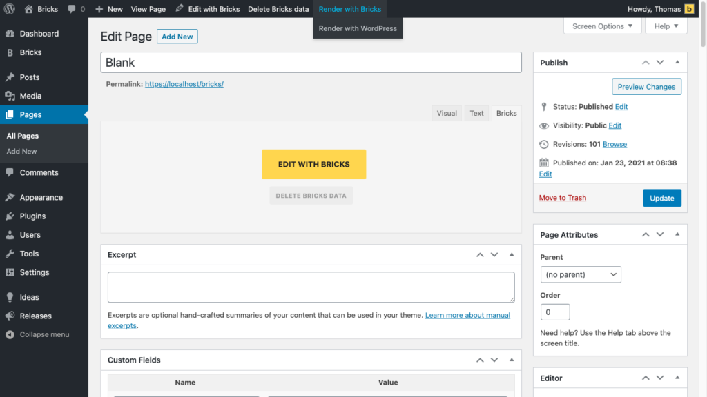

If you've created your pages with Gutenberg you can continue editing them with Bricks without having to start all over again. Bricks will convert your Gutenberg blocks into Bricks elements.

You can also save and convert your Bricks generated data to Gutenberg data to continue editing a page with Gutenberg.

This way you'll not suffer any lock-in effect when start using Bricks or if you should ever decide to move away from Bricks.

The block conversion works only with standard WordPress Gutenberg blocks, NOT custom-third party blocks

## How to load Gutenberg data into Bricks

Bricks allows you to convert your existing Gutenberg data into Bricks data. So you can continue editing any page created with Gutenberg in Bricks.

This only works for pages without any existing Bricks data. To delete the Bricks data of any page click the "Delete Bricks data" button in the WordPress top menu when editing a page in WordPress.

To enable this functionality go to **Bricks > Settings** and make sure **Load Gutenberg Data Into Bricks** is selected.

## How to save Bricks data for Gutenberg

By default, your WordPress-generated data won’t change when editing with Bricks. If you want to save your Bricks generated data as Gutenberg data as well go to **Bricks > Settings** and select **Save Bricks Data As Gutenberg Data**.

From now on whenever you edit and save in Bricks, your content will be saved as WordPress content, too. So your WordPress and Bricks data are in sync.

## Render content with Bricks or WordPress

You decide which pages you want to create with Gutenberg, the Classic Editor, or Bricks. The post status next to the page title tells you which content is used for rendering on the frontend:

To change the data being used to render a page edit the page in WordPress and hover over the **Render with WordPress/Bricks** button in the top menu, and select the source you want to use:

<figcaption>

Render with Bricks / Render with WordPress

</figcaption>

