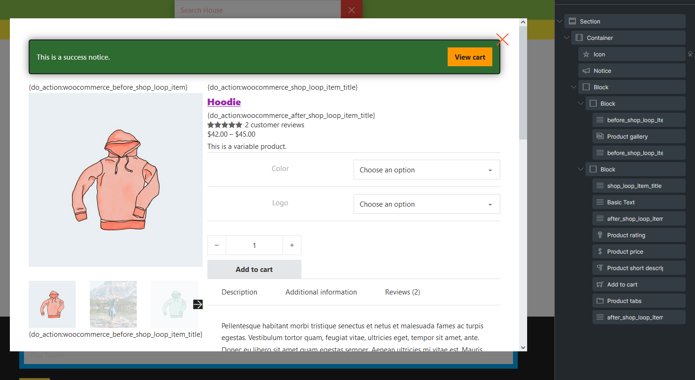
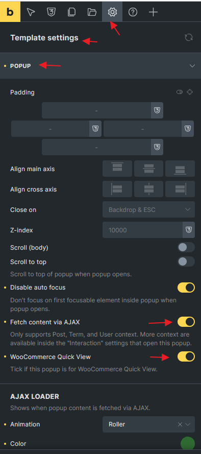
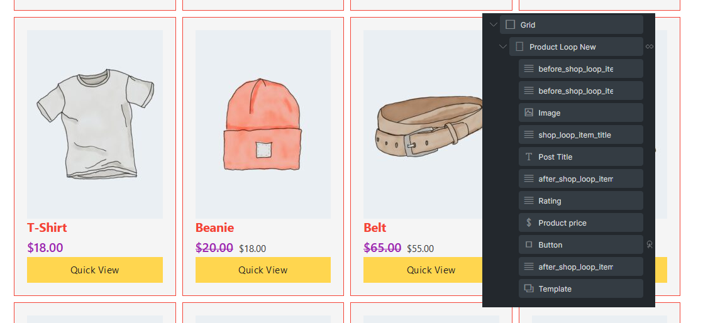
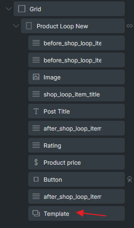
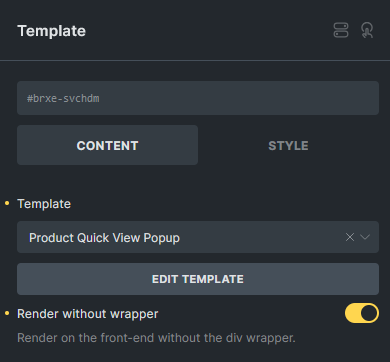
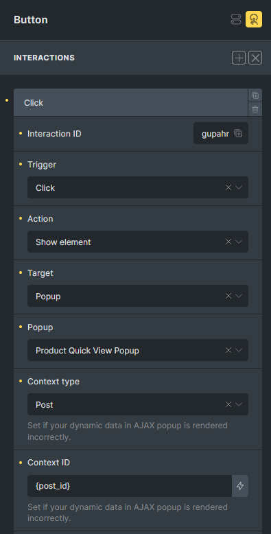

## Step 1: Design a Popup Template for Quick View

Begin by designing the popup template that will be used for the Quick View functionality. Incorporate essential elements such as the Product Gallery, Product Rating, Product Price, and Add to Cart button.

Additionally, consider including a WooCommerce Notice element within the popup to display any notifications or confirmations directly to the user after an add-to-cart action.

It's crucial to implement the appropriate template hooks, similar to those used in a standard single product page. If you're unfamiliar with template hooks, we recommend reviewing [this article](/article/woocommerce-template-hooks/#single-product-template-hooks) for further guidance.  
  
Below is an example of a WooCommerce Quick View Popup design:

## 
Step 2: Configure Popup settings

To proceed, ensure that you have enabled the **"WooCommerce Quick View"** (@since 1.10.2) and **"Fetch content via AJAX"** options in **Settings > Template Settings > Popup**.

Enabling the **AJAX loader** will enhance the user experience by providing a smoother interaction with the Quick View Popup.

Do not set any template condition for the popup template as we will embed it in the Products loop.

## Step 3: Create a Product Query Loop

Proceed by creating a Product query loop on a new page or within your Shop page template. Insert the necessary elements according to your specific requirements.

Include the appropriate [template hooks](https://academy.bricksbuilder.io/article/product-archive-woocommerce/) within the loop to ensure that any WooCommerce third-party plugins can effectively apply their logic within your Product query loop.

## Step 4: Insert Popup template and Configure Interaction to Trigger Quick View Popup

Within the product query loop, insert a Template element and select the popup template you created in Step 1.

For a cleaner HTML structure, you may choose to enable the "Render without wrapper" option.

  
Instead of using the Add to Cart element within the loop, utilize a Button element.

To ensure this button triggers the Quick View popup, configure the interaction as shown in the following screenshot:

## Summary

By following these steps, you've successfully implemented a Quick View Popup feature using Bricks.

This enhancement not only improves the user experience by allowing visitors to quickly access product details without navigating away from the current page, but it also provides a seamless integration with WooCommerce.

Remember, fine-tuning the design and interaction settings can further optimize the effectiveness of the Quick View feature, ensuring it meets your specific needs and enhances your overall site performance.
