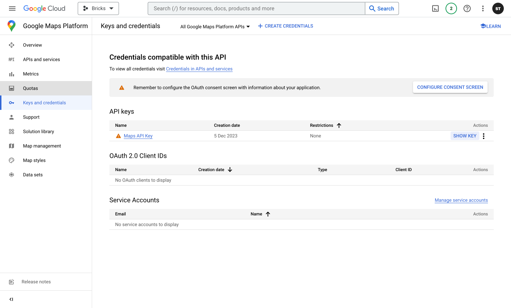
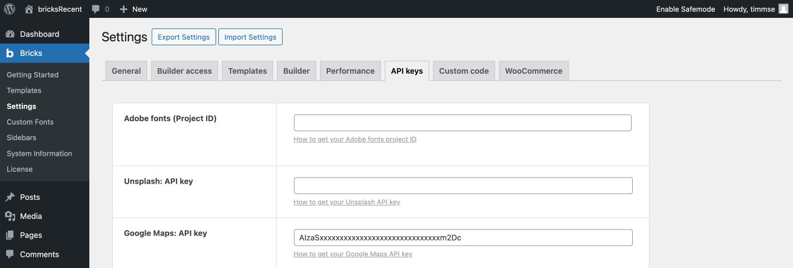
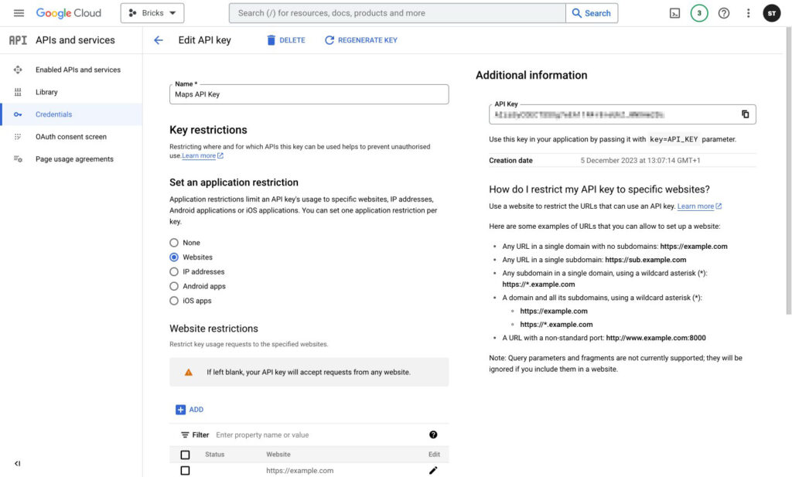
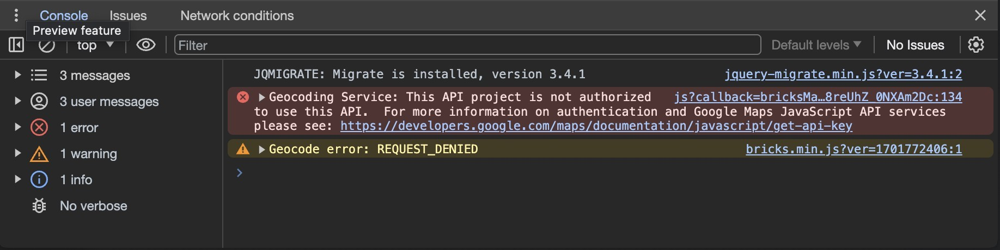

Thanks to the `Map` element, adding a Google Map to Bricks is easy. The biggest hurdle is creating the Google Maps API key. This article will show you how to create an API key and how to prevent unauthorized use by setting API and application restrictions.

Since [Bricks 1.10.2](https://bricksbuilder.io/release/bricks-1-10-2/), Google Maps can be used without an API key through the Embed API, which is very limited by Google. It only allows for one address, zoom level, and map type. For more options, you have to use an API key.

## Prerequisites

Before you start using the Maps JavaScript API, you need a project with a **billing account,** and the **Maps JavaScript API** and **Geocoding API** enabled. Check out the [Google documentation](https://developers.google.com/maps/documentation/javascript/cloud-setup) on how to do so.

As soon as you have completed the setup, you will find your API key under **Keys and Credentials » API Keys**.

Copy and paste the key into **Bricks » Settings » API keys » Google Maps: API key** and hit save.

Now, you can use the "Map" element on any page. If your map doesn’t show properly, inspect the developer console for more information.

## API and application restrictions

We recommend restricting where and for which APIs the API key can be used to prevent unauthorized use.

### Application restrictions

Since you're running a website, restrict the API key for websites only. Select "Websites" and add your URL by clicking the "Add" button. Here are some examples of URLs that you can allow to set up a website:

- Any URL in a single domain with no subdomains: https://example.com

- Any URL in a single subdomain: https://sub.example.com

- Any subdomain in a single domain, using a wildcard asterisk (\*): https://\*.example.com

- A domain and all its subdomains, using a wildcard asterisk (\*):  
    https://example.com  
    https://\*.example.com

### API Restrictions

**Restrict key** » Select APIs and enable the **Maps JavaScript API** and **Geocoding API**.

Save your API key settings.

## Common problems

If the map is not showing, open the developer console. You will receive further information and how to solve your specific issue there. In most cases, no billing account is assigned, the necessary APIs are not activated, or the restrictions are incorrect.

