WPML is a WordPress plugin known for its role in facilitating the creation of multilingual websites.

Coupling it with Bricks (`@since 1.9.1`) allows not only for the manual translation of posts, pages, and various content types into numerous languages but also offers automatic translation features, significantly broadening your website's reach and accessibility.

Once you've established a page in your primary language with Bricks, WPML enables you to easily translate the content into any language you wish to add to your website, be it manually or automatically.

This documentation will guide you through the process of translating your Bricks website using WPML.

## Setting up the environment

Before translating, set up your environment with the necessary plugins:

1. **Bricks setup**:
    - This guide will illustrate the translation process using a simple Bricks website. This website has main pages like Home and Blog, and templates including a header and an "All Archives" template, which has a [template condition](https://academy.bricksbuilder.io/article/template-settings/#template-conditions) to apply to all archives and the blog page.

2. **WPML plugin installation**:
    - You can use the [OTGS installer](https://wpml.org/version/otgs-installer-3-0-0/) to install the required **WPML Multilingual CMS** and **WPML String Translation** plugins.

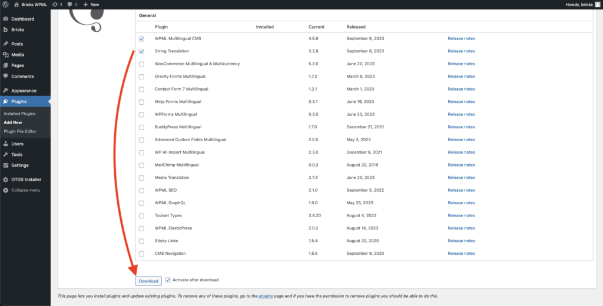

3. **Language Configuration**:
    - You can configure your website's languages and other settings through [the WPML setup wizard](https://wpml.org/documentation/getting-started-guide/). During this process, WPML will also ask you for context about your website, such as what it’s about and whose it for. 

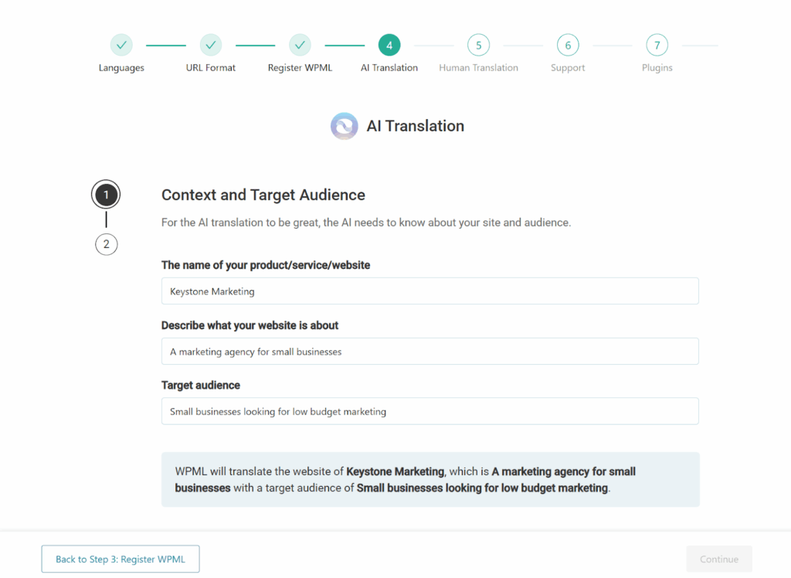

Using the context that you provide, WPML’s AI translator – [PTC (Private Translation Cloud)](https://ptc.wpml.org/about/) will create translations that fit your target audience and industry.

## Translation options with WPML & Bricks

WPML offers different ways to translate your Bricks content:

1. **[Advanced Translation Editor](https://wpml.org/documentation/translating-your-contents/advanced-translation-editor/)**:
    - Automatic (AI) Translation: Instantly translate your content using WPML’s AI-based engine, then optionally review it before publishing.
    
    - Manual Translation: A method where each page & string is translated individually.

3. **[String Translation](https://wpml.org/documentation/getting-started-guide/string-translation/)**:
    - Translate theme/plugin strings, widget texts, and other interface strings found under WPML → String Translation.

5. **Edit with Bricks**:
    - If needed, post-translation modifications to design or layout can be done in the Bricks builder for each language.

For more in-depth information on each method, refer to the official [WPML documentation](https://wpml.org/documentation/).

## Translating website content

Translate your website content using WPML and Bricks through the following steps:

### **Bulk translation via translation management**

WPML can translate any content you build with Bricks, including pages, posts, templates, and components.

To translate any Bricks content, start by going to **WPML** → **Translation Dashboard**. From here, expand the section with the content you want to translate and select your items. 

For example, to translate a page, expand the **Pages** section and select the page. This will include all Bricks element data and any component instance property values used on that page. To translate Bricks components themselves, expand the **Bricks components** section and select the components you want to translate.

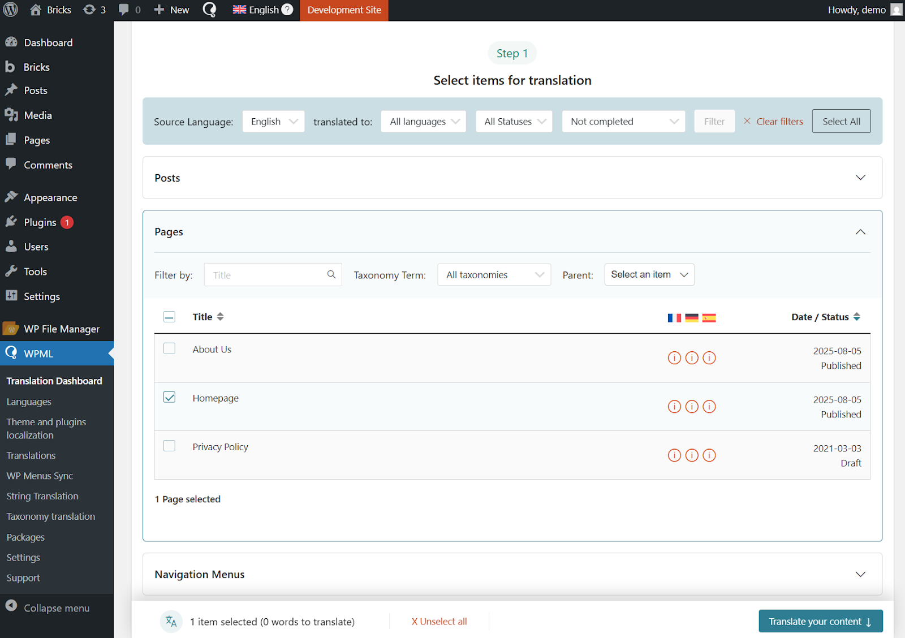

Next, select **Translate automatically** for the languages you want to translate into, and click the **Translate** button to begin. If you look under the table, WPML also shows you how much translating your content costs. 

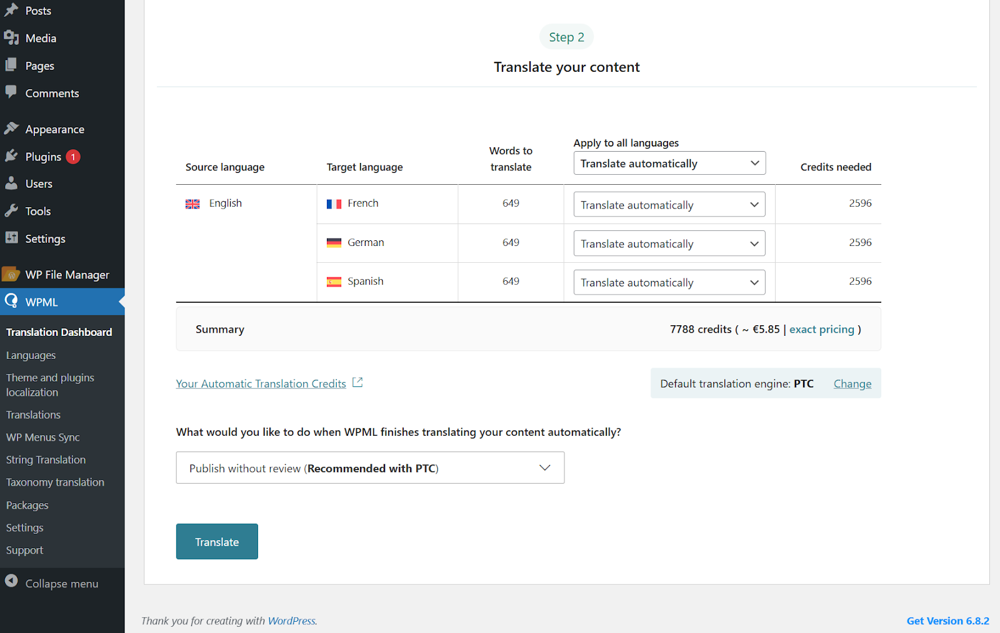

In most cases, your translations will be good to go, but you can always review and make changes using WPML’s **Advanced Translation Editor**.

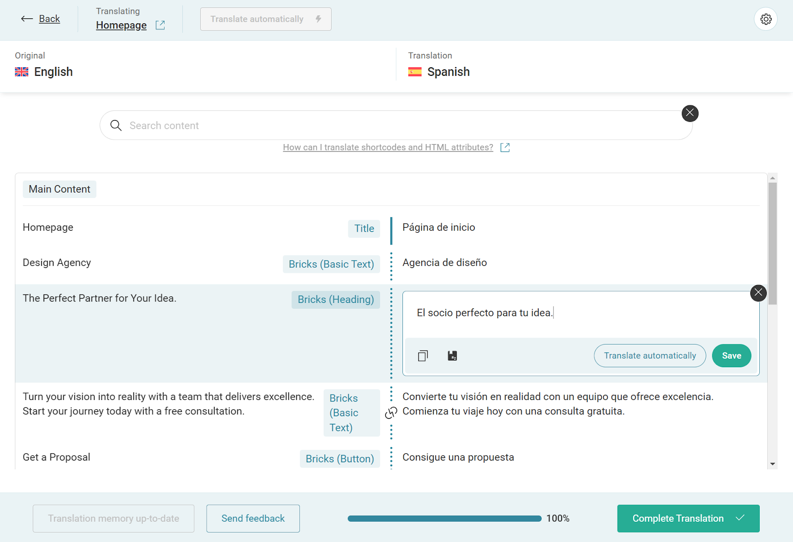

Just visit the translated page you want to edit on the front-end, and click **Edit translation** in the top admin bar. This will open the editor, where you can make any changes necessary.

Once you’re done reviewing, you can instantly publish your translations and display them on your website. Remember that you need to switch languages to view your translations. 

### **Translating individual pages and posts**

While **Translation Management** is perfect for translating multiple pages and templates in one go, you may sometimes want to focus on a single page or post—either for fine-tuning the translation or making additional adjustments. In those cases, you can use the **WPML Advanced Translation Editor** directly from the page/post edit screen.  
For comprehensive guidance on the various methods to translate pages and posts created by page builders like Bricks, refer to [WPML's official documentation](https://wpml.org/documentation/translating-your-contents/page-builders/) about this topic.

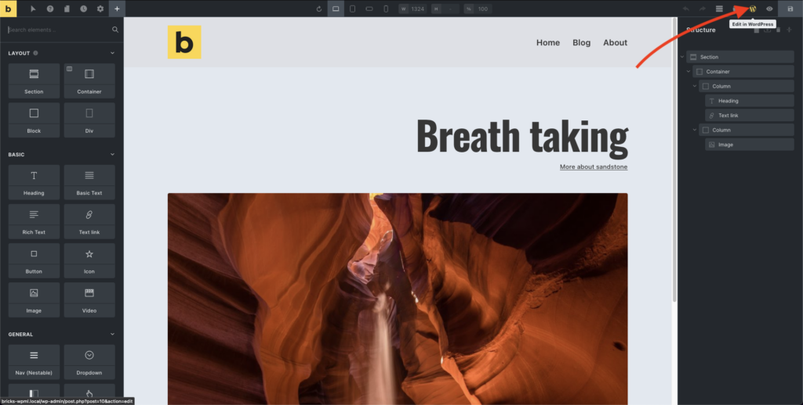

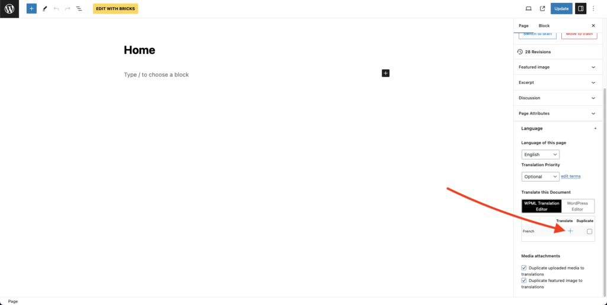

### **Template translation**:

Translating templates follows the same process as translating WordPress pages & posts. Your template settings & type will be automatically duplicated to the translated post.

If the translation of templates is not automatically enabled when you activate WPML, please [refer to the WPML documentation](https://wpml.org/documentation/support/language-configuration-files/#custom-types) on how to enable translation for custom post types, and ensure that it is enabled for “bricks\_template”.

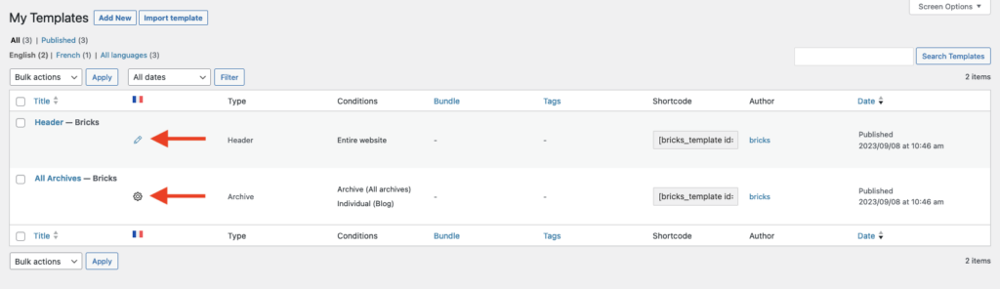

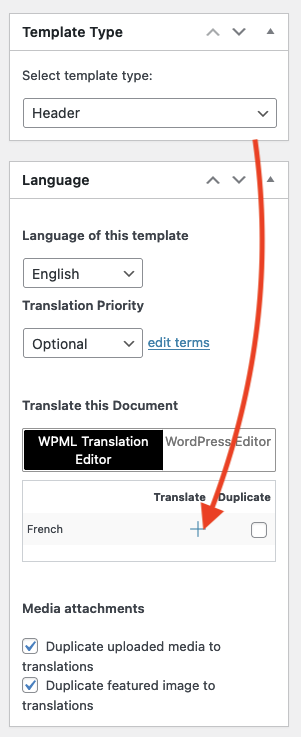

### Example: Translating an archive template:

We have set up a simple archive template, which is applied to both the "Blog" page and its translated version, "Blogue".

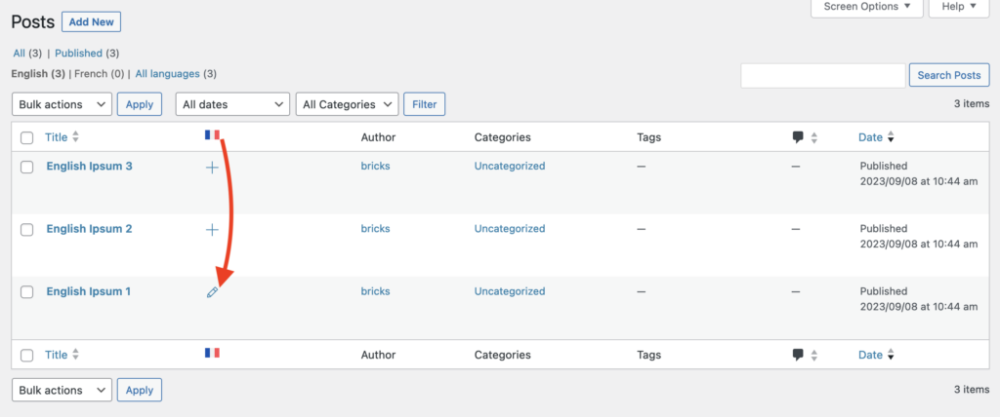

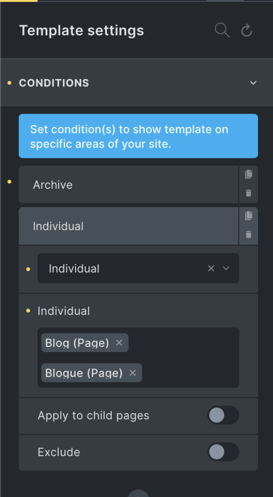

Each blog page will only display blog posts of that particular language (using only one template):

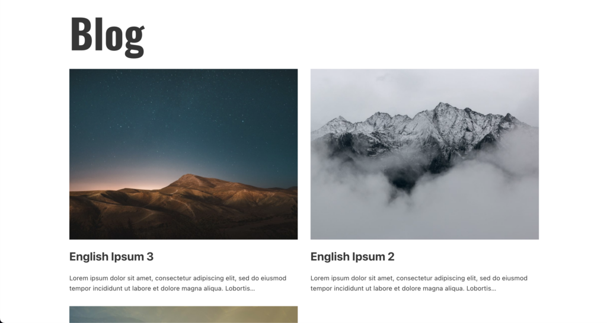

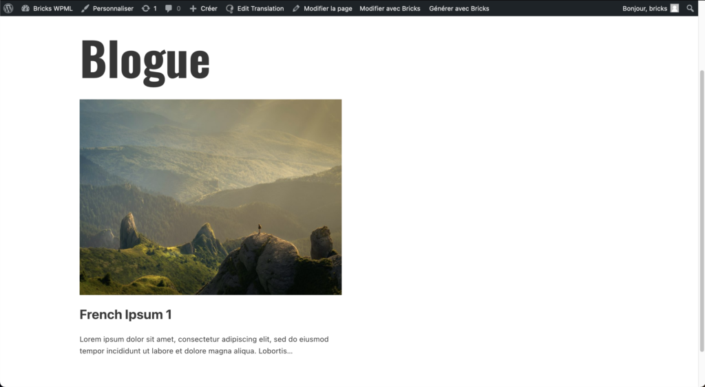

## Language switcher & menu translation

### **Language switcher**

Bricks provides a “Language switcher” element for WPML, which you can add anywhere on your site.

By default, the language switcher comes with a basic preset design. However, you can always customize the switcher to match your website style: 

1. Go to **WPML** → **Languages**. 

3. Scroll down to **Custom language switchers** and check the **Enable** box. This will reveal a **Customize** button. 

5. Click the button to set your custom preferences and save.

Your changes will immediately take effect on your website.

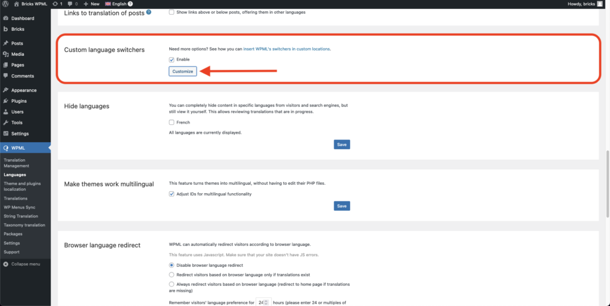

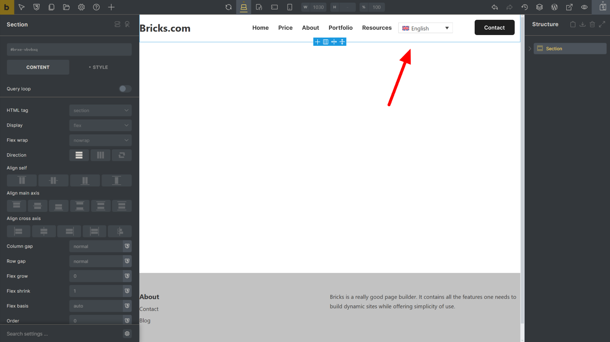

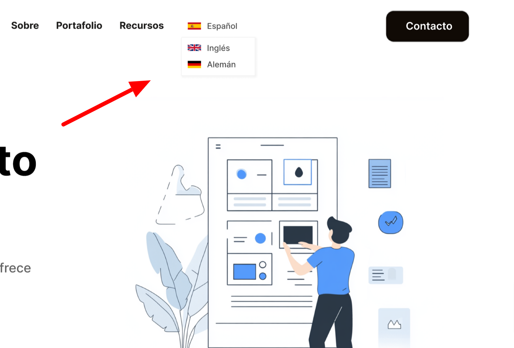

### **WPML menu translation**:

Consult WPML documentation for guidance on [translating WordPress menus](https://wpml.org/documentation/getting-started-guide/translating-menus/).

## Sync Bricks data across translated pages

After translating a page, you might want to modify the original page. Those changes you perform with Bricks in your original page are not applied to the secondary language pages.

But Bricks and WPML make it seamless to sync your design changes across translated pages without affecting the translated text. Here’s how you can do it:

### Step 1: Edit your original page with Bricks

Open the page in the primary language in the builder. Make the necessary design changes (edit layout, change styles, etc.)

### Step 2: Save your changes

Once done, save your changes.

### Step 3: Edit with WordPress

Close the builder by clicking "Edit with WordPress" to edit the page in WordPress.

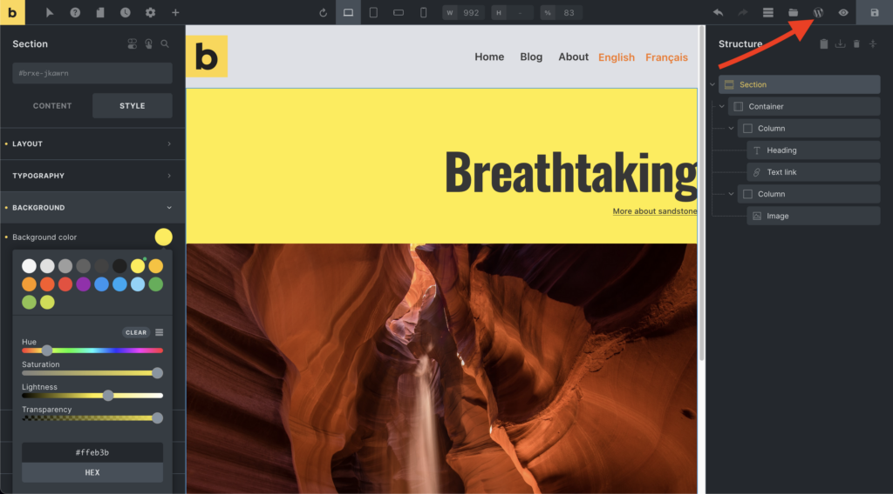

### Step 4: Update translation in the "Languages" panel

In the WordPress editor, navigate to the "Languages" panel. Typically found in the right sidebar or the document settings panel.

Here, you will find an option to edit or update the translation. Click the icon to open the "Advanced Translations Editor" as shown in this screenshot:

Translate any untranslated strings inside the Advanced Translation Editor, then click the "Complete" button at the bottom of the screen. Your new design changes are now synced with this translated page without affecting the translated text.

## **Creating different designs per language**

You can also access and edit the translated content directly with Bricks for specific language design or content modifications. For instance, instead of simply translating the text of your homepage, you can create a completely different layout that appeals to a specific target audience.

To create a different design per language: 

1. Use the admin language switcher to change to the language you want to edit.  

3. Find the page or template you want to make changes to and open it in Bricks.

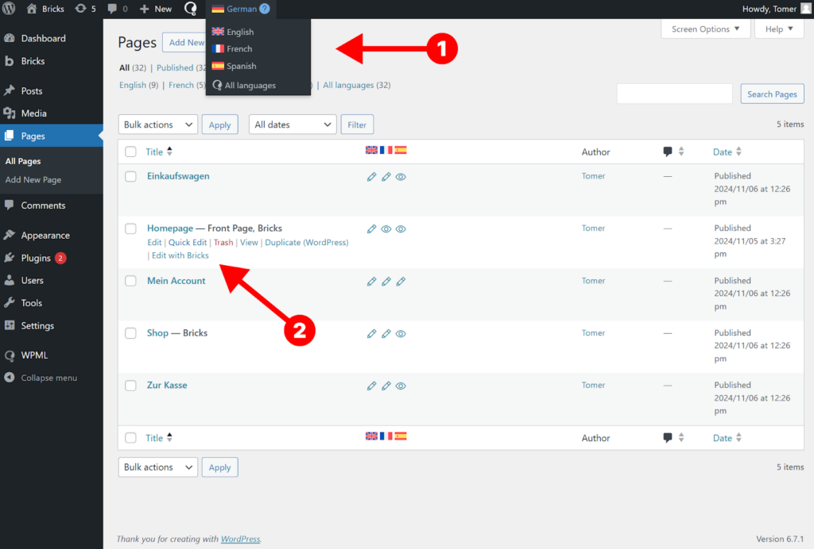

3. Make your design changes and save. Your pages will now have different designs when switching languages. 

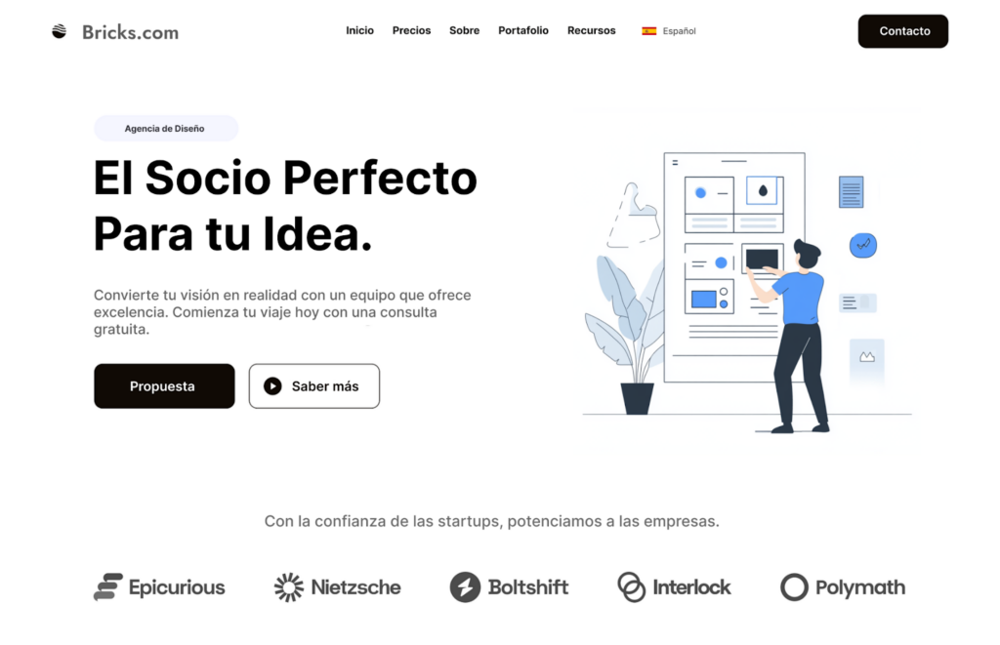

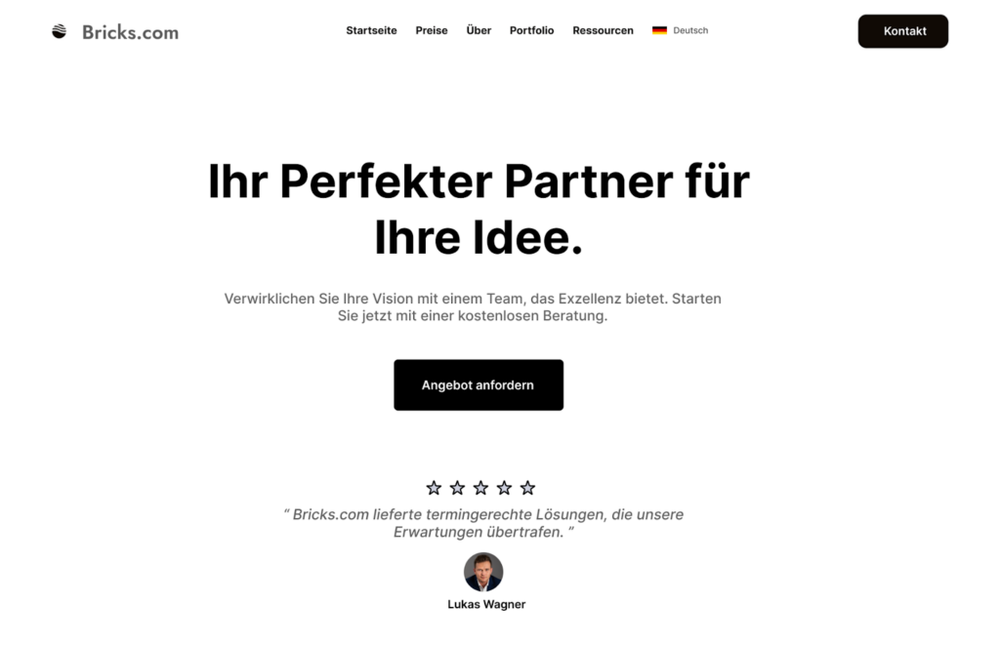

## Additional resources

Consult the following official WPML documentation for further guidance:

1. [**Getting Started with WPML**.](https://wpml.org/documentation/getting-started-guide/)

3. [**WPML FAQ**.](https://wpml.org/faq/)

5. [**Translating Content Created with Page Builders**.](https://wpml.org/documentation/translating-your-contents/page-builders/)

7. [**Translating External Links**.](https://wpml.org/announcements/2020/02/translating-links-with-advanced-translation-editor/)

## Fancy trying out WPML?

If you found this post insightful and you're considering giving WPML a try, we encourage you to use [our affiliate link](https://wpml.org/?aid=482001&affiliate_key=S35UDkP4zjiP).

_Note: The link we've provided is an affiliate link. This means we may earn a small commission if you decide to make a purchase through it. This comes at no extra cost to you, and it assists us in further innovating and refining our offerings._
