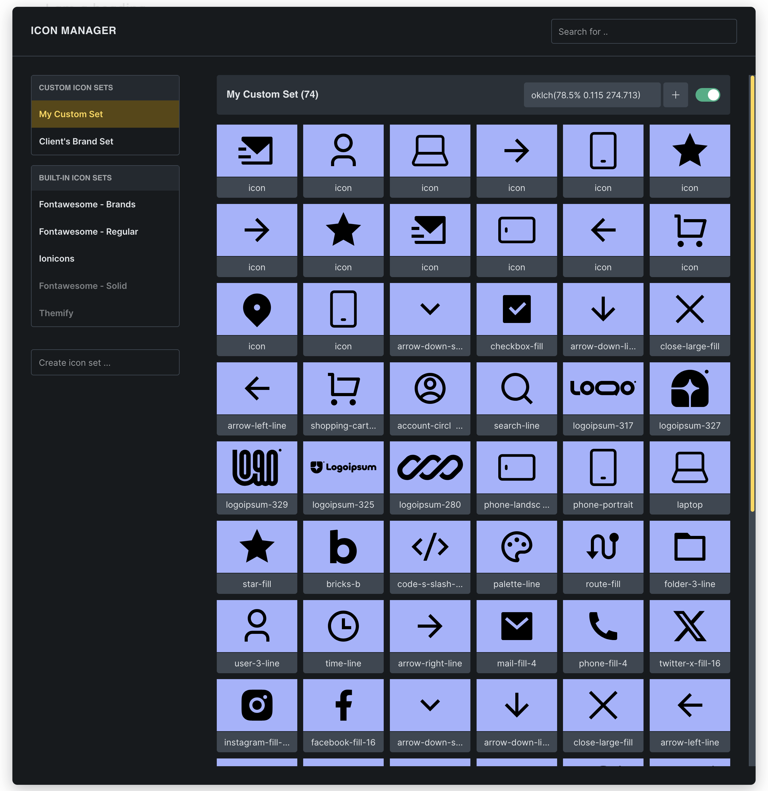

Bricks 2.0 introduces the **Icon Manager**, a new feature for uploading and managing your own custom SVG icon sets directly inside the builder. The Icon Manager makes it easy to create and maintain a consistent icon system across your site.

## Accessing the Icon Manager

To open the Icon Manager, go to **Settings > Icon Manager** in the builder toolbar, or click the **gear icon** within any icon control.

This opens a popup where you can manage both built-in and custom icon sets.

## Core functionalities

### Upload and manage custom icon sets

You can create your own icon sets by uploading a collection of SVG files. Each icon set is organized by name and can include as many icons as needed.

- **Create a new icon set** by entering a new name in the "Create icon set" field and click save

- **Upload SVG files** individually or in bulk from the WordPress media library

- Each icon in the set becomes available in all icon controls

#### Enable or disable icon sets

To keep your icon selection streamlined, you can disable any icon set, including built-in ones (i.e. FontAwesome). Disabled sets won't appear in the icon picker, but any icons already used on the page will still display and render as expected.
