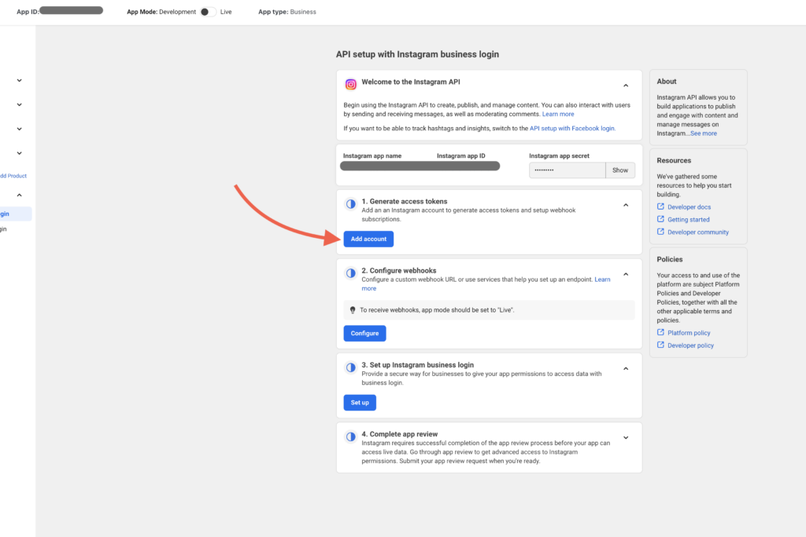
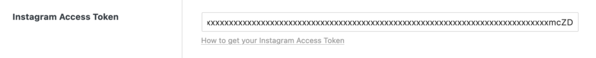

To use the Instagram Feed element (@since 1.9.1), you need an access token. This token allows secure retrieval of your Instagram account data. This guide explains how to get the token using the Instagram API with Instagram Login.

Before you can publish your app and generate an access token, you must connect your app to a **Business that has completed Business Verification**. Follow Meta’s [Business Verification guide](https://developers.facebook.com/docs/development/release/business-verification/) for instructions.

## Step 1: Ensure you have an Instagram Creator or Business account

Before proceeding, make sure your Instagram account is either a **Creator** or **Business** account.

1. Log in to your Instagram account.

3. Convert your account by following these instructions:
    - [Set up a Creator Account](https://help.instagram.com/2358103564437429?helpref=faq_content).
    
    - [Convert to a Business Account](https://help.instagram.com/502981923235522).

## Step 2: Set up an application

You first have to set up an application on the Meta for Developers platform by following these steps:

1. Access your [Meta for Developers platform](https://developers.facebook.com/apps). You can use an existing account or [create a new one](https://developers.facebook.com/docs/development/register/).

3. Provide an **App Name** and **Contact Email**.

5. Click **Create App**, then:
    - Under **Add use cases**, select **Manage messaging & content on Instagram** (from the **Content management category**), then click **Next**.
    
    - When prompted, you may connect a Business account now or skip and do it later.

7. Click **Next** and then **Go to dashboard** to complete the setup.

You will be redirected to the app dashboard for your new app with products you can add to your app.

## Step 3: Add the Instagram product to your app

1. On the app dashboard, scroll down to **Products** and locate **Instagram**.

3. Click **Set Up** next to Instagram.

5. Select **API Setup with Instagram Login** (NOT API Setup with Facebook Login).

## Step 4: Generate your Instagram access token

To retrieve an access token:

1. Assign an Instagram account for token generation:
    - In the App Dashboard, go to **Instagram > API Setup with Instagram Login**.
    
    - Click **Add an Instagram Account**.
    
    - Log in with your Instagram Creator or Business account credentials.

2. Confirm the account connection:
    - Your Instagram account must be public.
    
    - If you manage multiple accounts, ensure the correct one is selected.

4. Copy the generated access token tied to the assigned Instagram account.

## Step 5: Add the access token to Bricks

To finalize the setup, navigate to `Bricks settings > API keys` from your WordPress dashboard and paste the access token into the `Instagram Access Token` input field, and save your changes.

For more information, refer to Meta’s official documentation: [Create a Meta App for Instagram Platform](https://developers.facebook.com/docs/instagram-platform/instagram-api-with-instagram-login/create-a-meta-app-with-instagram).

**Note:** Once you retrieve and add the access token, Bricks will automatically refresh it every **20 days** using the `bricks_refresh_instagram_access_token` CRON job. No manual updates are required.
