Interactions, available since Bricks 1.6, let you bind certain user or browser events (e.g. click, mouse hover, content loaded, etc.) to trigger specific actions like show/hide an element or popup, add/remove/toggle CSS classes or HTML attributes, start animations, load more query loop results, etc.

You can also define interactions on your global classes instead of the individual element. Useful for interactions you plan on using throughout your site.

Running interactions inside the builder is not supported. Please preview your page on the front end to confirm your interactions are running as expected.

## Accessing interactions

When editing an element, click the “Interactions” (toggle) icon in the panel header to open/close the element interactions interface.

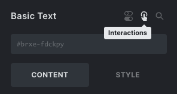

If an element has interactions, you’ll also see the “Interactions” toggle icon in the structure panel. Click the icon to open the interactions interface of this element.

## Adding interactions

To add an interaction to an element, click the "+" icon next to the "Interactions" title. You can add as many interactions to an element as you like. Clicking on the title of a specific interaction allows you to rename it.

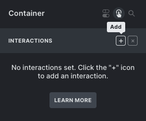

Each interaction is defined by a `trigger`, `target`, and `action`.

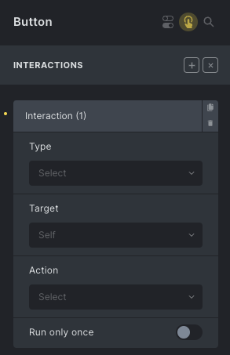

## Interaction: Trigger

The **Trigger** is the event that triggers this interaction. The event can be bound to the element itself (click, mouse hover, focus, blur, mouse enter, mouse leave, enter/leave viewport) or to the browser window (scroll, content loaded, mouse leave the window). Avaiable triggers as below:

- Click

- Hover

- Focus

- Blur

- Mouse enter

- Mouse leave

- Enter viewport

- Leave viewport

- [Animation end](#animation-end)

- [Query AJAX loader (Start / End)](#query-ajax-loader)

- [Form Submit](#trigger-form-submit), [Form Success](#trigger-form-success), [Form Error](#trigger-form-error)

- Scroll

- Content loaded

- Mouse leave window

- [Filter : Empty / Not Empty](#trigger-filter-empty-or-not-empty) (@since 1.11)

- WooCommerce (@since 2.0)
    - Added to cart
    
    - Remove from cart
    
    - Cart updated
    
    - Coupon applied
    
    - Coupon removed

## Interaction: Action

The **Action** is the logic that runs when the event is triggered. Here are the available actions in Bricks:

- Show element

- Hide element

- Set attribute

- Remove attribute

- Toggle attribute

- [Toggle offcanvas](#toggle-offcanvas) (@since 1.11)

- Load more (Query Loop)

- [Start animation](#animation-start)

- [Scroll to](#scroll-to)

- [JavaScript (Function)](#javascript)

- Open address (Map) (@since 2.0)

- Close address (Map) (@since 2.0)

- Clear form (@since 2.0)

- Browser Storage (Add, Remove, or Count)

The **Target** is the element on the page that the action affects. The target could be the element itself (default), a [CSS selector](https://developer.mozilla.org/en-US/docs/Web/CSS/CSS_Selectors), or a Popup.

By default, the interaction runs every time the event occurs (e.g., on every click on the element). Enable the "**Run only once**" checkbox if you want the interaction to only occur once on each page load.

### Action: Scroll To

Set up automatic scrolling to a specific element when certain events occur on your page. Additionally, you have the flexibility to fine-tune the behavior using the "Scroll to: Offset (px)" and "Scroll to: Delay (ms)" settings to meet your precise requirements.

Here's an example to illustrate how it works:

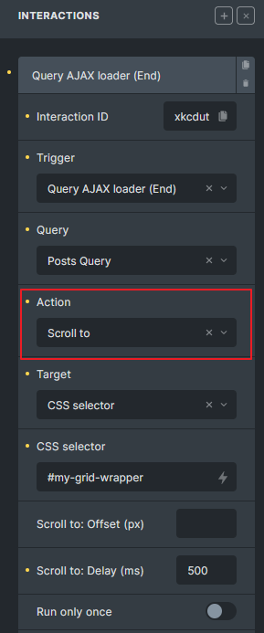

In this scenario, after the "Posts Query" AJAX call finishes, the page will smoothly scroll to the element with the CSS selector `#my-grid-wrapper`, waiting for `500 milliseconds` before initiating the scroll.

### Action: Toggle Offcanvas

Starting from version 1.11, a new action allows you to toggle the Offcanvas element using any element. Previously, only the Toggle element could interact with the Offcanvas. Please note: do not apply this action directly to the Toggle element itself.


### Action: JavaScript (Function)

With the release of Bricks 1.9.5, you have the ability to execute your own JavaScript functions directly from the Interactions panel.

Only JavaScript functions within the global scope can be executed.

To illustrate this, let's go over a few custom JavaScript function examples:

```php
<script>
window.myHelperFunctions = {}

myHelperFunctions.myCall = () => {
  console.log('myCall executed')
}

myHelperFunctions.nestedFn = {
  fn1: () => {
    console.log('fn1 executed')
  },
  fn2: () => {
    console.log('fn2 executed')
  }
}

// toggleMiniCart is a global scope function
function toggleMiniCart() {
  // run() is not a global scope function
  const run = () => {
    document.querySelector('.bricks-woo-toggle').dispatchEvent( new Event('click') )
  }
  setTimeout( run, 100 )
}
</script>
```

To execute the above functions, just enter the function name in the `Function` name (JavaScript) field. **Without parentheses or the window object!**

- To execute `myHelperFunctions.myCall()` : `myHelperFunctions.myCall`

- To execute `myHelperFunctions.nestedFn.fn1()`: `myHelperFunctions.nestedFn.fn1`

- To execute `myHelperFunctions.nestedFn.fn2()`: `myHelperFunctions.nestedFn.fn2`

- To execute `toggleMiniCart()`: `toggleMiniCart`

- You cannot execute the `run()` inside `toggleMiniCart` as it is not a global scope function

**IMPORTANT:** If you are targetting multiple elements through the "CSS Selector", Bricks iterates over each target element and executes the associated function.

### JavaScript function arguments

You can further enhance the versatility of your custom JavaScript functions by passing arguments directly to them. This is made possible through the use of the `Arguments` repeater control. Remember to arrange the order of your arguments to avoid any JavaScript errors.

The `%brx%` placeholder serves as an argument for your custom functions. By setting `%brx%` as an argument value, you gain access to valuable information related to the interaction:

- `param.source` (source element) : The interaction's source element node is the element that triggered the interaction in the first place.

- `param.targets` (target elements): An array of target elements node based on your target setting.

- `param.target` (target element): The target element node.

Here is an example to retrieve that information in a function:

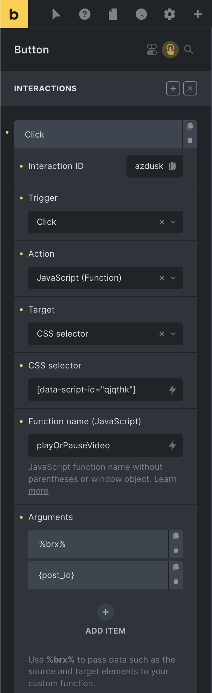

```php
// Play or pause a video element
// Click interaction that runs this custom JavaScript function
function playOrPauseVideo( brxParam, postId ) {
  const target = brxParam?.target || false
  // You can access targets (array) and the source element too
  // const targets = brxParam?.targets || false
  // const source = brxParam?.source || false
  
  if ( target ) {
    // Find the first video tag from my target node
    const video = target.querySelector('video')
    if ( video && video.play && video.pause ) {
	  // Pause or Play
      if ( !video.paused ){
        video.pause()
      } else {
        video.play()
      }
    }
  }
}
```

## Interaction: Conditions

Interaction conditions are an optional, more advanced feature. Allowing you to run an interaction only if certain conditions related to the browser storage (`window`, `sessionStorage`, `localStorage`) are fulfilled.

You can set "Interaction conditions" when editing an interaction like this:

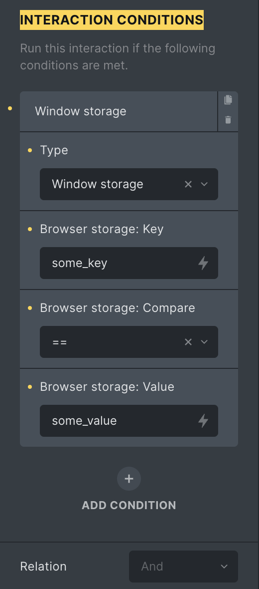

The interaction example above is fulfilled when the value of `window.some_key` is `some_value`.

The "Relation" setting lets you define if one (OR) or all (AND) interaction conditions must be fulfilled in order for the interaction to run.

### Example: Open a newsletter popup on click

In this example, we want to add a "subscribe newsletter" button to the site's footer. A click on this button should open a popup that contains our newsletter subscription form.

To create the modal/popup, we need to create a popup template first. Let's name it "Newsletter popup".

Make sure to set the template conditions of your newsletter popup to "Entire website".

In your footer template, add a button and set the following interaction:

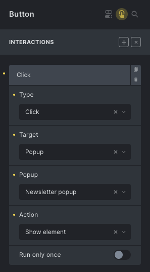

Now every time someone clicks this newsletter button in the footer of your website, your newsletter popup shows.

### Example: Show custom tooltip on hover

Let's create a custom tooltip next to a text element. The following example uses a "Basic Text" and an "Icon" element:

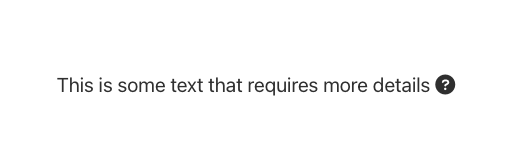

To show a custom tooltip near the "?" icon, we'll have a hidden element (e.g. Div + Text), where the Div has a custom class `.my-tooltip`, and it will be shown when the mouse is over the icon.

For this, we need to create two interactions on the Icon element. One to show the tooltip and another to hide the tooltip, like this:

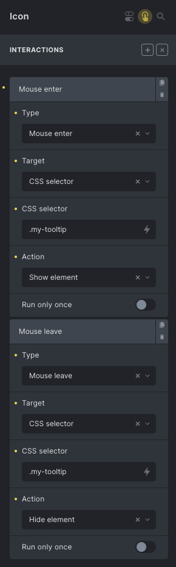

The end result, with some more styling, could look like this:

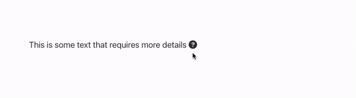

### Example: Create a toggle button (e.g. nestable accordion open/close icon)

We can create a toggle button like the mobile menu toggle using element interactions.

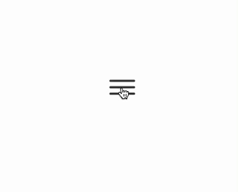

The idea in this example is to add two Icon elements inside a Div.

One of the icons shows when the button is not _active_ and the other icon shows when the button is _active_.

We'll also add custom CSS and custom classes to the Div and the icons. The Div should have a custom class `.toggle-button` with the following custom CSS:

```php
%root% .toggle-close-icon {
  display: none;
}

%root%.is-open .toggle-open-icon {
  display: none;
}

%root%.is-open .toggle-close-icon {
  display: block;
}
```

The default icon should have the class `.toggle-open-icon` and the _active_ icon the class `.toggle-close-icon`.

Finally, we need to set the element interactions.

The idea is to add and remove the class `.is-open` on the Div. So, when we click on the default icon, the `.is-open` class is added, and when we click on the _active_ icon, the `.is-open` class is removed.

For this to happen in the default icon, we set the following interaction:

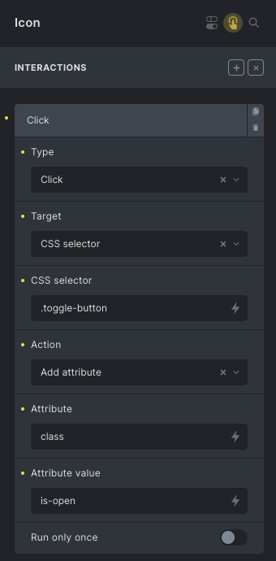

On the _active_ icon we set the opposite interaction:

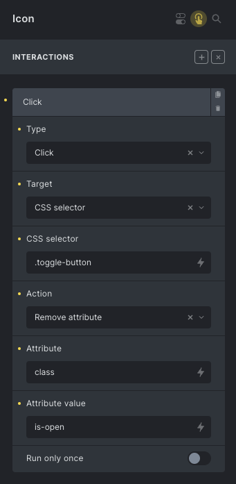

## Animations

You can animate elements in Bricks through Interactions.

Bricks uses the popular [Animate.css](https://animate.style/) library to provide various pure CSS animations.

### Action: Start animation

Adding the following interaction to an element runs the "jello" animation when someone clicks on the element.

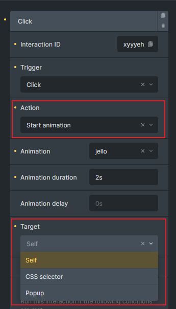

### Trigger: Animation end

A significant enhancement introduced in Bricks `1.8.4` is the ability to perform actions when a set of animations ends. This opens up opportunities for creating seamless chains of animations or interactions.

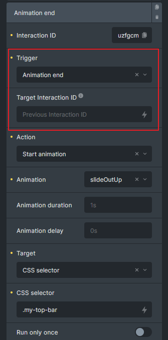

The **Target Interaction ID** field allows you to specify a particular Interaction with the "Start animation" action to listen to.

If the specified Interaction does not have the "Start animation" action or is not set, this interaction setting will be ignored and will not be triggered.

To listen to any previous Interaction within the same Interaction group (either set on the element level or class level), you can leave the field empty.

If you wish to target an Interaction in a different interaction group, you must fill in the **Target Interaction ID** field accordingly.


In the example above, **uzfgcm** interaction will execute its action once the **xyyyeh** animation ends.

Avoid using the current Interaction ID as the Target Interaction ID. Bricks will ignore this setting to prevent potential infinite interaction loops that could consume excessive browser memory.

You can also listen to this event to execute more complicated JavaScript logic.

```php
// Listen to animation xyyyeh
document.addEventListener( 'bricks/animation/end/xyyyeh', (event) => {
  // Get the element from the event
  const element = event.detail.el || false
  
  // Do your magic here
})
```

### Special Consideration for Popups

Popups in Bricks have special behavior when it comes to animations.

To open or close a Popup automatically after an animation ends, you only need to define the "Start animation" action with any \*In or \*Out animation. This eliminates creating a separate Interaction to close or open the Popup based on the animation end trigger.

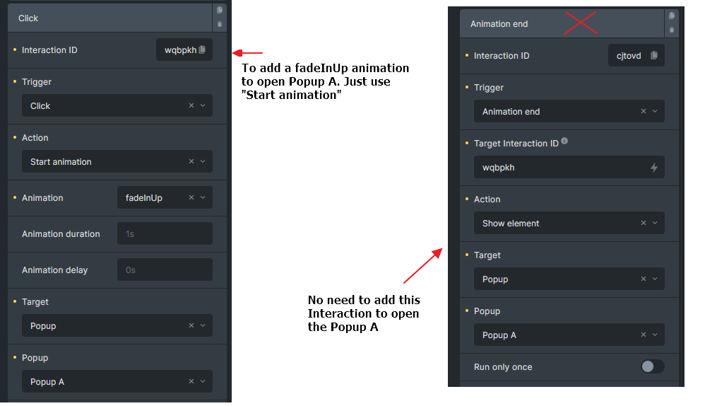

## Trigger: Query AJAX loader (Start/End)

An excellent addition introduced in Bricks 1.9. These two new triggers are for advanced users to build their own AJAX loader if the native AJAX loader inside the Query loop setting is unable to meet their design needs. This helps to execute actions when Bricks AJAX initiates or concludes.

Bricks AJAX = Infinite Scroll, Load More, AJAX pagination, or Query Filter

##### Example: Apply opacity 0.5 to a query div when AJAX starts and revert when AJAX ends

1. Create a grid layout for your query loop, then set a custom class for the grid with an opacity of 0.5.

3. Add an interaction to your grid so we can add and remove this class when AJAX starts and ends.

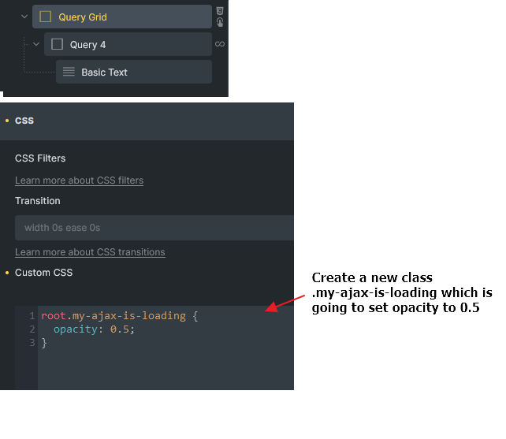

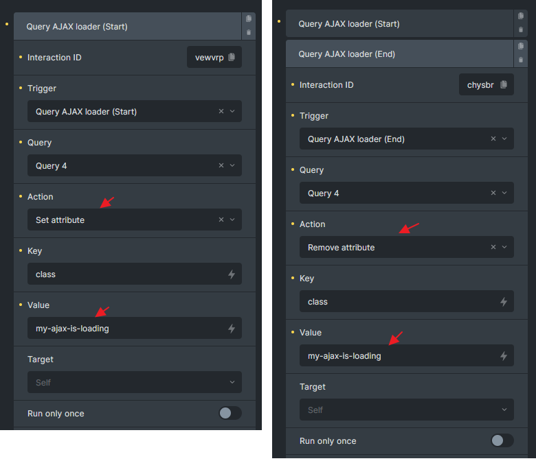

You can execute your own JavaScript function when the Bricks AJAX starts or ends via `bricks/ajax/start` or `bricks/ajax/end` events. (@since 1.9)

```php
document.addEventListener('bricks/ajax/start', (event) => {
  // Get the queryId from the event
  const queryId = event.detail.queryId || false

  if (!queryId) {
    return
  }

  // Do your magic here
})
```

## Form

Bricks `1.9.2` introduces a set of exciting new features that enhance your ability to customize interactions creatively. In this release, we've introduced three new interaction triggers and corresponding JavaScript events to empower you in crafting dynamic user experiences.


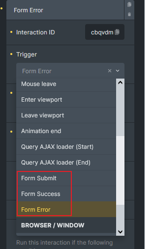

<figcaption>

New triggers: Form Submit, Form Success, Form Error

</figcaption>


### Trigger: Form Submit

This trigger occurs when the form has been submitted. It provides an opportunity to perform actions such as resetting or hiding specific elements before the form submission process takes place.

JavaScript example:

```php
document.addEventListener( 'bricks/form/submit', function ( event ) {
  // Access the element ID
  const elementId = event.detail.elementId;

  // Access the form data
  const formData = event.detail.formData;

  // Perform actions using elementId and formData
  console.log('Element ID:', elementId);
  console.log('Form Data:', formData);

  // You can now work with the elementId and formData in your event handler
});
```

### Trigger: Form Success

Occurs when a form submission was successful.

JavaScript example:

```php
document.addEventListener( 'bricks/form/success', function ( event ) {
  // Access the element ID
  const elementId = event.detail.elementId;

  // Access the form data
  const formData = event.detail.formData;

  // Access the raw response from AJAX
  const res = event.detail.res;

  // Do your magic here

});
```

### Trigger: Form Error

Is triggered when the form submission was not successful. Use this trigger to manage error scenarios.

JavaScript example:

```php
document.addEventListener( 'bricks/form/error', function ( event ) {
  // Access the element ID
  const elementId = event.detail.elementId;

  // Access the form data
  const formData = event.detail.formData;

  // Access the raw response from AJAX
  const res = event.detail.res;

  // Do your magic here

});
```

## Trigger: Filter: Empty / Not Empty

Introduced in version 1.11, these two new interaction triggers available when the Query Filters feature is activated.

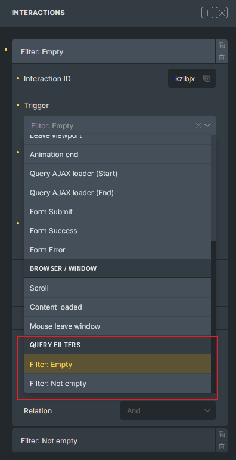

The triggers allow you to show or hide elements based on whether the associated filter's options or values meet the specified conditions. This is particularly useful when you enable the "Hide empty" option for filter elements.

**Filter: Empty** is triggered when:

- Active filters, Checkbox, Radio, Select - No options are available.

- Datepicker, Range, Search - The current value is empty.

**Filter: Not Empty** is triggered when:

- Active filters, Checkbox, Radio, Select - Options are available.

- Datepicker, Range, Search - The current value is not empty.

These triggers should be used together to toggle the visibility of elements dynamically. Using only one might cause issues, such as the target element hiding after the first filter action but failing to reappear on subsequent actions, unless you have a specific requirement or plan in place.

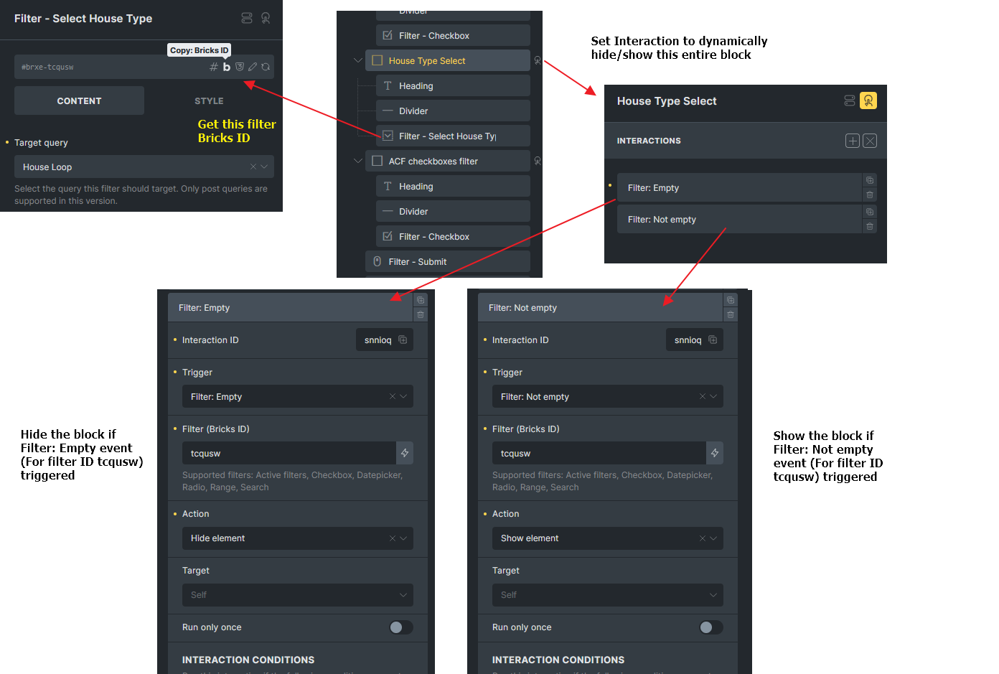

Example:  
If the Filter - Select returns no options, hide the block wrapper to avoid an awkward empty display. Otherwise, the block remains visible. This behavior is dynamic and handled via JavaScript.
