## When I open the builder I don't see the elements on the canvas

If you open the builder and you don't see the elements in the canvas but they are shown in the structure panel, and if you are using Cloudflare, then this is a known problem caused by a conflict between the [Cloudflare Rocket Loader](https://support.cloudflare.com/hc/en-us/articles/200168056-Understanding-Rocket-Loader)™ / other performance optimization feature and the Bricks builder JavaScript.

Starting with Bricks 2.0, a new **experimental setting** has been introduced to improve compatibility with Rocket Loader™. Enable it in **Bricks > Settings > Builder** and reload the builder page, your elements should now appear correctly on the canvas.

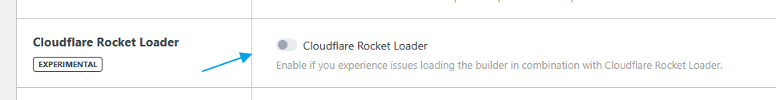

### Workarounds

### Method 1) Configuration Rules

Create a configuration rule for builder mode.

1. Log into the Cloudflare [dashboard](https://dash.cloudflare.com/login).

3. Select your account and website.

5. Go to Rules > Configuration Rules.

7. Create a new Rule, give it a name, and choose Custom filter expression
    - Field: URI Query String
    
    - Operator: contains
    
    - Value: bricks=run

9. Configure "Then the settings are…":
    - Add Rocket Loader and leave the checkbox empty.

11. Leave the other settings empty.

13. Save the rule by clicking "Deploy".

15. Wait for a few minutes and do a browser hard refresh in Bricks builder. (Clear browser caches)  
     

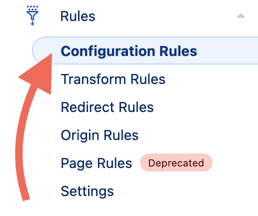

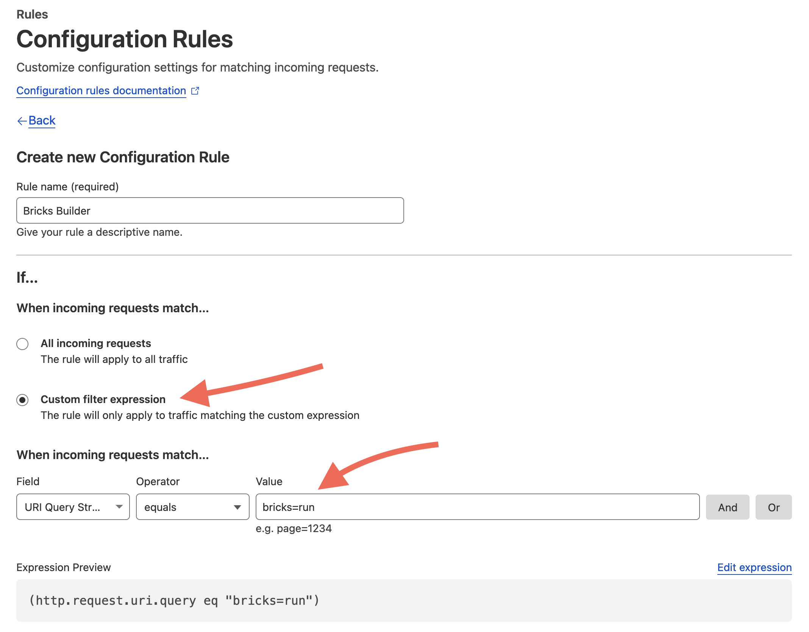

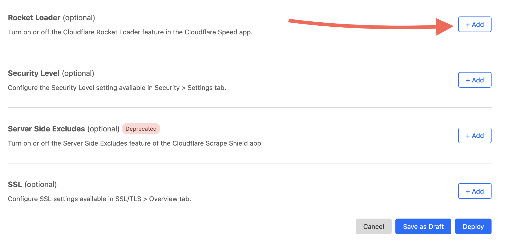

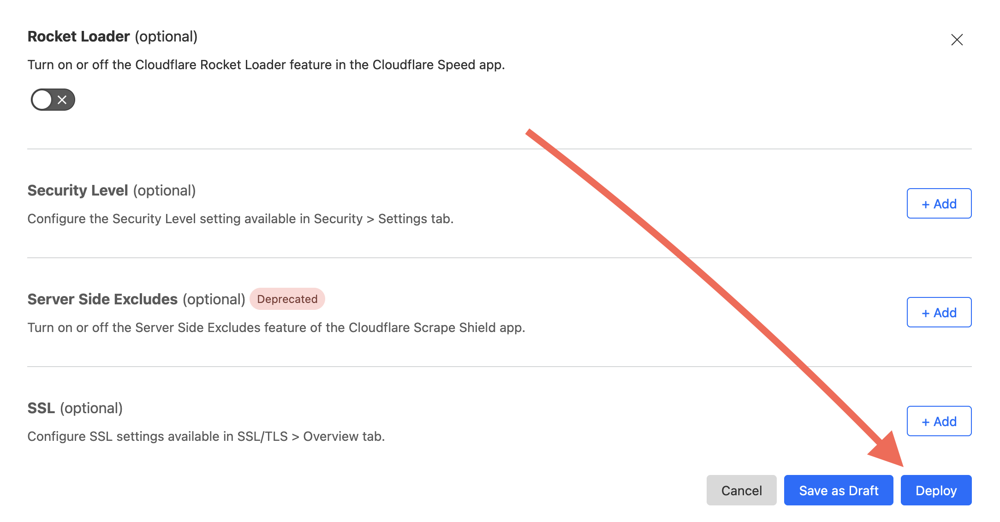

### Method 2) Disable Rocket Loader

Disable the Rocket Loader™ in the Cloudflare dashboard:

1. Log into the Cloudflare [dashboard](https://dash.cloudflare.com/login).

3. Select your account and website.

5. Go to Speed > Optimization.

7. Scroll down until you find Rocket Loader.

9. Turn it off.

### Method 3) Disable SiteGround Worker Routes

If the above 2 methods do not work and you are using SiteGround hosting, please check and disable the Worker created by SiteGround.

1. Log into the Cloudflare dashboard.

3. Select your account and website.

5. Go to Workers Routes.

7. If sg\_worker exists or another suspicious worker is defined without your awareness, you can remove it.

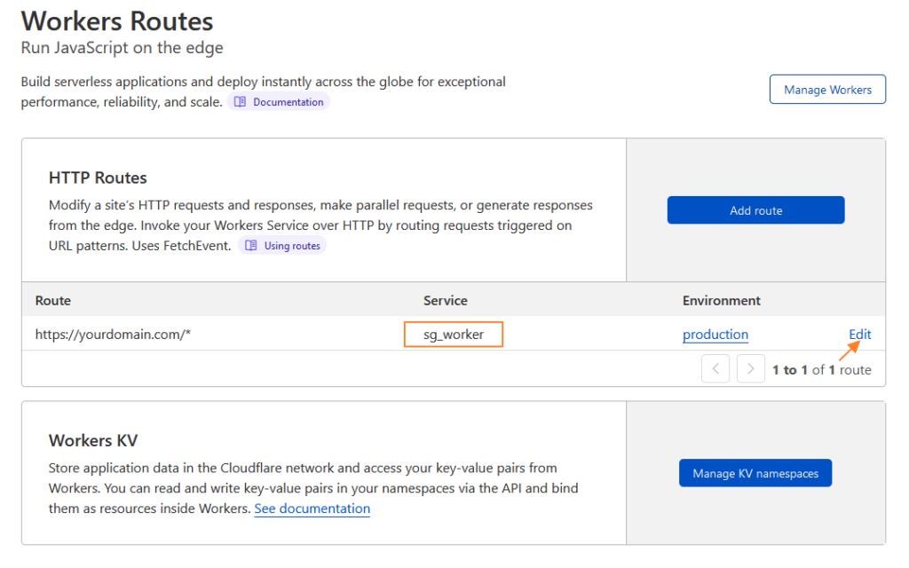

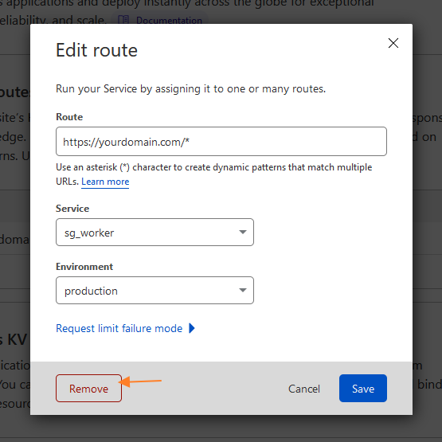

## GoDaddy MU Plugin Causing Empty Canvas

For **GoDaddy** users, if you're experiencing an empty canvas issue **without Cloudflare Rocket Loader**, the cause might be a MU plugin injected by GoDaddy hosting.

To resolve this, add the following snippet in your child theme's `functions.php` file or via a code snippets plugin to dequeue the problematic script:

```php
add_action( 'wp_enqueue_scripts', function() {
  if ( bricks_is_builder() ) {
    wp_dequeue_script( 'GoDaddy\WordPress\Plugins\Launch\PublishGuidepublish-guide-script' );
    wp_deregister_script( 'GoDaddy\WordPress\Plugins\Launch\PublishGuidepublish-guide-script' );
  }
}, 1000 );
```

This will prevent the GoDaddy MU plugin from interfering with Bricks' builder rendering.

## Copy/paste elements or styles not working

Bricks 1.5.1 uses the Clipboard API to copy and paste elements and styles across different domains.

Copy/paste is only supported for pages served over **HTTPS**.

### Using Firefox

Firefox is more restrictive regarding reading from this API, which prevents the paste action, and therefore it requires the user to manually grant permission to use the API.

To do so, please follow these steps in your Firefox browser:

1. Enter `about:config` in navigation bar

3. Click "Accept the Risk and Continue"

5. Search `clipboard`  and set `dom.events.asyncClipboard.readText` and `dom.events.testing.asyncClipboard` to  `true`

7. Restart Firefox

## Internal server error (500) when trying to edit homepage with Bricks

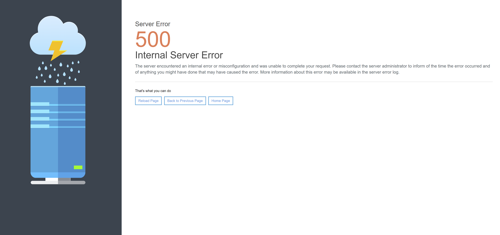

If you see a screen similar to the above, showing an internal server error (500) when trying to edit a page with Bricks (often reported as the homepage), you should look at the server logs and adjust the server configuration. This error is most probably caused by a security server configuration that prevents the request to hit WordPress and Bricks.

Some servers do not have the `SecResponseBodyLimit` defined leading to errors like:

```php
ModSecurity: Output filter: Response body too large (over limit of 1048576, total not specified).
```

(Note: the SecResponseBodyLimit sets the maximum response body size that will be accepted for buffering).

Check this [forum post](https://forum.bricksbuilder.io/t/solved-internal-server-error/1711) for possible solutions. If the issue persists, please contact your hosting support for guidance.

For **GoDaddy** users, you might need to add this line of code in your .htaccess file (first line)

```php
SubstituteMaxLineLength 10M
```

## My Blog page is not using the posts archive template

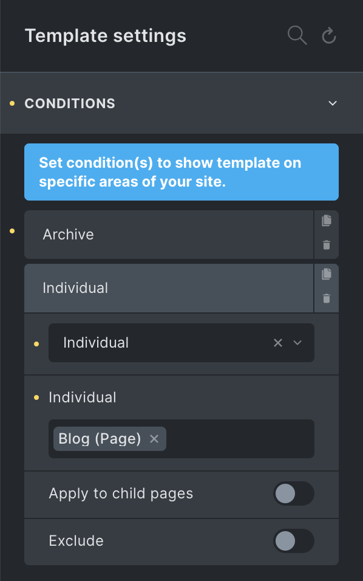

The Blog page (WordPress Posts Page set in the Settings > Reading) is a special WordPress page, and therefore it is not an archive. If you want to set a Bricks template for the Blog page, you would need to set the template condition Individual and select the Blog page.

## I'm using SVG files in Bricks elements but I cannot change their color

This usually happens when your SVG file contains inline styles which override the styles generated by the Bricks builder. If you want to use these SVG files in combination with the Bricks style's controls, you need to remove the inline styles from the SVG file before uploading it to the WordPress installation.


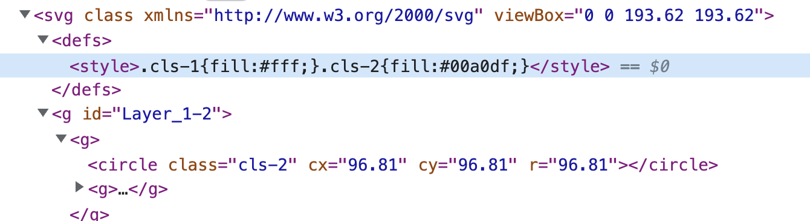

<figcaption>

An example of an SVG file containing inline styles

</figcaption>


## Custom Fonts not working on the frontend

If your custom fonts are not displayed in the frontend, it is probably because your WordPress website is delivered via HTTPS, but your WordPress URLs are still set to HTTP (WordPress Settings » General).

Changing the WordPress URLs from `http://` to `https://` will fix the problem and your fonts will be displayed correctly from now on.

## YouTube background video doesn't autoplay on mobile

This restriction is imposed by the YoutTube iFrame Player API and cannot be influenced by us. See [https://developers.google.com/youtube/iframe\_api\_reference#Mobile\_considerations](https://developers.google.com/youtube/iframe_api_reference#Mobile_considerations)

However, Vimeo and local videos (mp4) should work as long as the mobile device is not in low-battery mode.

## Slider doesn't autoplay / Animation Flickering

This is most likely caused by the reduced motion or animation setting of your operating system.

On Windows, please make sure that the **"Show animations in windows"** setting is enabled:

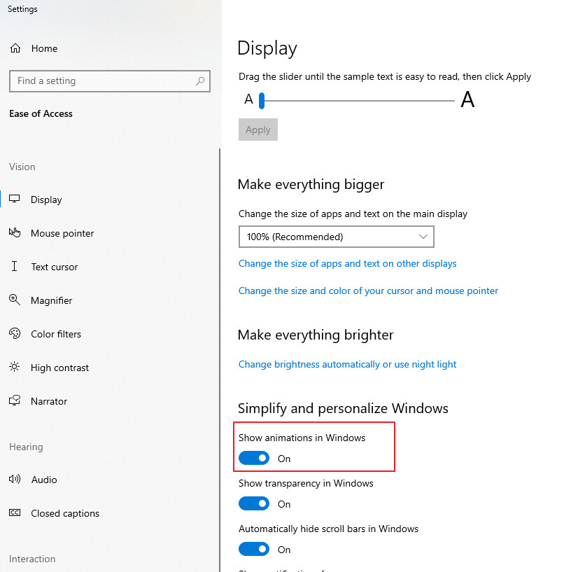

On macOS, please make sure that the **"Reduce motion"** setting is NOT enabled:

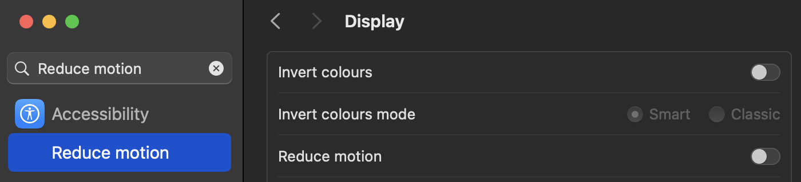

## Invalid Post Type / Custom Post Type 404 Errors

This problem is probably [the most common problem](https://www.google.com/search?q=wordpress+404+cpt&sourceid=chrome&ie=UTF-8) in WordPress: your custom post type returns a 404 error. In most cases, however, the problem can be solved very easily.

### Re-save your permalink settings

All you have to do is go to WordPress » Settings » Permalinks and click on "Save Changes".

### Check for slug conflicts

The slug refers to the user-friendly and URL-valid name of a post, page, category, tag, or any content (even images) within your website. It is a part of the URL that identifies a specific piece of content.

Let's assume you have a "Portfolio" page whose slug is "portfolio". Now you create a custom post type called "Portfolio", whose slug is also "portfolio". If you now try to call up a single post from your portfolio (yoursite.com/portfolio/your-portfolio-post), there will be a 404 error too. To solve this issue, rename either the page slug, or the custom post type slug to something else. Re-save your permalinks again, and everything should work as expected.

## Builder changes not saved

If you save changes in the builder and everything appears to be saved, but upon refreshing or viewing on the frontend the changes are lost, it could be due to an issue with your database schema.

Specifically, check the `meta_value` column in your `wp_postmeta` table (or your table prefix, e.g., `psjw_postmeta`). This column should be set to "LONGTEXT" to ensure it can store large amounts of data. If it's set to a type with a lower storage capacity, such as "TEXT," it may not save larger data correctly.

For more details on storage limitations, refer to this resource: [Understanding Storage Sizes for MySQL TEXT Data Types](https://www.atlassian.com/data/databases/understanding-strorage-sizes-for-mysql-text-data-types).

WordPress defaults to using "LONGTEXT" for the `meta_value` column, which allows for much larger data storage. See the default schema here: [WordPress Database Description](https://codex.wordpress.org/Database_Description).

To resolve this issue:

1. Check your `meta_value` column type in the `wp_postmeta` table (or `psjw_postmeta`).

3. Ensure it is set to "LONGTEXT."

You can change the column type to "LONGTEXT" using the following MySQL command:

```php
ALTER TABLE your_prefix_postmeta MODIFY COLUMN meta_value LONGTEXT;
```

Replace `your_prefix_postmeta` with your actual table name, e.g., `psjw_postmeta`.

3. Verify that other columns in your `postmeta` table match the default WordPress schema.

If you are not comfortable making these changes or are using a managed hosting provider, it's best to get in touch with your hosting provider. They can help address this issue, which might persist across different hosting services due to the migration of the incorrect database schema.

## Save button spinning endlessly due to ModSecurity

If you find that the save button in the Bricks builder is spinning endlessly, and your server logs point to ModSecurity errors, this could be caused by certain ModSecurity variables being too restrictive:

- `SecRequestBodyLimit`

- `SecRequestBodyNoFilesLimit`

- `SecResponseBodyLimit`

While we can’t guarantee this will resolve your specific issue, other users have found that increasing these values fixed the problem.

The values can vary depending on your server, so you might need to experiment or consult your hosting provider to make these changes.

## Query Filter Indexer: No Progress

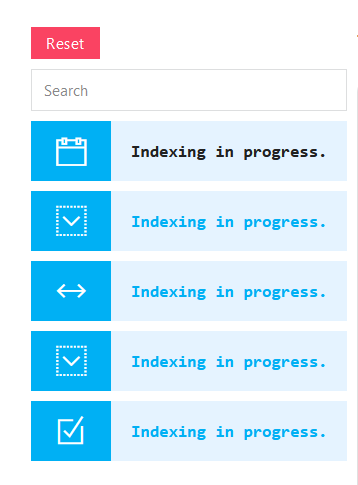

If the filter element continues to display "Indexing in Progress" in the builder, try clicking the "Continue Index Job" button by following the instructions in [this article](/article/query-filters/#filter-index).

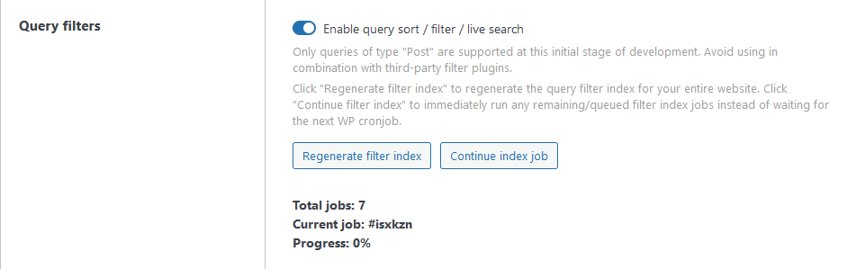

However, if the indexing jobs remain pending without any progress, it might be caused by specific firewall rules blocking the background process.

Best to check your website firewall settings or contact your hosting support. If your website is protected by HTTP Authentication, please add this [code snippet](/article/query-filters/#filter-index) in your child theme's functions.php as well.

For users with Cloudflare proxy enabled, ensure that Bot Fight Mode is disabled. [Refer to this guide to prevent false positives](https://developers.cloudflare.com/bots/troubleshooting/frequently-asked-questions/#what-should-i-do-if-i-am-getting-false-positives-caused-by-bot-fight-mode-bfm-or-super-bot-fight-mode-sbfm).

## Avoiding Slow Queries in Media/Attachment Dynamic Data

When working with plugins like **ACF**, **Meta Box**, or **JetEngine** to create fields that store image or attachment file information, it is recommended to set the field’s return value to **object** or **ID** instead of **URL**.  
Examples of Field Types:

- **ACF**: Image, Gallery, File

- **JetEngine**: Media, Gallery

- **Meta Box**: File Input, Image Select

- **Toolset**: Attachment URL to Post ID

This recommendation is important because Bricks uses the `attachment_url_to_postid` WordPress function to retrieve additional image data, such as dimensions and available sizes, when working with URL values. On websites with a large number of posts, this function can be resource-intensive, potentially slowing down page loading times.  
By returning the field as an object or ID, Bricks can access the required data directly, improving performance and reducing the likelihood of slow queries.

## **Slider doesn’t autoplay / Animations not working**

If your animations on your site are not working or your slider isn't autoplaying, it might be due to the "Reduce motion" setting on your device. This is an accessibility feature that Bricks respects. To see animations:

- **On Windows**: Ensure that the “Show animations in windows” setting is enabled.

- **On macOS**: Make sure that the “Reduce motion” setting is NOT enabled.

## Orphaned elements

In rare cases, Bricks element data may become corrupted. This can happen if a parent element (like a Section) is deleted but its child elements are not properly deleted due to a bug or third-party template import with corrupt data. These leftover elements are no longer linked to a valid parent and are referred to as **orphaned elements**.

Orphaned elements are not rendered in the builder or frontend but still exist in the page data, which can lead to unexpected issues such as:

- Orphaned text showing up in the WPML Advanced Translation Editor

- Incorrect filter element counts

- Unused styles or scripts (e.g. icon libraries) being loaded

### How to detect and clean up orphaned elements

Starting with Bricks 2.0, you can now detect and remove orphaned elements from within the builder.

Bricks automatically checks for orphaned elements on builder **load**. You can also:

1. Enable **“Check for orphaned elements on builder save”** in **Bricks Settings → General → Data integrity** to scan every time you save in the builder.

3. Add `&check=orphaned` to the builder URL to manually trigger a scan on save (helpful for debugging).

When enabled, Bricks will automatically check for orphaned elements on builder load and save. If any are found, you’ll see a notification with an option to **Clean up** the data. Clicking it will remove the orphaned elements from the current page.

After cleanup, we recommend reviewing your page to confirm everything looks correct. If anything went wrong, you can simply click undo to reverse the operation.

#### **Site-wide orphaned elements review**

You can also scan your entire site for orphaned elements from **Bricks Settings → General → Data integrity**. Click the **“Start: Orphaned elements review”** button to begin. Bricks will crawl all templates, pages, and any post type using Bricks, and list any that contain orphaned elements.

If no issues are found, you’ll see the message “No orphaned elements found”. If orphaned elements are detected, you’ll have the option to click **“Clean up all orphaned elements”**, which will remove them across all affected posts.

We recommend taking a backup before running the cleanup, just in case. Once confirmed, Bricks will proceed to delete the orphaned elements from each listed post.
