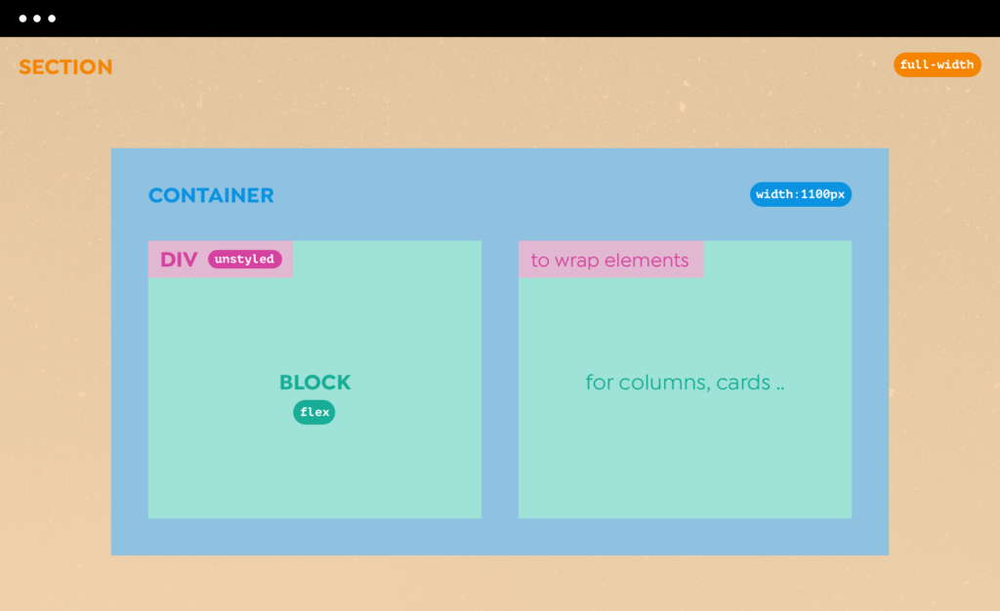
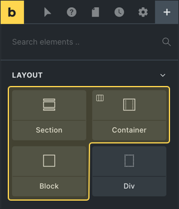
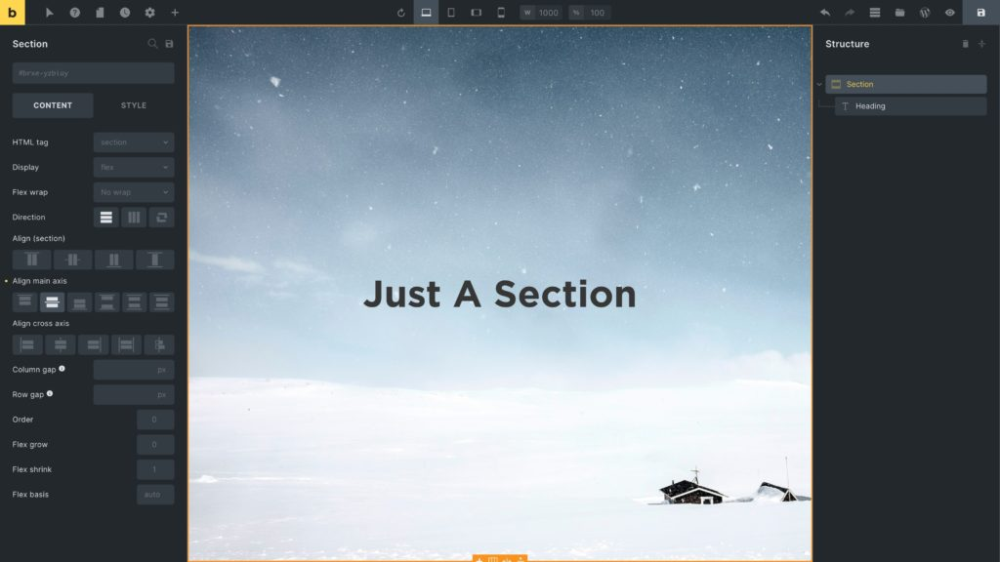
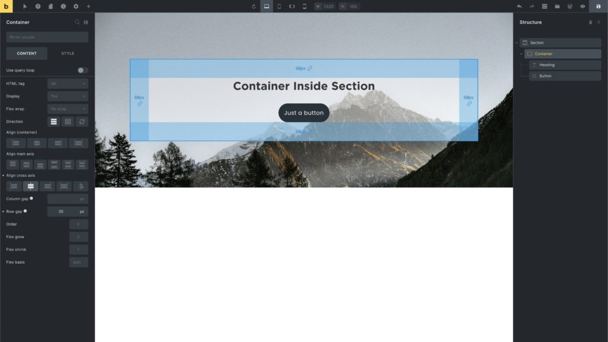
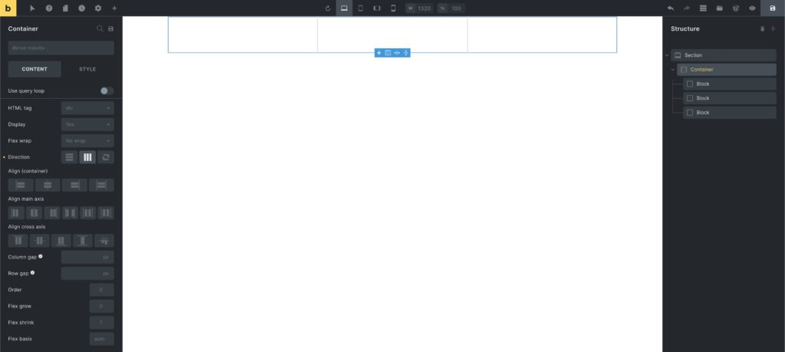
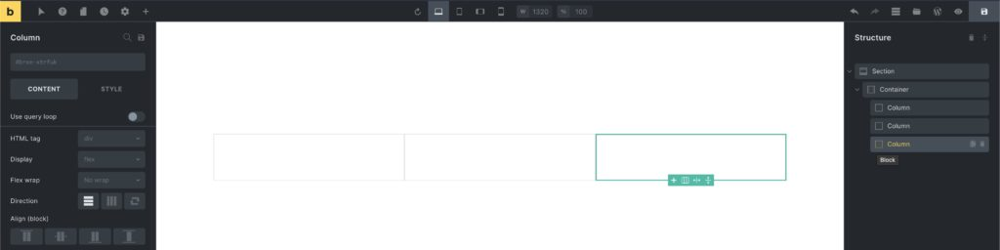
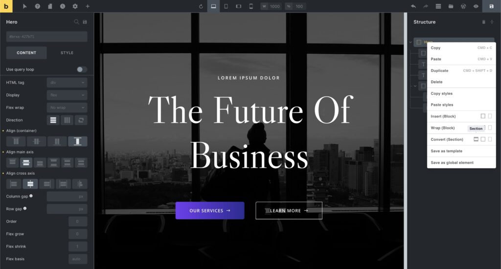
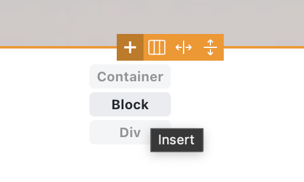
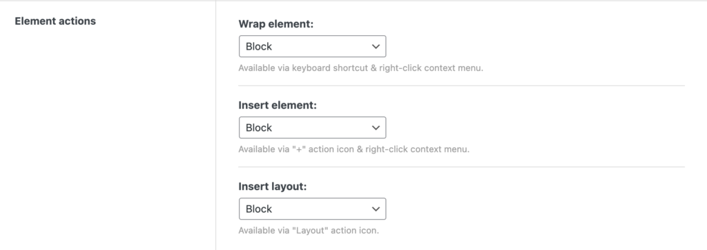
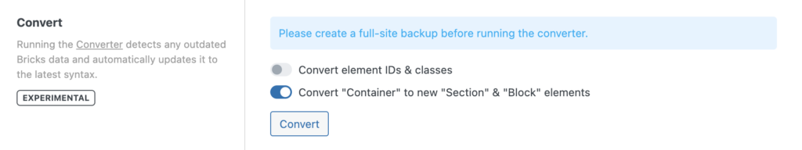

Bricks has four layout elements (since 1.5) to group & lay out your content in a fast, predictable, and streamlined approach:

- **Section**: Use to structure/divide your page (think: one topic per section)

- **Container**: Contain elements at 1100px width (centered)

- **Block**: Flexbox with 100% width (e.g. column)

- **Div**: Plain, unstyled div (grows according to inner elements)

<figcaption>

Two-column layout inside a section

</figcaption>

If you are new to web design, we recommend using the Section, Container, and Block element. As they come with presets that work well out-of-the-box without having to configure commonly used settings for every layout element.

**The Section, Container, & Block element are just Divs with some presets**. They all use the [flexbox](https://developer.mozilla.org/en-US/docs/Web/CSS/CSS_Flexible_Box_Layout/Basic_Concepts_of_Flexbox) layout model. So you can easily direct, align, and space out elements inside of them.

**The Div element is the most basic element to group & lay out your content.** In Bricks the Div is plain (no predefined styles). So you can style it any way you want.

You can customize the defaults of any layout element in your [Theme Styles](https://academy.bricksbuilder.io/article/theme-styles/).

Quick overview of the main properties of each layout element:

| **Element** | **Tag** | **Display** | **Width** | **Where To Use** |
| --- | --- | --- | --- | --- |
| Section | `section` | flex | 100% | Root level |
| Container | `div` | flex | 1100px | Inside Section |
| Block | `div` | flex | 100% | Inside Section or Container |
| Div | `div` | block | \- | Anywhere |

## Section

Use sections as the outermost building block. To separate & space out individuals parts of your page.

A section takes up 100% of the available width. It adjusts in height according to its content. Sections are stacked on top of one another.

When adding a new Section, a "Container" element is automatically added inside the section.

You can remove this Container if you don't need to "contain" any other elements inside of it. As we did in the following hero section example:

<figcaption>

Example: Hero Section (width: 100vh)

</figcaption>

You can overwrite the section defaults under Settings → Theme Styles → Element - Section.

To space out your sections, you can set the `margin` or `padding` to your liking. You can also change the default `display` and `height` values.

_Learn more: [Section element](https://academy.bricksbuilder.io/article/section-element/)_

## Container

A Container is automatically centered, and has a default width of 1100px. Which you can customize under Settings → Theme Styles → Element - Container.

Place your Container inside a Section. And Block / Div elements inside your Container for a multi-column or multi-row layout.

The following screenshot shows a Container (with 60px `padding`) inside a Section (with `background-image`):

_Learn more: [Container element](https://academy.bricksbuilder.io/article/container-element/)_

## Block

The Block element provides the same controls as the Container (flexbox, query loop, etc.). The difference is that the Block uses a default width of 100% instead of a predefined 1100px width like the Container.

Use the Block element to create equal column/row layouts inside a Section or Container.

_Learn more:_ [Block element](https://academy.bricksbuilder.io/article/block-element/)

### How To Create Multi-Column Layouts

To create a three-column layout inside a Container:

1. Select the Container

3. Change "Direction" to "Horizontal"

5. Click the little "+" icon on the canvas 3x to insert 3 Block elements.

The result should look like this:

<figcaption>

Section > Container > 3 Blocks: 3-column-layout

</figcaption>

The fastest way to create a multi-column layout is to select the Container, click the little "column" layout icon on the canvas, and select the pre-defined column layout of your choice:

<figcaption>

"Insert Layout" Tool

</figcaption>

[By default](#default), the inserted layout consists of "Block" elements. The "Column" label is just that: a label. It's still a Block element. Visible by the icon in the structure panel. You can also see the element name when you hover over the element icon in the structure panel:

## Div

The Div element is the most generic element to group and lay out your content.

In contrast to the other layout elements, **the Div element in Bricks is completely unstyled**. Giving you 100% freedom regarding its markup & styling.

When used inside one of the other layout elements the Div grows and shrinks according to the elements it contains.

_Learn more:_ [Div element](https://academy.bricksbuilder.io/article/div-element/)

## How to Insert, Wrap, and Convert layout elements

You can right-click on any layout element to reveal the context menu. From there you can "Insert", "Wrap", and "Convert" layout elements with one click.

The screenshot below shows how to convert a root Container to a Section by right-clicking on the "Hero" Container in the structure panel, and then selecting the "Section" icon under "Convert":

<figcaption>

Context menu: Convert "Container" into a "Section"

</figcaption>

When editing a layout element, you can insert any other layout element by hovering over the "+" icon on the canvas, which provides you with "Container", "Block", "Div" options.

Hold down "CMD / CRTL" to insert an element after the active element.

### Element actions: Setting the default element

Under "Bricks → Settings → Builder → Element actions" you can change the layout element that's being used by default for "Insert", "Wrap", and the "Layout" tool:

### Optional: Converting your Container-based layout

To convert your existing "Container"-based site to use the new "Section" & "Block" elements, you can run the Converter with the **'Convert "Container" to new "Section" & "Block" elements'** option enabled:

<figcaption>

Located under: Bricks > Settings > General > Converter

</figcaption>

## Masonry layout

Starting at Bricks 1.11.1 you can enable the "Masonry layout" for all layout elements under `Style > Layout > Masonry`. Learn more at [https://academy.bricksbuilder.io/article/masonry-layout/](https://academy.bricksbuilder.io/article/masonry-layout/)
