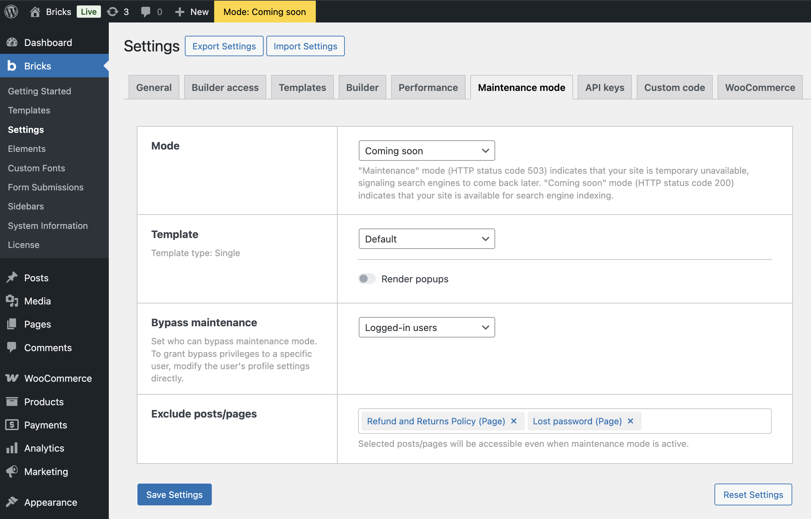

Bricks 1.9.4 introduces the **Maintenance Mode** feature. A straightforward way to manage your site's availability during updates or construction.

**How to enable Maintenance Mode**

1. Log in to the WordPress dashboard.

3. Navigate to Bricks > Settings > Maintenance.

Here, you'll find several settings to configure:

- **Mode selection**: Choose `Disabled`, `Maintenance`, or `Coming Soon`. "Maintenance" mode (HTTP status code 503) indicates that your site is temporarily unavailable, signaling search engines to come back later. "Coming soon" mode (HTTP status code 200) indicates that your site is available for search engine indexing.

- **Template** _(optional)_: Assign a custom single template for your maintenance or coming soon mode.
    - **Render popups** _(optional)_: Enable this setting if you want Bricks popups to be rendered on the maintenance or coming soon template. This is **disabled by default**.

- **Bypass maintenance**: Customize access settings for different user roles.

- **Exclude posts/pages** _(since 2.0)_: Select specific pages or posts where Maintenance Mode should **not** be applied.

**Configuring role-based access**

In the "Bypass maintenance" setting:

1. Select from the dropdown menu: `Logged-in users` allows all logged-in users to bypass maintenance mode; `Logged-in users with role` provides a more granular control.

3. If `Logged-in users with role` is selected, checkboxes will appear to enable or disable maintenance mode bypass for specific roles such as Editor, Author, Contributor, etc.

**Individual user access settings**

To configure access on an individual user level:

1. From the WordPress dashboard, go to "Users".

3. Click to edit a specific user's profile.

5. In the user profile, find and adjust the "Bypass Maintenance" setting. This allows you to enable or disable maintenance mode bypass for that user, overriding the broader role-based settings.

**Filters:**

- [https://academy.bricksbuilder.io/article/filter-bricks-maintenance-should\_apply/](https://academy.bricksbuilder.io/article/filter-bricks-maintenance-should_apply/)
