The **Map** element in Bricks allows you to display Google Maps with a range of capabilities, from showing a single location to dynamically rendering multiple markers based on queries.

You can get started quickly by adding a Google Maps API key. Follow this guide to set it up: [How to set up your Google Maps API key](/article/how-to-set-up-your-google-maps-api-key/).

Without an API key, the Map element is still functional but limited to displaying **a single marker** only.

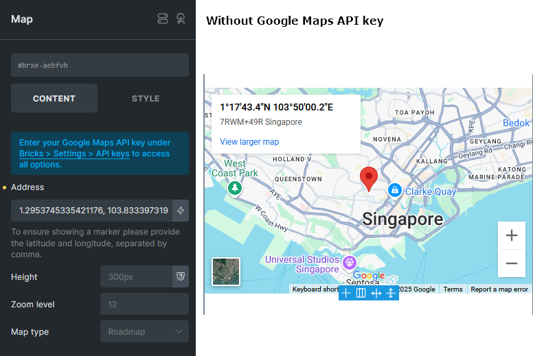

To ensure a marker is shown, simply enter a pair of coordinates (latitude and longitude, separated by a comma) in the **Address** field.

## Displaying multiple addresses

To unlock advanced features such as multiple locations, clustering, and custom Info Boxes, a valid **Google Maps API key** is required. Once your key is added, you will see more controls on the element.

### Addresses

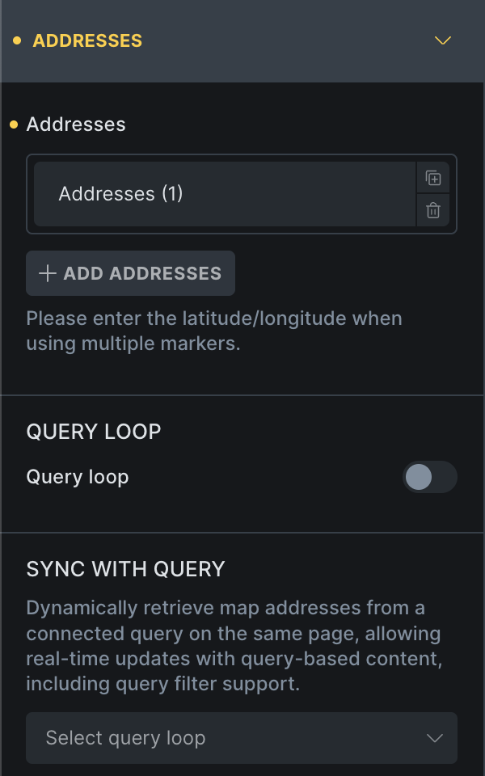

Bricks supports three address input modes:

#### 1) Static

Manually define multiple locations using the "Addresses" **Repeater** control of the Map element. This mode supports only the default Google Maps Info Box.

#### 2) Query loop

Use this mode when map addresses to feed the map with addresses/coordinates from a query.

For example, if you have a **custom post type** like "Properties" where each property contains an address, enabling the Query loop allows you to show markers of all property addresses on the map. `(@since 2.0)`


You can also define a **[custom Info Box](#custom-info-box)** using a popup template.

In our example above, we selected the custom post type `property`, where each address is stored in a custom field (ACF). Providing the latitude & longitude coordinates will be more accurate than a physical address.

#### 3) Sync with query

Ideal for use cases where the map is shown alongside a dynamic query loop such as a directory, Sync with query allows the map to update live with the query as users interact via **AJAX Pagination**, **Load More**, or **Query Filters**.

This mode requires adding a **[Map Connector](#map-connector)** element inside the target query loop.

It also supports **[custom Info Boxes](#custom-info-box)** using popup templates.

**Example setup:** You want to display a query loop on the same page as your map and connect the two. If this query loop uses **AJAX Pagination**, **Query Filters**, or **Load More**, enabling Sync with query allows the map markers to update dynamically in real-time as users interact with those features.

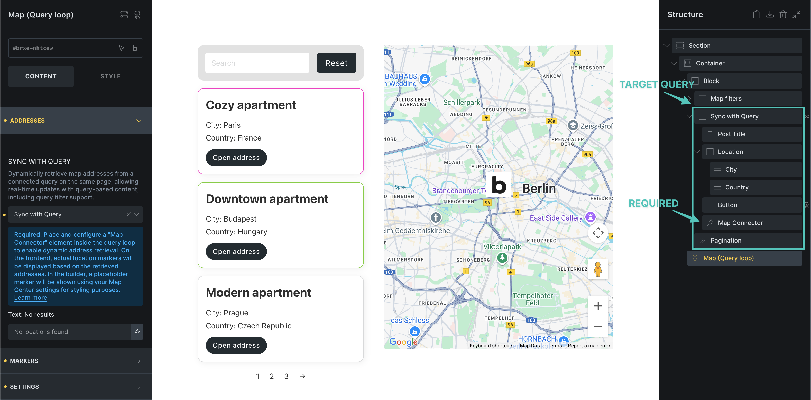

**Map markers update according to query results**:

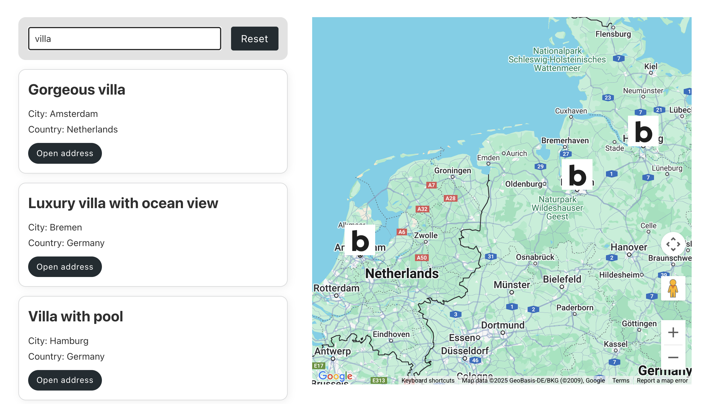

## Markers


### **Cluster markers**

Enable this option to automatically group nearby markers into a cluster. `(@since 2.0)`

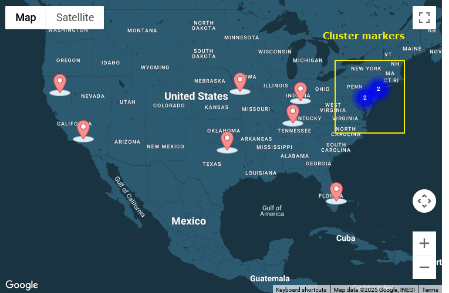

## General Settings

#### Map ID

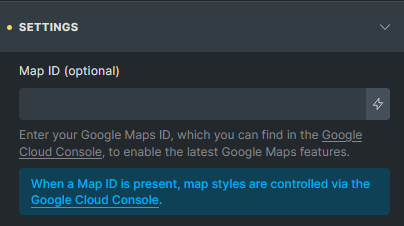

Enter your **Google Maps ID** (available in your Google Cloud Console) to enable the latest Maps features `(@since 2.0)`  
When set:

- Bricks uses Google's modern `AdvancedMarker` API.

- Map styles are managed via your Google Console (style settings in Bricks are disabled).

- Deprecated browser console warnings are avoided.

#### Map Center

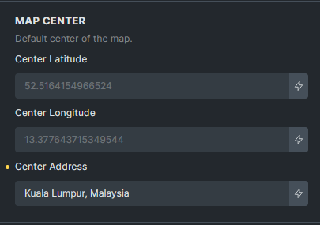

Set the default center point of the map. Particularly useful when using **Sync with query**—if the synced query returns no results, the map will reset to this center point. `(@since 2.0)`

#### Others

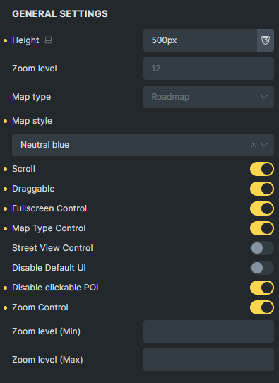

## Map Connector (element)

**The Map Connector element `(@since 2.0)` is required when using Sync with query.**

Place it inside the target query loop that you want to sync with your map. It generates an invisible `<template>` node containing location data, which is then read by the map to dynamically render the markers.

**Note:** It’s strongly recommended to provide **latitude and longitude** values whenever available. If you rely solely on addresses and require geocoding every time markers are rendered, you may incur charges from the Google Maps Platform Geocoding API.

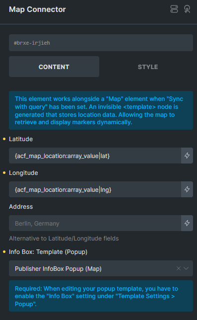

You can also define the Info Box (popup template) that should show when a marker is clicked. Make sure the selected popup template has the **"Info Box (Map)"** option enabled in its settings.

## Info Box (Popup template)

Introduced in version 2.0, the **Info Box (Map)** option is available in Popup template settings.

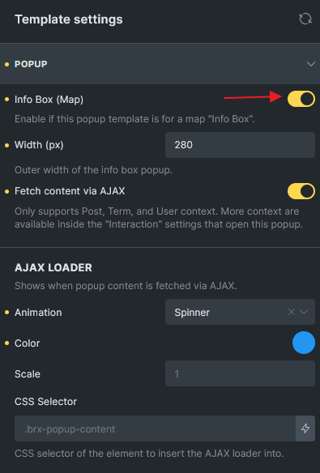

- Once enabled, the popup will display with a default width of 300px in the builder and remove the backdrop for preview.

- You can customize the design of the Info Box in the builder.

- Supports **Fetch content via AJAX**.

- Supports **AJAX loader** animation when loading dynamically.

- It is recommended to set **Populate Content** to the post or term being looped so dynamic data displays correctly in the builder.

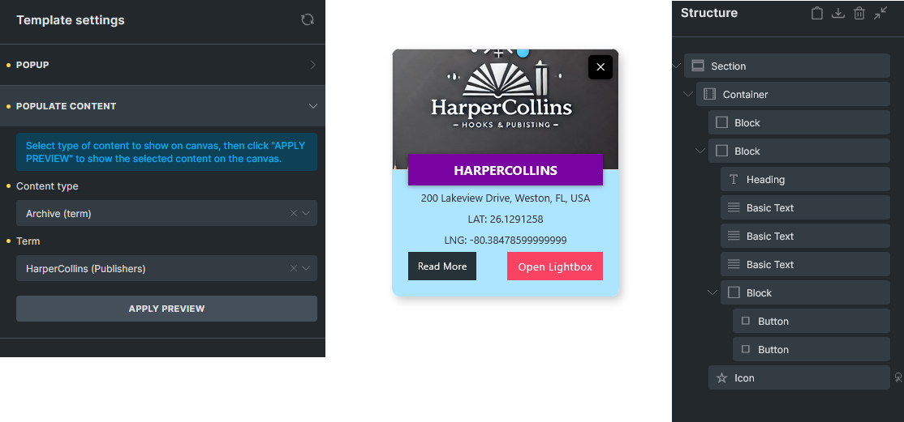

## Map Interactions

Two new map interaction actions are introduced in Bricks 2.0:

- Open address (Map)

- Close address (Map)

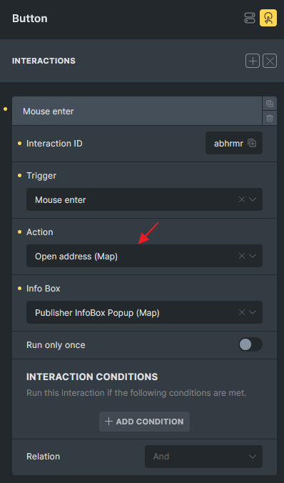

Use cases:

- Use a button or element inside the query loop to **open** the Info Box for the corresponding marker.

- Add a close icon inside the Info Box popup to allow users to manually **close** it.

These interactions provide greater control and flexibility over how Info Boxes behave in dynamic mapping scenarios.

## Resolving Google Maps Script Conflicts with Other Plugins

If you're using a plugin like Fluent Form, which may enqueue the Google Maps script on the same page, this can result in a JavaScript conflict because the script cannot be loaded twice.

To prevent this issue, you can dequeue Bricks' Google Maps script and trigger the `bricksMap()` function manually after a short delay, ensuring the Fluent Forms map script has loaded first:

```php
add_action( 'wp_enqueue_scripts', function() {
  if ( is_page( 1567 ) ) {
    wp_deregister_script( 'bricks-google-maps' );
  }
}, 999 );

add_action( 'wp_footer', function() {
  if ( is_page( 1567 ) ) {
    echo '<script>
      document.addEventListener("DOMContentLoaded", function() {
        setTimeout(function() {
          bricksMap();
        }, 1000); // Adjust delay if needed
      });
    </script>';
  }
}, 999 );
```

Replace `1567` with your actual page ID. Adjust the delay as necessary to ensure the Fluent Forms map script has fully loaded before `bricksMap()` runs.
