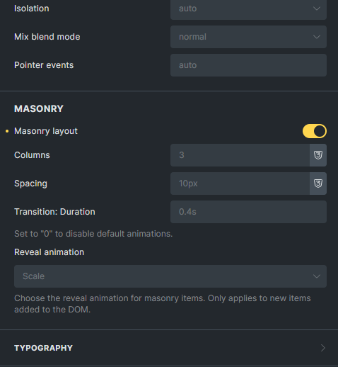
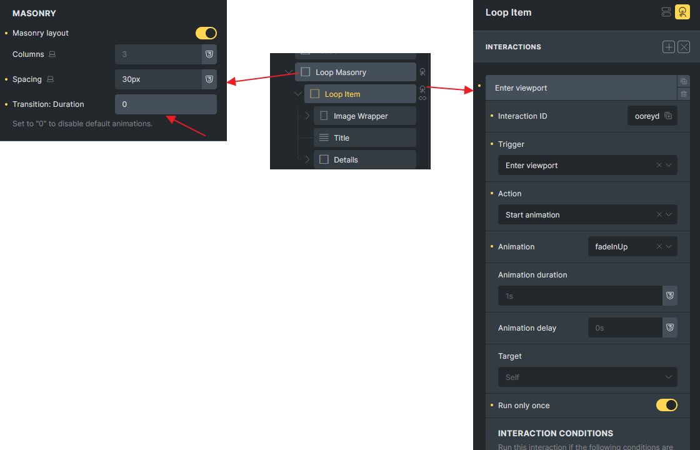
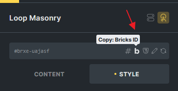

Starting with version 1.11.1, you can easily apply a masonry layout to any layout element in Bricks.

The new Masonry Layout controls are available under `Style > Layout > Masonry` for all layout elements (Section, Container, Block, Div).



Bricks utilizes the **[IsotopeJS](https://isotope.metafizzy.co/)** library to create the masonry layout, which it also uses for the **Image Gallery** and **Posts** elements, for optimal performance.

## How It Works

When the Masonry layout is enabled, all direct child elements become masonry items.

You can customize the number of columns and adjust spacing for different breakpoints to achieve a responsive layout.

**Tip:** Ensure that no conflicting CSS styles are applied to the masonry-enabled element, as they may interfere with the masonry layout. It’s best to clear all custom styles for the element to allow the masonry effect to work smoothly.

You can also use the masonry layout to wrap items in a **query loop** for a dynamic grid effect. This is particularly useful for layouts with posts, products, or any repeated content, enabling you to display query items in a visually engaging, staggered grid format.


## Use Bricks Interaction Animation

If you want to apply custom animations using the **Interactions** panel (e.g., setting an **Entry Viewport Trigger** and **Start Animation** for masonry children), you can disable the default masonry animations by setting **Transition: Duration** to `0`.

This prevents any overlap between the default masonry transitions and your custom animations, ensuring a smoother effect.



## Troubleshooting

### Custom CSS Conflicts

If the masonry columns don’t align with your settings, inspect the CSS styles applied to the child elements. Styles such as **width**, **flex-basis** or **align-self** within flex layouts can override the masonry column settings. Adjust or remove these styles to ensure the masonry layout functions as expected.

### Dynamic Content Updates via Custom JavaScript/AJAX

If you have custom code/plugins that adds masonry child nodes via JavaScript or AJAX, it’s likely that the masonry layout may not update correctly. To fix this, you can manually refresh the masonry instance by running the following JavaScript.

```php
bricksUtils.updateIsotopeInstance('BRICKS_ID');
```

Replace `'BRICKS_ID'` with the specific ID of your masonry element. This function will reinitialize the masonry layout to accommodate the new nodes, ensuring the layout remains intact.


