Bricks 1.8 introduced a completely new, fully responsive, accessible, and highly customizable suite of elements to create nav menus/site navigations in Bricks.

https://www.youtube.com/watch?v=1GbJx0JnDDE

The new menu builder consists of 5 new elements (listed below), which you can mix, match, and configure to your liking to design all kinds of desktop & mobile menus.

There are some best practices to be aware of to ensure proper accessibility & styling. So please take the time to go over the information below to get a solid understanding of this new, powerful tool.

### **Nav (nestable)**

This new nestable element contains both your desktop & mobile menu.

As with any other nestable element, you can now add any element to your menus in Bricks and are no longer limited to the old "flat" Nav menu.

There is a built-in setting for selecting the breakpoint at which you want to show your mobile menu. The mobile menu uses the same markup & elements as the desktop menu. It's just optimized & styled for mobile devices & small screens.

You can also design mobile menus with completely different content/elements by using the new Offcanvas & Toggle elements. Both of which we'll explore later on.

### Text link

A simple, but super handy new element to create simple nav menu text links (plus an icon if needed). This is much better than turning a Basic Text element into a link. You can, of course, use the Text link anywhere else on your site.

### Dropdown (nestable)

Use the new Dropdown element to create fully accessible sub-menus. Which you can nest as many levels as you want by adding dropdowns within dropdowns. You can also choose when to trigger a dropdown (on hover, click, or both).

The little dropdown arrow next to the dropdown text/link lets you always toggle the Dropdown via the keyboard (on SPACE or ENTER press) for accessibility.

A Dropdown can be turned into a fully-fledged nestable mega menu in one click. Covering the entire width of the viewport or adapting to the width and vertical position of any other element on your page.

You can even create multilevel mobile menus where only the active dropdown slides into the view.

We also got settings to easily design custom dropdown carets.

### Toggle

The main purpose of this new, fully-accessible "hamburger" toggle icon/button is to show/hide your mobile menu and/or Offcanvas elements.

You can choose from various animation effects, and even set your own custom toggle icon.

The Toggle automatically detects the Offcanvas or Nav (Nestable) context it is placed in.

You can use it for so much more, though. As it provides settings to toggle any HTML attribute of any element on your page.

Similar triggers can be achieved via [Interactions](https://academy.bricksbuilder.io/article/interactions/). But the Toggle comes with built-in accessibility & menu builder logic that makes the whole toggle process so much faster, easier, and better.

### Offcanvas (nestable)

Being nestable, the new Offcanvas element lets you create unique mobile menus with completely different content from your desktop menu. You can populate the Offcanvas with any elements you like, and are not limited to menus, though.

The Offcanvas comes with two effects: slide-in (default) & offset, and can be toggled (open/close) through the "Toggle" element. It's super simple as you can see in the [Offcanvas set up](#mobile-menu-offcanvas) section down below.

Starting at Bricks 1.11, [the new "Toggle Offcanvas" interaction](https://academy.bricksbuilder.io/article/interactions/#toggle-offcanvas), let's you toggle your Offcanvas from any element.

## Default menu structure

When adding a **Nav (Nestable)** element to the canvas it is populated with 2 Nav links, 1 Dropdown, and 2 Toggle elements (to show & hide the mobile menu).

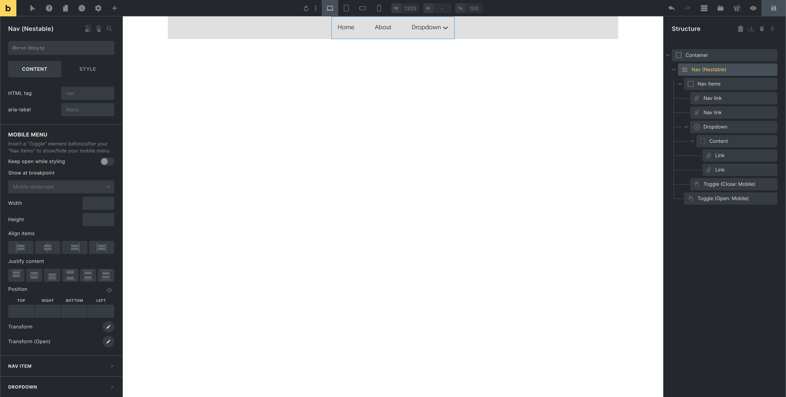

Being a nestable element, you can add any Bricks element inside your menu.

The "Nav items" Block is a special element that can't be deleted individually as it holds all top-level menu items, and serves as the mobile menu wrapper. The same goes for the "Content" Div inside the Dropdown element, which contains all dropdown content.

All top-level menu items are automatically wrapped in a `li` HTML tag for accessibility. The "Nav items" uses an `ul` tag. The same goes for the "Dropdown structure.

## Default mobile menu structure

By default, the mobile menu becomes visible at the "Mobile landscape" breakpoint. Meaning instead of displaying the top-level menu items, a (hamburger) Toggle becomes visible that opens the mobile menu when you click on it. You can, of course, select any other breakpoint to start showing your mobile menu when editing your Nav nestable element.

**IMPORTANT**: Make sure you are editing the "Mobile menu" and "Nav items" element settings on the breakpoint at which the mobile menu starts to display at (default: Mobile landscape).

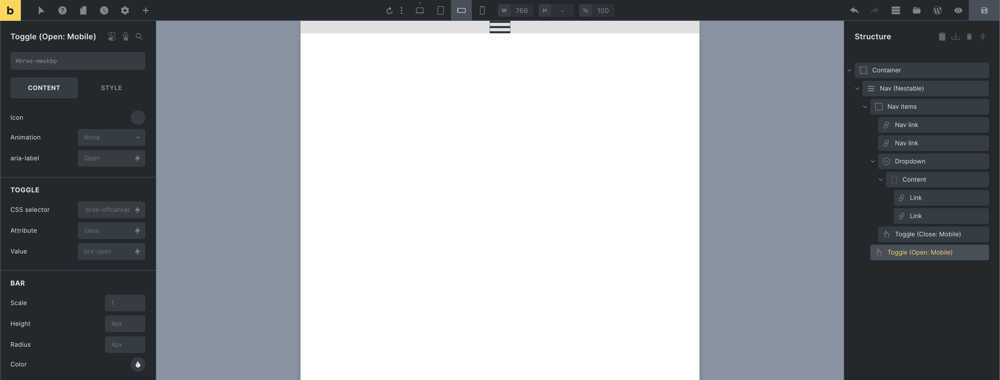

The Toggle element labeled "Toggle (Open: Mobile)" opens the mobile menu (highlighted in the screenshot above).

You can choose from various animations that are performed on the Toggle when clicked.

The "Toggle (Close: Mobile)" element is located inside the "Nav items" (the mobile menu wrapper).

## Mega menus

Creating mega menus with Bricks couldn't be easier. Just "Enable" the mega menu setting when editing the "Dropdown" element of your choice.

By default, the Dropdown Content covers the entire available (viewport) width like this:

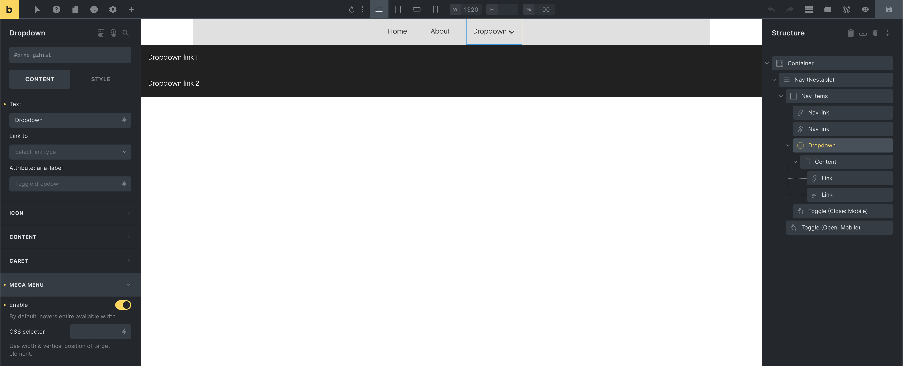

You can also define a "CSS selector" whose width & horizontal position the mega menu will adjust to. The following screenshot uses the element `id` of its outer Container:

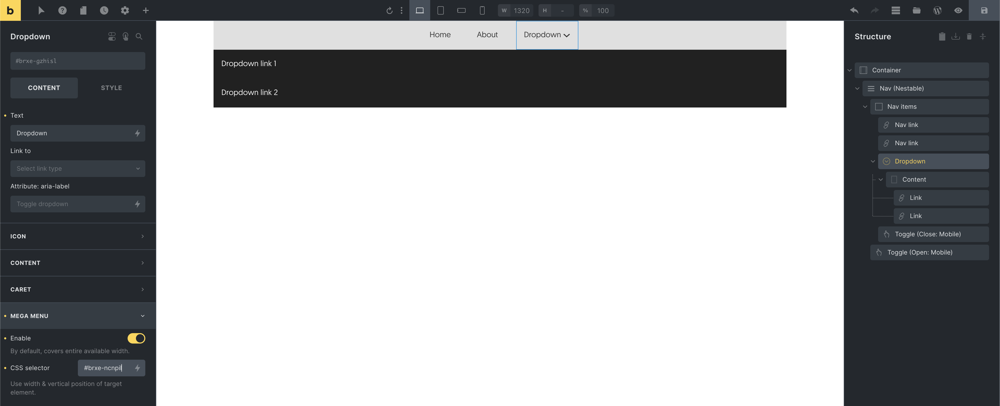

The Dropdown "Content" is just a Div element. Allowing you to can create any mega menu layout:

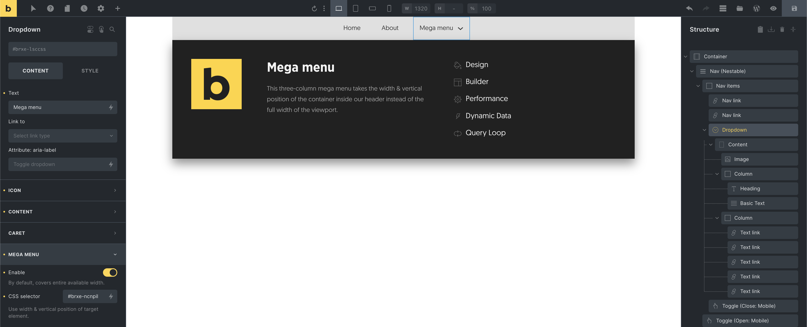

<figcaption>

A simple three-column mega menu

</figcaption>

### WordPress mega menu

You can also add mega menus to your WordPress menu by enabling the "Mega menu" setting of your "Nav menu" element like this:

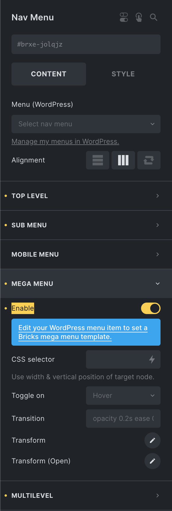

Next, create your mega menu using a new template (template type: section).

Then, go to "Appearance > Menus" and expand the top-level menu item you want to display this mega menu under, and select your mega menu template from the "Mega menu" options:

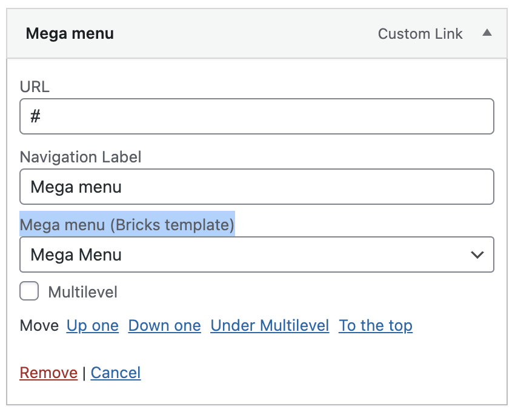

Your mega menu template now appears when you hover over this menu item on the frontend.

## Multilevel dropdown menus

Creating multilevel dropdowns is just as easy. Simply enable the "Multilevel" setting on an individual Dropdown or directly on the "Nav nestable" element so it gets applied to all your Dropdowns.

"Multilevel" means that only the active Dropdown Content is visible. This is especially useful for dropdown menus with a lot of items or for dropdowns with multiple nested Dropdowns, as they most likely overflow the viewport. Especially on mobile.

A customizable "back" link can also be set, which is displayed as the first item of every Dropdown level.

As only the active Dropdown is visible, the multilevel dropdown automatically toggles on click, not hover.

You also only have to enable "Multilevel" at the root level of your Dropdown. All sub Dropdowns have multilevel capability out-of-the-box.

### WordPress multilevel menus

Bricks 1.8 lets you turn your WordPress sub menus into multilevel menus too. Simply enable the "Multilevel" setting of your "Nav menu" element, and then activate the "Multilevel" setting of your WordPress menu items under "Appearance > Menus" like this:

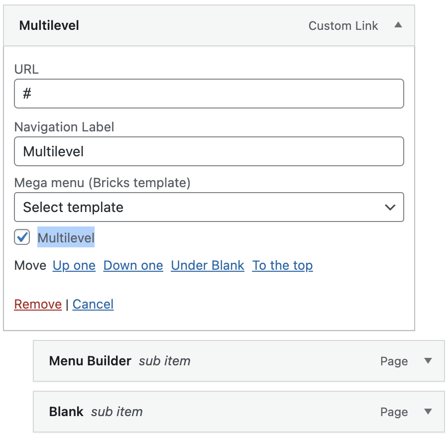

## Static (position) dropdown menus

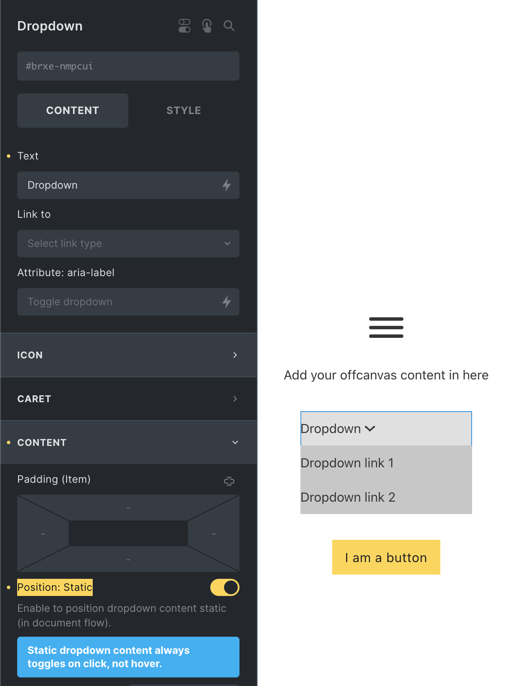

By default, the dropdown content is positioned `absolute`. Taking it out over the document flow. Which is the expected/desired in a desktop menu.

But when, for example, the Dropdown is placed inside an Offcanvas you most likely don't want this behaviour.

Instead you want to show the dropdown content on click and positioned right underneath the dropdown toggle & in the normal document flow.

To accomplish that simply enable the "Position: Static" setting when editing the Dropdown of your choice.

## WordPress dropdown menus

To use a WordPress menu inside your custom nav nestable, add the "Nav menu" element inside your Dropdown > Content element. Then edit it, and select the WordPress menu you'd like to display inside your dropdown.

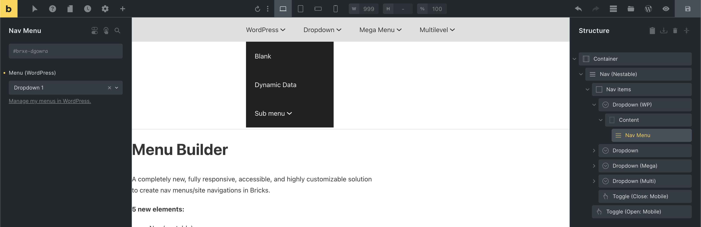

This means every WordPress menu you create for your nav nestable should hold the menu items you want to display inside a specific dropdown.

We have chosen this approach as it lets you take full advantage of the nav nestable customisation options, while still being able to control your menu via WordPress.

You can style this WordPress menu by editing the "Dropdown" it's been places in, or if you wish to style it like the entire menu you can tweak the "Dropdown" settings of your "Nav nestable".

## Unique mobile menus (Offcanvas + Toggle)

Use the new Offcanvas element to create unique mobile menus. Or any other content you want to slide into view via the Toggle element.

Let's start by adding an Offcanvas element to our page.

Make sure you position the Offcanvas element outside the "Nav (nestable)". Otherwise, the Toggle logic of those two togglable elements can interfere. **We position it AFTER our "Nav nestable".**

As we don't use the default mobile menu view of the Nav nestable, we can delete the "Toggle (Close: Mobile)" element.

We'll use the "Toggle (Open: Mobile)" element to open our Offcanvas element. Simply copy the Offcanvas element ID from the panel, edit the "Toggle (Open: Mobile)" element, and paste it under the "CSS selector" setting.

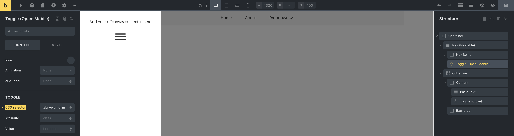

<figcaption>

Toggle: "CSS selector" setting containing our Offcanvas element ID

</figcaption>

Save your changes, and head to the front end. A click on the Toggle icon should open your Offcanvas.

As the Offcanvas is a nestable element, you can add any layouts & elements inside of it.

The Offcanvas comes prepopulated with a close Toggle. Clicking outside the Offcanvas (on the backdrop) also closes the Offcanvas.

When editing the Offcanvas in the builder make sure to enable the "Keep open while styling" setting, so the Offcanvas does not disappear when you edit different elements.

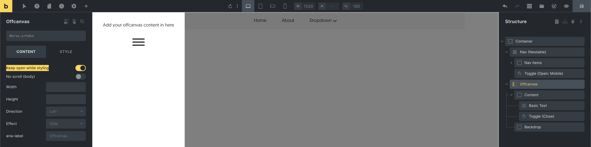

<figcaption>

Offcanvas: Enable the "Keep open while styling" setting while editing the Offcanvas content

</figcaption>

## Non-fullscreen mobile menus

To show the default mobile menu without it covering the full screen, edit your Nav (nestable) and set the "Height" under "Mobile menu" to `fit-content`.

This way the height of your mobile menu automatically grows or shrinks according to its content.

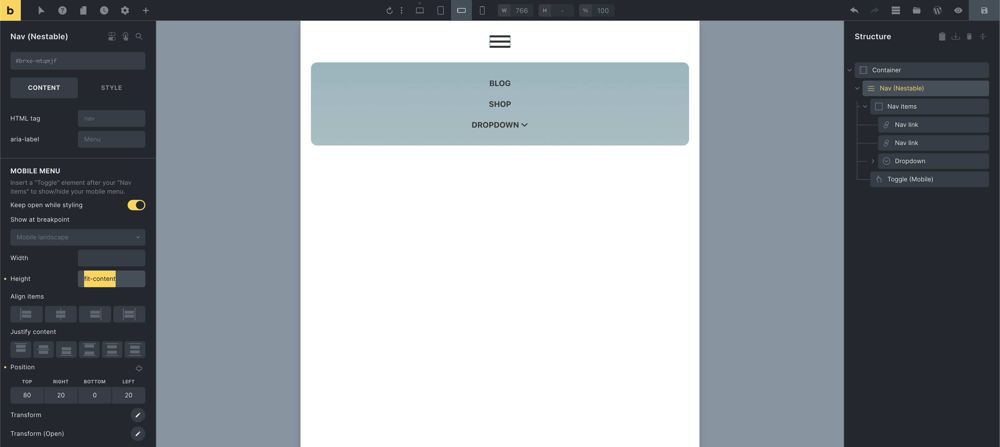

Then set the "Position" of your "Mobile menu" to your liking, (see screenshot above) so it doesn't cover the Toggle.

As the "Nav items" element serves as the mobile menu wrapper, you can edit it to set your mobile menu padding, background, etc. Make sure you perform those styling changes on the breakpoint at which your mobile menu starts to show, so those styles only apply to the mobile, and not the desktop menu.

Now that the mobile menu no longer covers the entire screen, you can probably remove the "Toggle (Close: Mobile)" element that Bricks adds by default.

Bonus tip: To prevent the mobile menu from covering your Toggle, which might happen on certain screen sizes & positioning, edit the Toggle element and set it's `z-index` under "Style > Layout > Z-index" to a value of `1001` or more.
