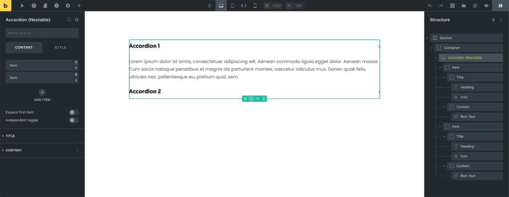

Bricks 1.5 introduces **Nestable Elements**. Plus an API that allows you to programmatically define your own custom elements that can contain other elements. In exactly the structure you want.

Prior to Bricks 1.5 every element in Bricks was "flat". Meaning even though an element contained a deep HTML structure (like the Slider, etc.) you couldn't click on an inner part of this element to edit it directly (e.g. contents of slide 3), or change the inner structure of it to your liking via Drag & Drop, as you could do inside a layout element.

Making it often impossible to properly customise more complex elements like the Icon Box, Pricing Table, List, etc.

Complex elements such as the Accordion, Slider, and Tabs weren't properly customisable at all.

## Full Access & Control Over Individual Element Structure

Starting at version 1.5, Bricks provides three nestable elements:

- Accordion (Nestable)

- Slider (Nestable)

- Tabs (Nestable)

Those elements were notoriously hard to properly customise due to their complex structure, and the limits of their "flat" element structure.

Now that you can populate every slide with the elements you want, purpose-specific slider-like elements such as the "Carousel" & "Team Members" are not really needed.




<figcaption>

Accordion - Nestable

</figcaption>


Nestable elements are going to exist alongside their flat origin elements for the foreseeable future until we have collected enough feedback & fixed any major bugs in order to fully make the switch to nestable elements.

Certain interactive nestable elements that are heavily JavaScript-driven (such as the Accordion, Slider, and Tabs) might prevent the Drag & drop from working 100% on the canvas. If you encounter this behavior you can always add & order elements by using the Structure panel too.

**Nestable tabs**: If you need to change the \`display\` property of the tab "pane", please do so by adding another "Block" element inside the panel and setting the `display` setting there. The pane itself uses `display: none` in order to hide all non-active panes. If you change the display setting there, all tab panes will always be visible.

So you can start playing around with those new nestable elements, and slowly transition away from the old plain elements.

Over time we'll convert more and more `flat` elements into nestable elements, so that you'll be able to properly customize most elements in Bricks once their nestable equivalent becomes available.

## Nestable Elements API

The rest of this article shows how to programmatically create your own nestable elements.

A good starting point to learn about the new nestable elements syntax is to inspect the Bricks source code of the following nestable element files:

- accordion-nested.php

- slider-nested.php

- tabs-nested.php

### Define Your Custom Element As "nestable"

First make sure to set the `[$nestable](https://academy.bricksbuilder.io/article/create-your-own-elements/#builder)` property of your custom element class to `true`.

This is required so Bricks knows to render this custom element using the nestable render function in the builder, and to enable drag & drop inside the builder for this custom element.

### Nestable Element Template

You can define the structure of your custom element via the `get_nestable_children` function. It expects to return an array of element definitions.

This is best illustrated by having a look at the Nestable Slider elements' `get_nestable_children` function:

```php
public function get_nestable_children() {
  return [
      [
        'name'     => 'block',
        'label'    => esc_html__( 'Slide', 'bricks' ) . ' {item_index}',
        'settings' => [
          '_hidden' => [
            '_cssClasses' => 'hidden-class', // CSS class not visible in builder UI
          ],
        ],
        'children' => [
            [
              'name'     => 'heading',
              'settings' => [
                'text' => esc_html__( 'Slide', 'bricks' ) . ' {item_index}',
              ],
            ],
            [
              'name'     => 'button',
              'settings' => [
                'text'  => esc_html__( 'I am a button', 'bricks' ),
                'size'  => 'lg',
                'style' => 'primary',
              ],
            ],
          ],
      ],
  ];
}
```

The code above adds a "Slide" block inside the nestable slider, which then contains a "Heading" & "Button" element.

The `children` property, if set, accepts an array of further nested elements. Specify the `settings` array to populate individual elements inside your nestable element as needed.

### Nestable Render Function (PHP)

The only new function you need to add to your PHP `render()` function is called `render_children` and it requires the element instance `$this` to be passed as the first parameter:

```php
public function render() {
  $output = "<div {$this->render_attributes( '_root' )}>";

  // Render children elements (= individual items)
  $output .= Frontend::render_children( $this );

  $output .= '</div>';

  echo $output;
}
```

### Nestable Render Function (Vue x-template)

To render elements inside your nestable element in your custom x-template, simply add the `<bricks-element-children>` component plus `element` props as shown in the following code snippet:

```php
public function render_builder() {
  <script type="text/x-template" id="tmpl-bricks-element-custom-nestable">
    <component :is="tag">
      <h2>Title before nestable children</h2>
      <bricks-element-children :element="element"/>
      <p>Text node after nestable children</p>
    </component>
  </script>
}
```

### Nestable Element Items (in panel)

If your nestable element structure is based on items on the same level (such as our Accordion above), then you can add a Repeater (see builder panel in screenshot above) by adding a `repeater` control with the `items` property set to `children`:

```php
public function set_controls() {
  // Array of nestable element.children (@since 1.5)
  $this->controls['_children'] = [
    'type'          => 'repeater',
    'titleProperty' => 'label',
    'items'         => 'children',
  ];
];
```

If you are start using and/or experimenting with the new Nestable Elements API for your custom elements, [we'd love to hear your feedback](https://bricksbuilder.io/contact/). Does this API miss any features, did you encounter any bugs?
