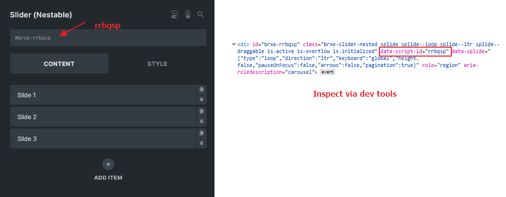
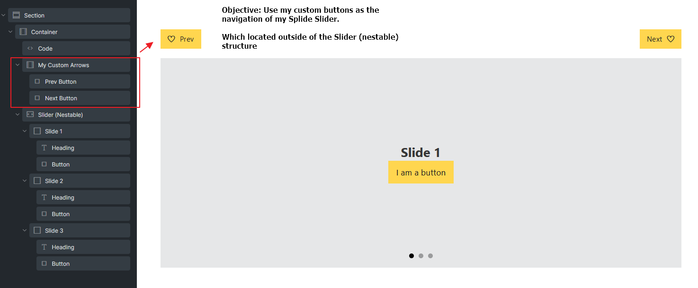
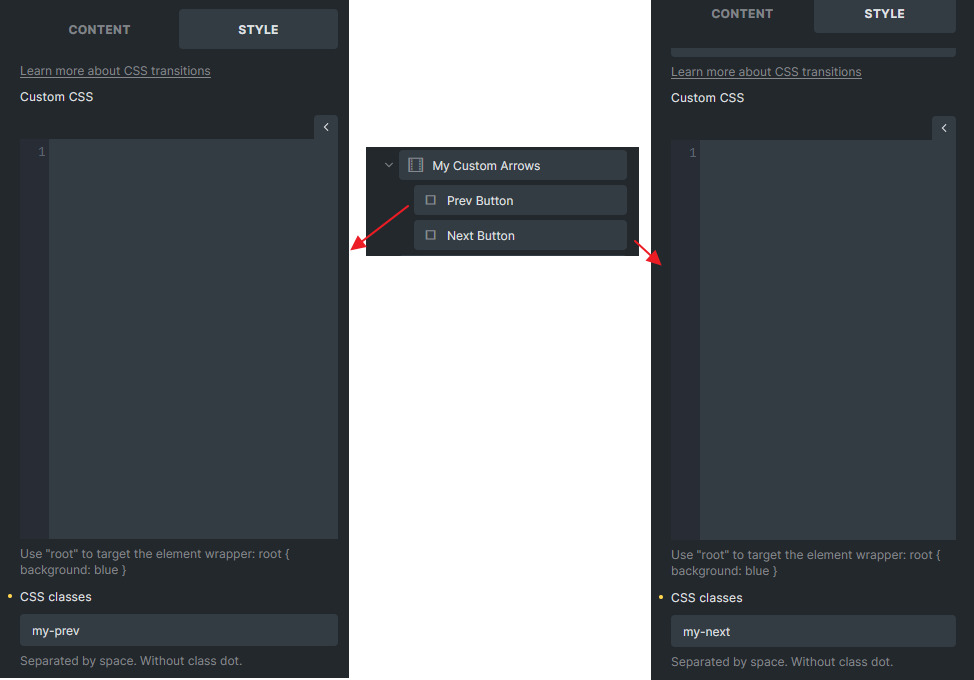
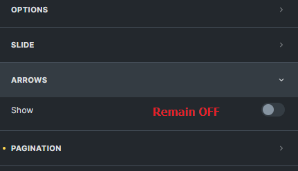
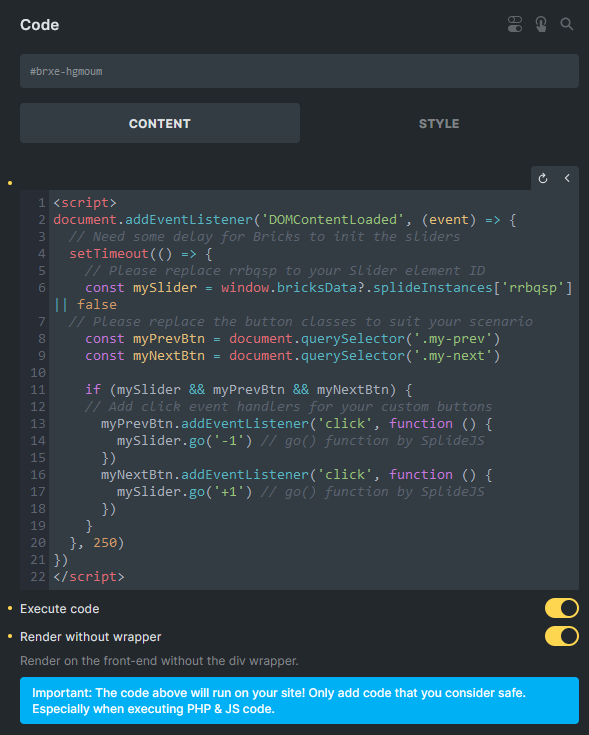

Bricks introduced the Nestable Slider in version 1.5, utilizing the [SplideJS](https://splidejs.com/) library.

This article is intended for developers, walking you through how to access and customize the Splide instance.

All initialized Splide instances are stored and can be accessed through `window.bricksData.splideInstances`.

You must first identify the Nestable Slider element's unique ID to retrieve the appropriate instance from the variable. You can find this ID within the builder when editing this element or through your browsers' developer tools.



According to the example above, I can access my Splide Instance through `window.bricksData.splideInstances['rrbqsp']`

If you have assigned a custom CSS ID to the Slider, please note that this ID is not the same as the element ID. In such cases, you should obtain the correct element ID through your browser's developer tools.

## Update Nestable Slider options via JavaScript

Objective: Update `noDrag` option for all Nestable Sliders on the current page.

```php
<script>
document.addEventListener('DOMContentLoaded', (event) => {
  // Define a function to update the no-drag option for all splide instances on the page
  const updateNoDragOption = () => {
    for( const splideId in window.bricksData.splideInstances ) {
      const splideInstance = window.bricksData.splideInstances[splideId]
      if ( splideInstance ) {
        // Tell Splide that any elements with .no-drag class is not draggable
        splideInstance.options = { noDrag : '.no-drag' }
      }
    }
  }
  
  // Need some delay for Bricks to init the sliders
  setTimeout(updateNoDragOption, 250)
})
</script>
```

## Custom navigation arrows outside the slider

Objective: Implement custom navigation buttons located outside of the Nestable Slider.



Please set unique classes for your buttons. We assigned the `my-prev` and `my-next` CSS classes in our example.



Next, place a Code element and write some simple JavaScript. Remember to turn **ON** the Execute code checkbox. (Arrows for the Slider remained **OFF**)





```php
<script>
document.addEventListener('DOMContentLoaded', (event) => {
  // Give some times for Bricks to init the sliders
  setTimeout(() => {
    // Please replace rrbqsp to your Slider element ID !!NOT CSS ID!!
    const mySlider = window.bricksData?.splideInstances['rrbqsp'] || false
    // Please replace the button classes to suit your scenario
    const myPrevBtn = document.querySelector('.my-prev')
    const myNextBtn = document.querySelector('.my-next')

    if (mySlider && myPrevBtn && myNextBtn) {
      // Add click event handlers for your custom buttons
      myPrevBtn.addEventListener('click', function () {
        mySlider.go('-1') // go() function by SplideJS
      })
      myNextBtn.addEventListener('click', function () {
        mySlider.go('+1') // go() function by SplideJS
      })
    }
  }, 250)
})
</script>
```
