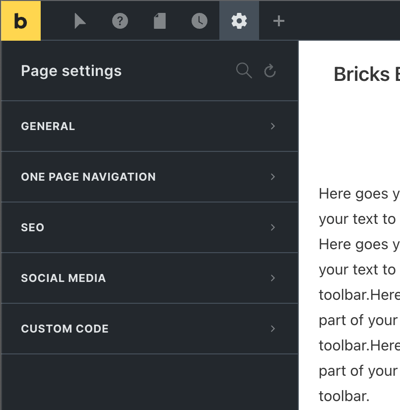
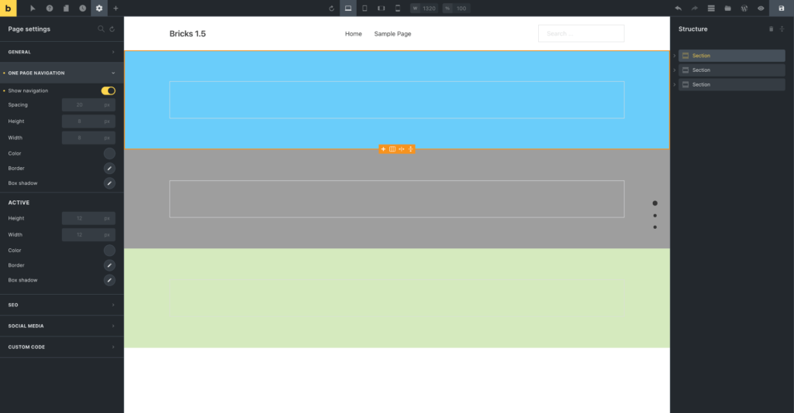
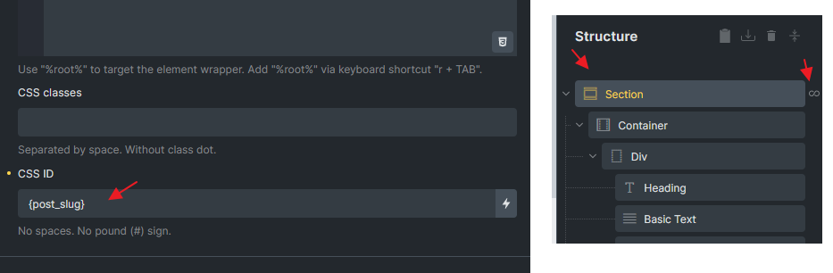

Page Settings allow you to customize the markup and styling of the page you are currently editing. They are located within the Settings panel (gear icon in the builder toolbar).

Use the **Reset** icon in the panel header to clear all page settings with a single click.

There are different kind Page Settings organized into the following groups:

- **General**: Disable header and footer of an individual page.

- **One Page Navigation**: Settings to create a one-page site.

- **SEO**: Permalink, title, and metadata.

- **Social Media**: To customize how this page looks when shared on social media.

- **Custom Code**: Custom CSS & JavaScript for use on the current page.

## One Page Navigation

If enabled, Bricks adds a vertical dot menu to the right edge of the page in a fixed position, with each dot linking to the page's root element.

**Note**: A unique CSS ID is required for root elements (sections, etc.) for One Page Navigation to work. If the root element is within a query loop, you can assign a CSS ID using dynamic tags like post\_id or post\_slug. (assumed it's a post loop)

