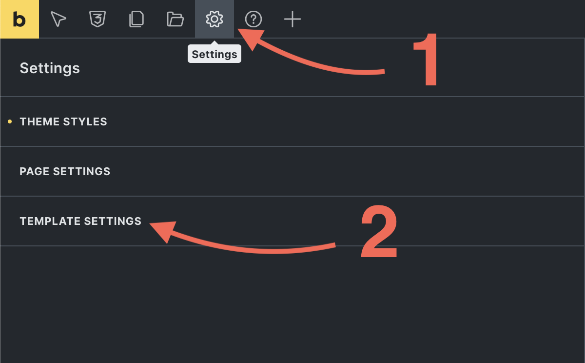
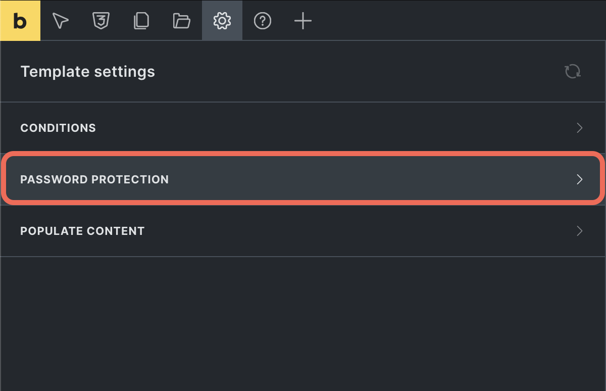
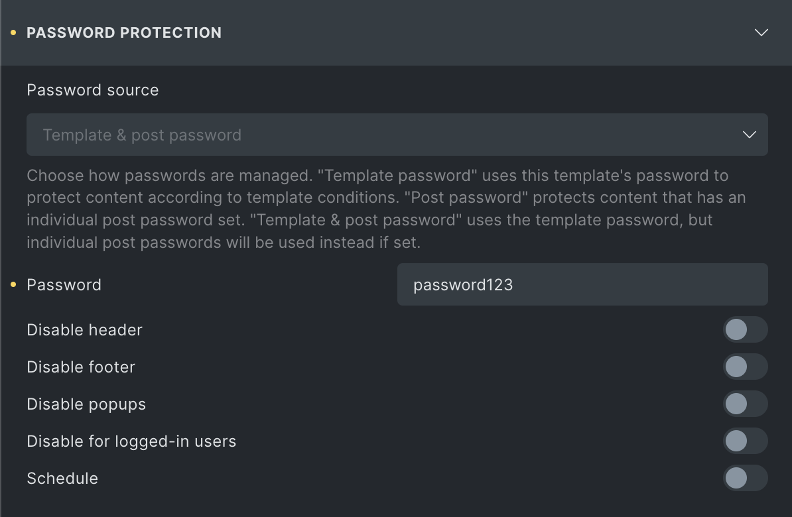
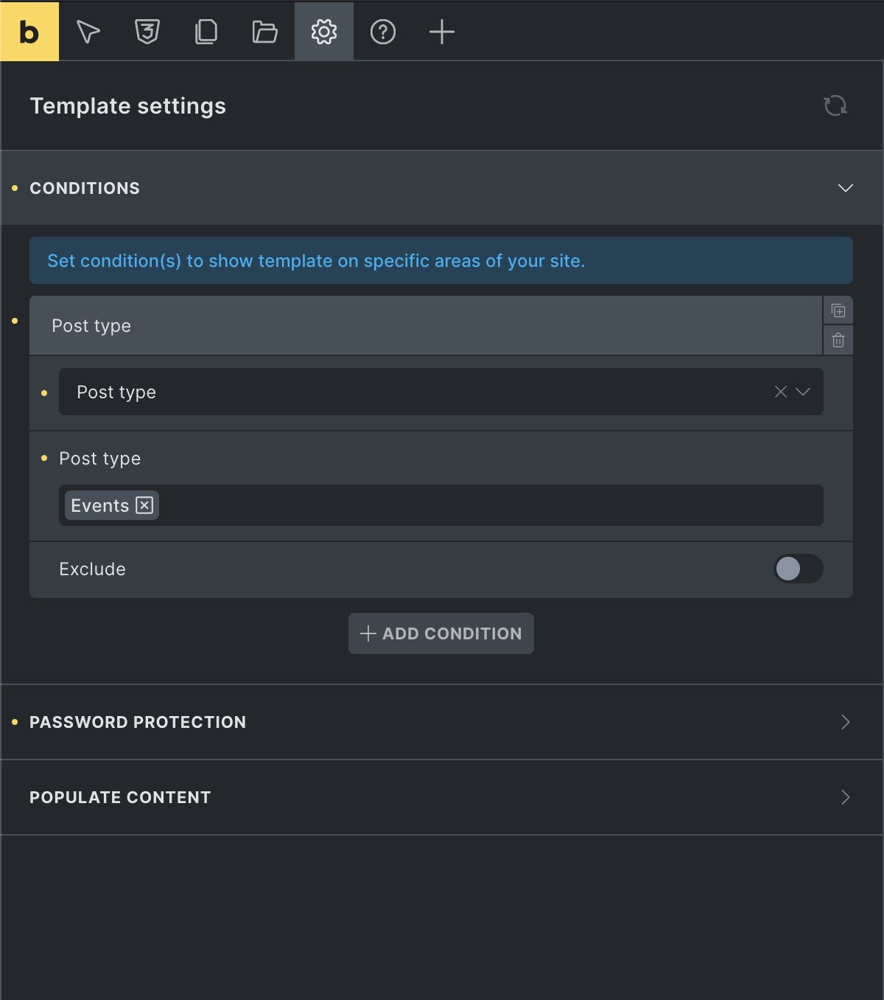
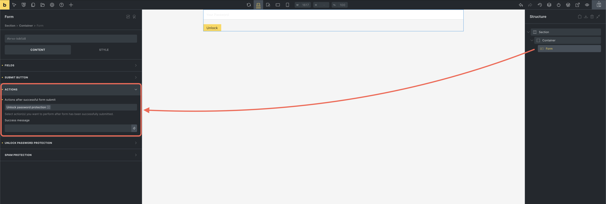
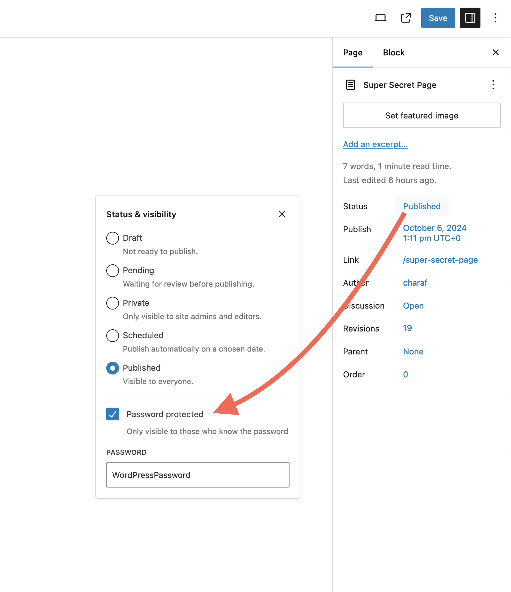
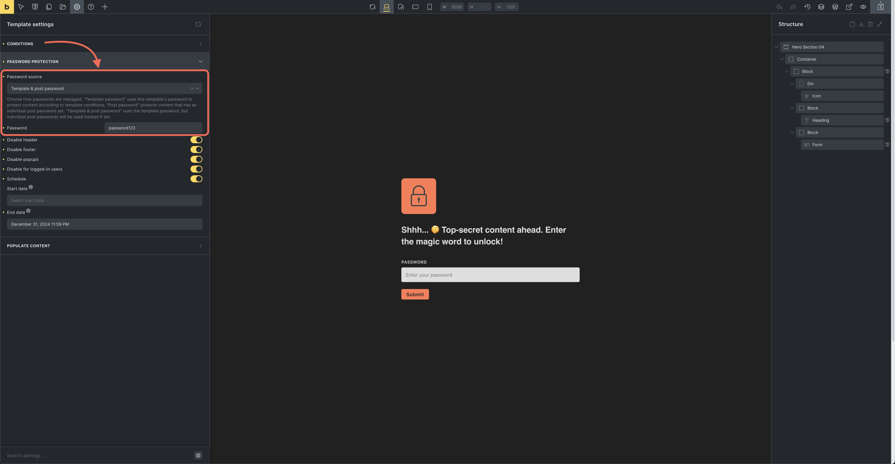

Bricks 1.11.1 introduces a Bricks-native Password Protection feature, giving you a simple yet powerful way to secure content across your website without needing extra plugins.

Whether you want to lock down individual pages, posts, broader areas like custom post types, or even the entire website, you can create custom templates that control access with ease.

Customize the password entry experience, schedule when protection is active, and manage everything directly within Bricks.

**This new feature is currently in its experimental phase!** We encourage you to test it thoroughly, especially with any caching solutions you use. Your feedback is valuable and will help us refine and improve this feature.

## How to set up password protection

1. Enable this experimental feature under `Bricks > Settings > General > Password Protection`

3. **Create a password protection template**
    - From the WordPress dashboard, navigate to `Bricks > Templates` and create a new template.
    
    - Under **Template type**, select **Password protection**.

5. **Configure password protection settings**
    - Click **Edit in Bricks** to customize the template.
    
    - To access the password protection settings, go to `Settings > Template settings > Password protection`.
    
    - Available settings include:
        - **Password source:** Select how passwords are managed. Options are **Template password**, **Post password**, or **Template & post password**. See details on each method in the [password source options](#password-source-options) section below.
        
        - **Password:** Set the password for template-wide protection. This field is only available if the **Password source** is set to **Template password** or **Template & post password**.
        
        - **Disable header**.
        
        - **Disable footer**.
        
        - **Disable popups**.
        
        - **Allow logged-in users to bypass**.
        
        - **Schedule:** Schedule when the password protection is active.
            - **Start date:** Set the date and time when protection begins.
            
            - **End date:** Set the date and time when protection ends.

3. **Set template conditions**
    - Set [the template conditions](https://academy.bricksbuilder.io/article/template-settings/#template-conditions) under `Settings > Template settings > Conditions` to define where this template applies.
    
    - For more dynamic control, use the `[bricks/password_protection/is_active](https://academy.bricksbuilder.io/filter-bricks-password_protection-is_active)` filter to customize when the template should be active or bypassed.

4. **Add form element for unlocking**
    - Add a **Form Element** to the password protection template.
    
    - Add an **Unlock password protection** form action. This action will allow users to unlock the protected content by entering the correct password.

## Password source options

The behavior of the password protection feature depends on the selected **password source** option. Below are details on how each option works and instructions for setup:

### **Template password**

Selecting **Template password** applies the password set in the template settings to all pages or posts that meet the template conditions. No further configuration is needed on individual posts. Simply:

- Set the password in `Settings > Template settings > Password protection > Password`.

- Define the template conditions under `Settings > Template settings > Conditions` to specify where this template will apply.

For any content matching these conditions, the password form will be automatically rendered, restricting access to those pages.

### Post password

When **Post password** is selected, this template customizes the default WordPress password protection form but requires individual post-level password settings.

To protect content using the **Post password** method:

1. Enable password protection on each post or page through the WordPress editor.

3. Set a password directly on the individual post or page (or through quick edit).

5. The template conditions will control where the custom password form appearance applies, but protection is managed at the post level.

### **Template & post password**

The **Template & post password** option uses the template password by default. However, if an individual post password is set, it will take precedence.

Setup process:

1. Enter a password in **Password protection > Password**.

3. Define template conditions as needed to apply the password protection across relevant content.

5. For any posts with an individual password set, that password will override the template password.

This setup provides flexibility by allowing individual content to have unique passwords while maintaining general protection for all content under the template.

### Password protection filters:

- [https://academy.bricksbuilder.io/article/filter-bricks-password\_protection-cookie-expires/](https://academy.bricksbuilder.io/article/filter-bricks-password_protection-cookie-expires/)

- [https://academy.bricksbuilder.io/article/filter-bricks-password\_protection-is\_active/](https://academy.bricksbuilder.io/article/filter-bricks-password_protection-is_active/)
