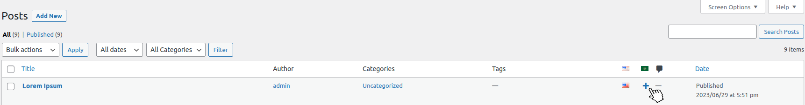
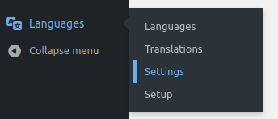
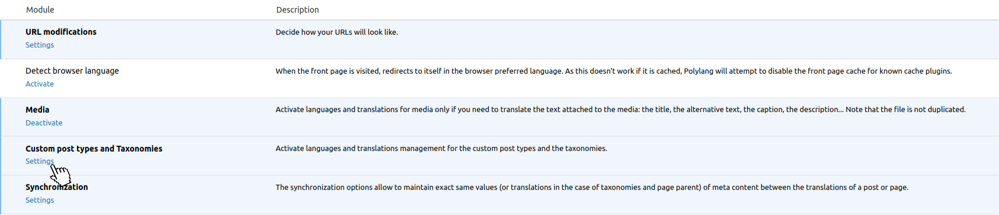
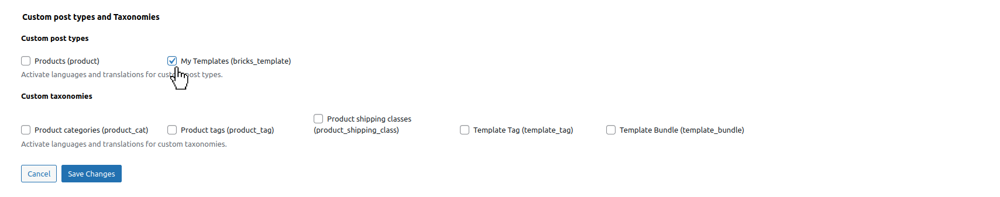
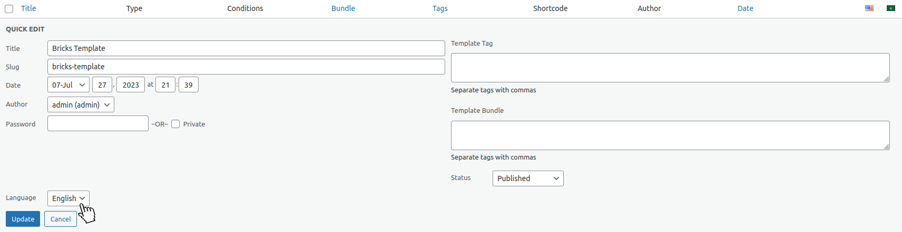
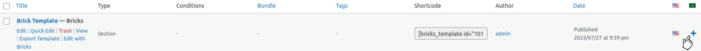
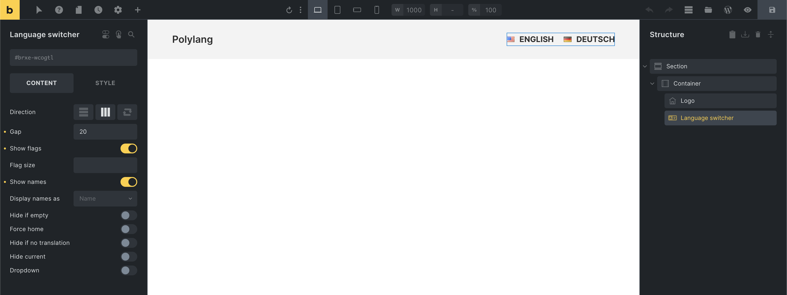
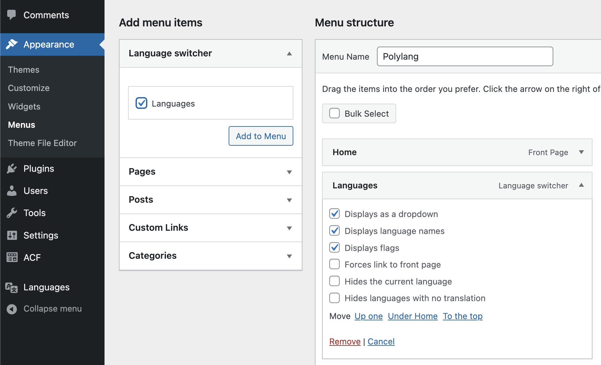

Polylang is a WordPress plugin designed to simplify the creation of multilingual websites.

With Polylang, you can write posts, custom post types, pages, create categories, and post tags in multiple languages.

In combination, Bricks and Polylang facilitate the design and management of multilingual websites.

After creating a page in your default language with Bricks, you can use Polylang to translate the page into any other language your website supports.

## Setting up Polylang with Bricks

Assuming you have Bricks installed and activated on your WordPress site, the next step is to set up Polylang. This guide applies to both the free version of Polylang and Polylang Pro.

To set up Polylang with Bricks, follow the steps below:

1. In your WordPress dashboard, go to `Plugins > Add New`.

3. Type "Polylang" into the search bar and press Enter.

5. You'll see the Polylang plugin in the search results. Click on `Install Now`.

7. After the installation is complete, click `Activate`.

9. Once activated, a new `Languages` menu item appears on your WordPress dashboard. Visit it, and add the languages you want to support on your website.

Remember to set the default language and add other languages as needed.

After adding languages and assigning any current posts/pages to their appropriate language, you can start translating your pages and posts with Polylang.

For Polylang Pro users, the installation process is slightly different as the plugin needs to be downloaded from the Polylang website and uploaded to your WordPress site. You can refer to the official Polylang documentation for detailed instructions on installing Polylang Pro.

For detailed instructions on configuring Polylang's settings, please refer to the [official Polylang documentation](https://polylang.pro/doc-category/getting-started/).

## Translating posts & pages

Translating your pages and posts using Polylang and Bricks is a straightforward process. Here are the steps:

1. In your WordPress dashboard, navigate to the page or post you want to translate.

3. On the right-hand side, you'll see a "Languages" meta box (added by Polylang). This box displays your default language and other languages you've added.

5. Under each language, you'll see a "+" button. Click this button to create a new translation for the selected language.

4. This action will create a new page or post draft. You can now use Bricks to design your page or write your post in the new language.

6. Once you're done, click "Publish". The translated page or post will automatically be linked to the original one.

**Note:** Polylang Pro users have the advantage of the "Clone" feature, which allows you to copy the entire content and settings of a page or post into a new translation. This can significantly speed up the translation process, especially for complex layouts.

For users of the free version of Polylang, the [Yoast Duplicate Post](https://wordpress.org/plugins/duplicate-post/) plugin can be a good alternative. It allows you to duplicate a post or page, which you can then edit with the translation.

Make sure to enable the duplicator for the "My templates" post type under `Settings > Duplicate post > Permissions`. **Assign the duplicate page to the correct language and link it back to the page you’ve cloned it from.**

Please ensure you check the [official Polylang documentation](https://polylang.pro/doc/translating-pages-posts-categories-and-tags/) for detailed instructions.

## Translating templates

Translating templates in Bricks with the help of Polylang is a slightly distinct process compared to translating standard pages or posts. This is mainly because the translation of Bricks templates is not enabled by default in Polylang (as existing templates without a language set are not rendered on the front end).

Here is a step-by-step process to enable it:

1. In your WordPress dashboard, navigate to `Languages > Settings` to visit the `Custom post types and Taxonomies` tab.

2. Enable the `My Templates (bricks_template)` checkbox enables translation for your Bricks templates.

3. Next, go to `Bricks > Templates` in your WordPress dashboard.

5. Choose the template you want to translate and assign a language to it in the "Languages" meta box.

5. Once the language is set, you can initiate the translation process as you would do with a standard post or page by clicking the "+" button for the desired language in the Languages meta box.

6. The newly translated template will be created in draft mode. At this point, you can modify the content and adapt it to the new language using Bricks.

**Note:** Setting a language for your current templates is a prerequisite before you can translate them.

**Important:** Duplicating the template for each language you wish to translate it into is essential. If a Bricks page uses a template that has not been translated into the page's language, that template will not be visible on the page in that language. Hence, ensure that all the templates used on your pages are translated for each supported language.

## Using templates conditions

Bricks templates have [template conditions](https://academy.bricksbuilder.io/article/template-settings/) that define where a particular template is rendered on your website. While these conditions offer flexibility, using them with Polylang introduces complexities due to how Polylang handles languages as WordPress taxonomy terms.

Although you can select language terms in Bricks conditions, it's generally not recommended because of potential unexpected bugs. This is due to Polylang creating distinct posts or pages for each language, which are separate entities linked by the plugin.

Due to backward compatibility, these language terms are available in the conditionals but may not behave as expected.

Instead, it's advisable to directly translate the templates as covered in the [Translating templates](#translating-templates) section. This involves duplicating each template for every language you want to support and translating the content within those templates. This method ensures consistent results when showing the correct template per language and avoids potential confusion and inconsistencies.

## Managing multilingual menus

Polylang's method for handling menu translations involves creating a separate menu for each language. To do so, you should follow these steps:

1. Go to `Appearance > Menus` in your WordPress dashboard.

3. Click `Create a new menu`.

5. Give your menu a name, ideally including the language for easy identification.

7. Choose the display location for this menu, then click `Create Menu`.

9. _(Optional)_ Use the admin language option in the admin bar at the top of the screen to match the menu language. This ensures the pages listed are in the selected language, helping you add the correct content.

11. Start adding the pages, posts, categories, or custom links this menu will contain.

13. Repeat these steps for each language your website supports.

Keep in mind that Polylang changes the language of the content on your site, not individual menu items, so you’ll need to create separate menus for each language. Additionally, when translating a page or template (e.g., a header template with a Nav element), be sure to edit the navigation element in the translated template to select the correct menu for that language. This ensures that each language version of the header template displays the appropriate menu.

For more details, please refer to the Polylang documentation: [https://polylang.pro/doc/create-menus/](https://polylang.pro/doc/create-menus/).

## The language switcher

Bricks provides a dedicated "Language switcher" element for Polylang, which you can add anywhere on your site and customize without leaving the builder.

To replace default Polylang flags with custom ones, please refer to the Polylang documentation on this topic [here](https://polylang.pro/doc/can-i-use-my-own-flags-for-the-language-switcher/).

You can also add the language switcher to your WordPress menu by adding the "Language switcher" under Appearance > Menus like this:

## Troubleshooting common Polylang issues

When integrating Polylang with Bricks, you might encounter some common issues. Here are a few possible problems and suggested solutions:

### 1\. Templates don't show after Polylang activation

If you have Bricks templates that don't appear after activating Polylang, this might be due to language settings. Ensure each of your templates is assigned a language. This setting is found on the right side of the WordPress editor page under "Languages". Remember to update your template after assigning a language.

### 2\. Untranslated templates do not appear

When an untranslated Bricks template doesn't appear, it might be due to a language discrepancy between the page and the template. If a Bricks page uses a template that isn't translated into that page's language, the template won't show. To fix this, translate your templates into all languages your pages use.

### 3\. Incorrect language in menus

If a menu appears in the wrong language, double-check that you've assigned the correct language to each of your menus, as per the [Managing multilingual menus](#managing-multilingual-menus) section above. Remember, Polylang requires a separate menu for each language on your site.

### 4\. Incorrect language query results in Archive or Search template

Please ensure all archive or search templates have enabled **Is main query** on the main query loop.

## Additional resources

To learn more about Polylang and its various features, you can refer to the following resources from Polylang's official documentation:

1. [Getting Started with Polylang](https://polylang.pro/doc-category/getting-started/): This guide covers the basics of setting up and using Polylang on your WordPress site.

3. [Polylang FAQ](https://polylang.pro/doc-category/faq/): Here you'll find answers to commonly asked questions about using Polylang.

5. [Polylang advanced](https://polylang.pro/doc-category/polylang-advanced/): This section provides more advanced Polylang guides.

These resources can provide additional insights and answers to more specific or complex issues you might encounter when using Polylang.
