The Popup Builder is a very flexible, fully customizable solution to show popups anywhere on your website based on **[Interactions](https://academy.bricksbuilder.io/article/interactions/)**.

A popup in Bricks is just a template. To create our first popup, let's add a new template and select the new template type **Popup** like so:

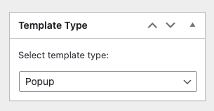

Save the new template, then edit it with Bricks.

You'll immediately notice that this template looks different than other Bricks template types.

The popup content shows centered on the canvas, there is a new "Template Settings" group named "Popup", and there is no "Populated Content":

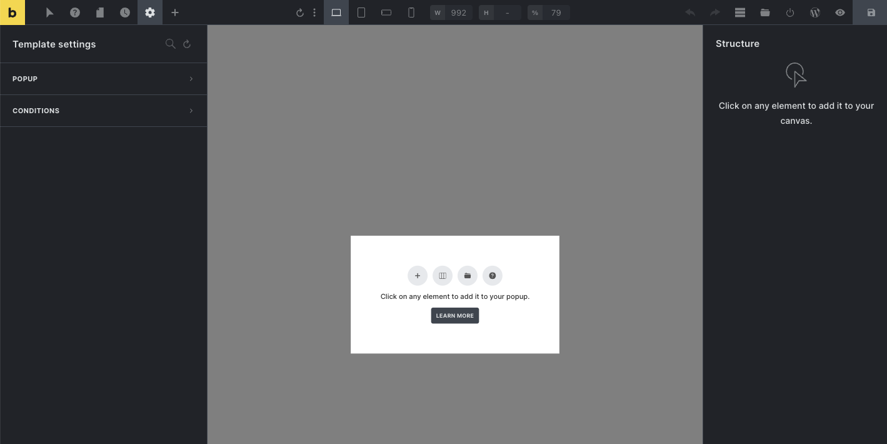

Building out the content of your popup is the same process as on any other page or template in Bricks: You simply add the elements you need to the canvas via click and/or drag & drop.

## Popup conditions

Use the [template conditions](https://academy.bricksbuilder.io/article/an-intro-to-templates/#template-conditions) inside the builder under "_Settings > Template Settings > Conditions_" to tell Bricks where on your website this popup should appear.

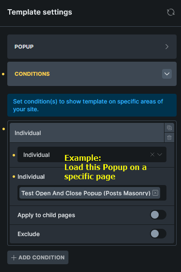

You can add as many popup templates to a page as you like.

## Popup settings

Popup-specific settings are located under "_Settings > Template Settings > Popup_".

The first control group lets you style the popup overlay & content:

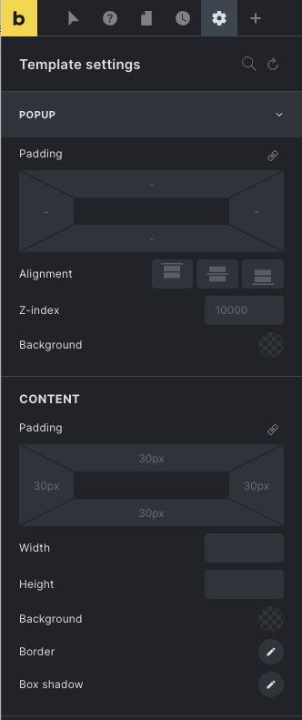

You can globally style your popups via the "Popups" control group inside your Theme Styles.

## Popup interactions

Further down the popup settings panel, you'll find the **Interactions** control group.

This is where you define the trigger(s) to open/close the popup.

**Triggers** are browser events like "Content loaded", "Scroll" (by _X_ px, _X_ % of the body height or _X_ vh (viewport height)), moving the mouse outside the window, etc.

A commonly used trigger is to show the popup once the content is loaded (e.g. newsletter popup, special offers, etc.). To do that, set a "Content loaded" interaction like so:


**NOTE**: Clicking outside the popup content (on the overlay) or pressing the ESC key closes the popup.

_**If no interactions are defined on the popup itself or any other element on the page that triggers the popup to show, the popup remains hidden**_.

## Popup limit

By default, the popup shows every time it is triggered by an interaction.

You can also define popup limits under "_Settings > Template settings > Popup > Popup limit_" when editing your popup template.

Once a limit has been reached, the popup is no longer displayed.

There are three types of popup limits, and the counter for each increases every time the popup is displayed:

| **Limit type**  | **Browser storage**                   | **Description**        |
| --------------- | ------------------------------------- | ---------------------- |
| Per page load   | `window.brx_popup_{id}_total`         | Resets after page load |
| Per session     | `sessionStorage.brx_popup_{id}_total` | Resets after tab close |
| Across sessions | `localStorage.brx_popup_{id}_total`   | Resets once deleted    |

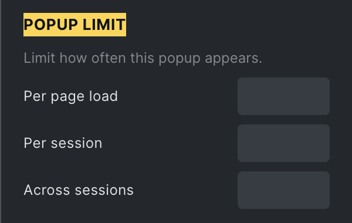

## Popup events & helper functions

Below is a list of the available popup helper functions and events (JavaScript) for developers.

### Open or close popup via JS

You can use `bricksOpenPopup` and `bricksClosePopup` to programmatically open or close the popups created in Bricks.

Both of these functions accept the popup ID (= template ID) or popup element node.

### Example: Open Popup by selector

```php
// Open Popup ID 3321 if any element with .brxe-heading or .my-custom-selector class
document.querySelectorAll('.brxe-heading, .my-custom-selector').forEach( (el) => {
	el.addEventListener('click', () => {
		bricksOpenPopup(3321)
	})
})
```

### Example: Open a looping popup by query element ID and loop index on page load

```php
// Open a selected looping popup where query Element ID is vfiqrn and loop index is 7
document.addEventListener('DOMContentLoaded', ()=>{
	// If you are using code element, set some delay after DOMContentLoaded to ensure windows.bricksIsFrontend set properly
	setTimeout( ()=>{
		const queryId = 'vfiqrn'
		const targetPopup = document.querySelector(`.brx-popup[data-popup-loop="${queryId}"][data-popup-loop-index="7"]`)
		bricksOpenPopup(targetPopup)

	}, 200)

})
```

### Listen to popup open or close events

You can execute your own JavaScript function when the popup is opened or closed via `bricks/popup/open` or `bricks/popup/close` events.

```php
// Listen to open event
document.addEventListener( 'bricks/popup/open', (event) => {
	// You can get the popup id
	const popupId = event.detail.popupId
	// You can get the popup element
	// const popupElement = event.detail.popupElement

	// Do your stuff here
	if (popupId == 3321) {
		console.log(`3321 popup is opened`)
	}
})

// Listen to close event
document.addEventListener( 'bricks/popup/close', (event) => {
	// You can get the popup id
	const popupId = event.detail.popupId
	// You can get the popup element
	// const popupElement = event.detail.popupElement

	// Do your stuff here
	if (popupId == 3321) {
		console.log(`3321 popup is closed`)
	}
})
```

## Popup setup examples

### Example: Popup inside query loop

You can also add a popup inside a query loop via the **Template** element. Inside the popup template, you can use dynamic data to display data of the loop item.

The screenshot below illustrates the setup for a "Quick view" button that shows a popup template with a "Add to cart" button, the product short description, etc.

We've also set an interaction on the button inside the query loop that shows our "Quick view" popup template when it's clicked.

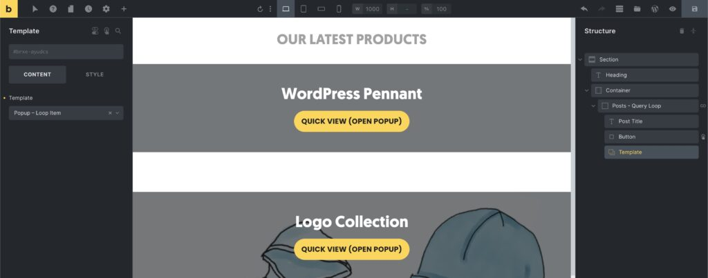

**NOTE (for Bricks version < 1.7.1):** Template element must be placed as the sibling/sibling's child (layout structure) of the interaction element. Otherwise, the popup will not be triggered. Do **NOT** set interaction on the Query Loop div itself.

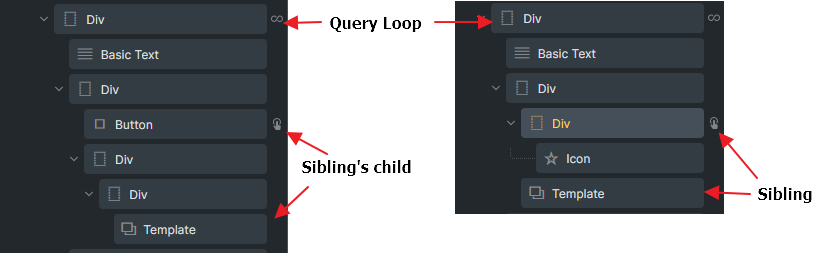

<figcaption>

Example layout structure to trigger a looping popup for Bricks version < 1.7.1

</figcaption>

### Example: Show popup when the mouse leaves the browser window (exit intent)

After setting up the popup template, and creating the layout, go to "_Settings > Template Settings > Popup_", scroll down to the Interactions group, and add the following interaction:

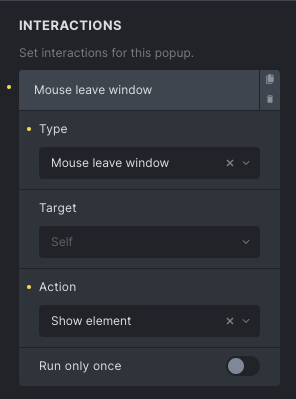

### Example: Add popup close icon (using interactions)

To create a popup close icon that is triggered when clicking on it, let's add an Icon element to our popup. Any element works, though.

Tip: When editing the Icon element, set the "Cursor" style under Styles > Layout > Misc to "pointer". This offers a better visual hint that this is an interactive icon.

Open the **Interactions** panel when editing your Icon element, and create a new interaction of type "Click", set the target to"Popup", select the popup, and set the "Action" to "Hide element".

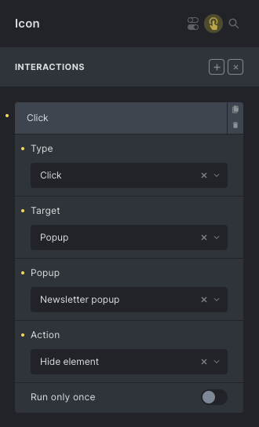

If you are planning to use this popup close icon in more places creating a global close popup element might be a good idea.

After saving this element as a [Global Element](https://academy.bricksbuilder.io/article/global-elements/), you need to use a different approach when setting the close popup interaction so it can target any popup. In this case, use "CSS selector" as the "Target", and set the "CSS selector" to "`.brx-popup`", like so:

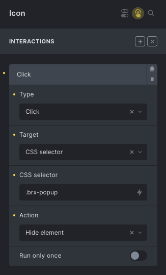

### Example: Show popup before a certain date/time (using element conditions)

While the template conditions determine on which pages the popup appears, you can further restrict a popup by defining [Element Conditions](https://academy.bricksbuilder.io/article/element-conditions/) on the outermost popup element.

To only show a popup before November 1st, 2022, you'd set the following element condition on the outermost layout element of your popup:

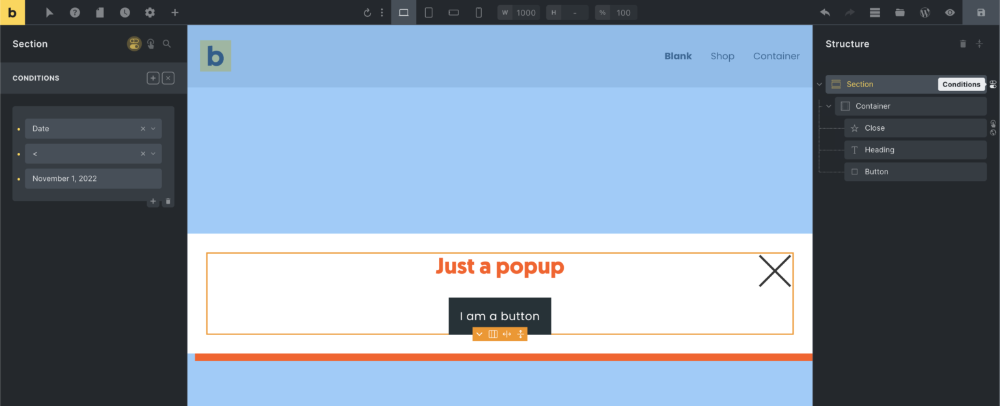

If this element condition is not fulfilled, meaning Nov 1st, 2022, is reached, then the popup HTML is no longer rendered. So even if the popup is triggered by an interaction, it won't show as there is no popup HTML to display.

## AJAX popup

Bricks introduces AJAX popups in `1.9.4`. The primary goal is to reduce the DOM size and queries of popups when they are used within query loops.

### Enabling AJAX content fetching for popups

When editing a popup template, simply enable the **"Fetch content via AJAX"** option. You can also specify an AJAX loader animation, which is placed inside the popup's `.brx-popup-content` by default. Keep in mind that for AJAX rendering, context is vital. Dynamic data from repeater rows (like ACF or Metabox) can't be displayed as they lack unique IDs, such as posts, terms, or users.

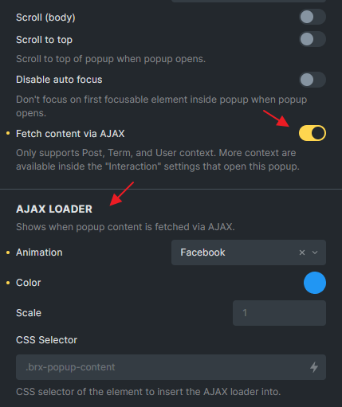

### New popup interaction context settings

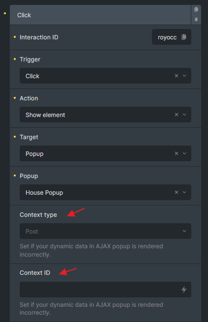

These new settings can be found in the "Interactions" panel if your interaction is set to show a popup.

By default, Bricks automatically identifies the current context or object when opening an AJAX popup through interaction. This works regardless of whether you're within a query loop and covers various object types, such as posts, terms, or users.

### Why are these context settings necessary?

Consider creating a product quick view popup with all the related dynamic data in the popup template. When fetching this template via AJAX, it's crucial to inform Bricks about the current product (context). This ensures that all dynamic data populates correctly. Providing an incorrect context type and ID during the fetch can result in empty or inaccurate dynamic data. Remember that not all looping data can be the context in an AJAX popup. As an example, you cannot tell Bricks currently your context is a repeater few in N row of the repeater field.

### When to specify context type and ID?

In cases where you're inside a query loop, especially a nested query loop or a custom field repeater loop, Bricks may not detect the correct context automatically. In such instances, you should specify the Context Type (post, term, or user) and Context ID (post ID, Term ID, or User ID). You can use dynamic data like `{post_id}`, `{term_id}`, `{mb_related_agent:value}`, etc., to set these values.

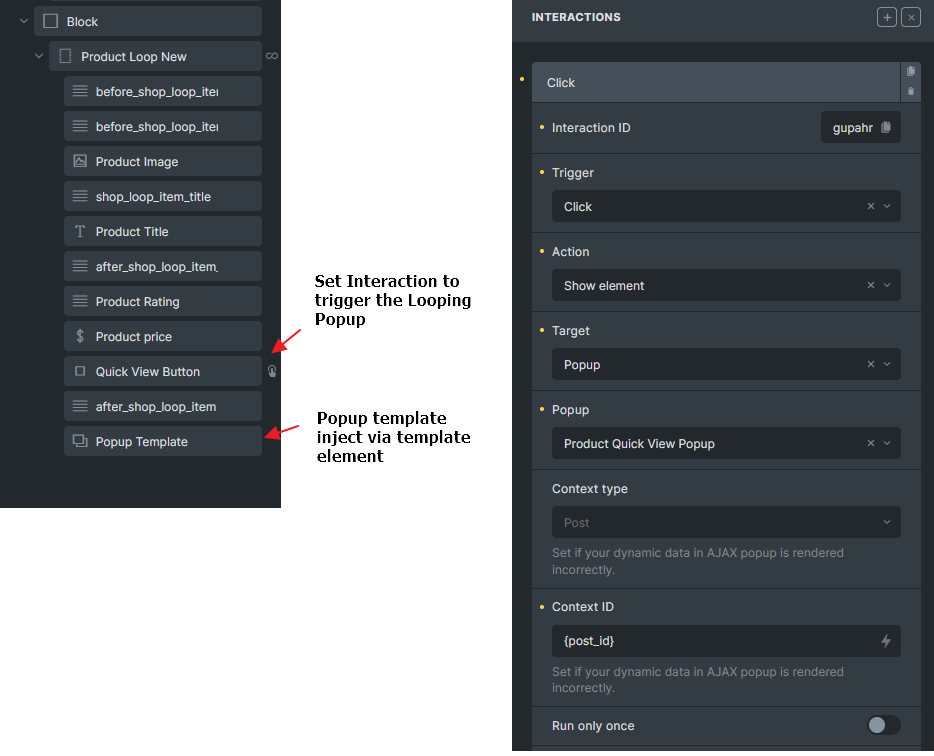

<figcaption>

A looping product quick view popup structure in Bricks

</figcaption>

### AJAX popup JavaScript events (@since 1.9.4)

New JavaScript events added related to AJAX Popup:

- `bricks/ajax/popup/start` - Emitted before making an AJAX popup call.

- `bricks/ajax/popup/end` - Emitted after completing an AJAX popup call.

- `bricks/ajax/popup/loaded` - Emitted after adding AJAX popup content to the DOM.

You can retrieve the `popupId` or `popupElement` by accessing `event.details.popupId` or `event.details.popupElement` as usual.

```php
// Listen to AJAX popup content loaded event
document.addEventListener( 'bricks/ajax/popup/loaded', (event) => {
    // You can get the popup id
    const popupId = event.detail.popupId
    // You can get the popup element
    // const popupElement = event.detail.popupElement

    // Do your stuff here
    if (popupId == 3321) {
      console.log(`3321 AJAX popup content DOM loaded. Init my custom element JS`)
    }
})
```

### Example: Open an AJAX popup with context in JavaScript (@since 1.9.4)

Since `1.9.4`, `bricksOpenPopup` accepts 3 parameters.

- `object` - Either the popup element object or the popup ID

- `timeout` - This parameter is for the counter animation inside the popup (can be ignored if not needed).

- `additionalParams` - Used specifically for AJAX popups. Expect properties like popupContextId and popupContextType

```php
// To open the popup with ID 1190 (already set to fetch content via AJAX) with a context of post ID 668
bricksOpenPopup(
  1190,
  0,
  {
    popupContextId: 668,
    popupContextType: 'post'
  }
);

// To open the popup with ID 2350 (already set to fetch content via AJAX) with a context of term ID 39:
bricksOpenPopup(
  2350,
  0,
  {
    popupContextId: 39,
    popupContextType: 'term'
  }
);
```
