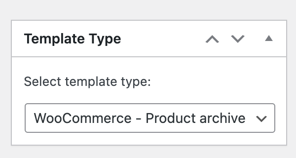
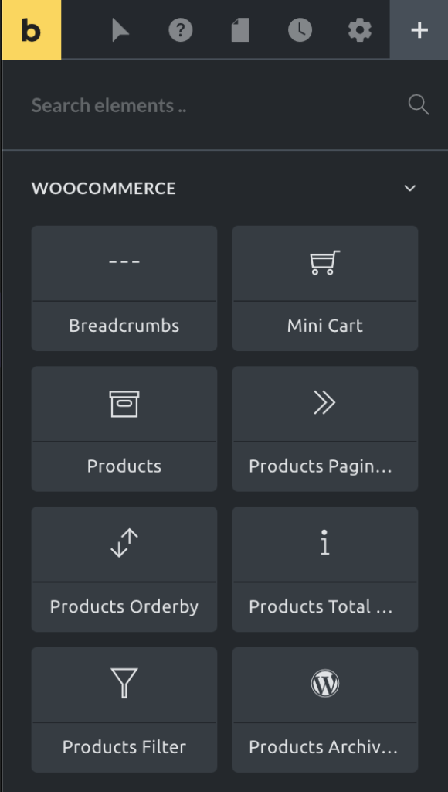

The template type "WooCommerce – Product Archive" is only visible if WooCommerce is installed & active.

Create a template of type "WooCommerce – Product Archive" in Bricks to design your product archive pages (product categories, tags, attributes, etc.).

To create this template, go to the Bricks templates screen and add a new template. Then select the template type **"WooCommerce – Product Archive"** from the top-right dropdown:

Click "Publish" or "Save Draft". Then "Edit with Bricks" to open the builder.

It is also possible to create/edit this and other templates in the Bricks editor interface by clicking on the Folders icon or pressing CMD / CTRL + SHIFT + L.

Please remember to add [template hooks](/article/woocommerce-template-hooks/#product-archive-template-hooks) if you are using third-party plugins.

## Product Archive Elements

### Archive title

There is no specific element to add a heading to the product archive.

To add a heading to this template you could use the Post Title element or add a Heading element with the `{archive_title}` tag.

### Breadcrumbs

Use the breadcrumbs element to output the navigation links from "Home", and higher level categories until the content displayed in the page.

This element uses the WooCommerce breadcrumbs default engine to generate each part of the breadcrumbs path.

### Products archive description

The products archive description will render the product category (or any other product taxonomy term) description.

If used in a template that renders the **Shop** page, it will output the page content (from the Gutenberg/blocks editor).

### Products

This is the main element to list products in a grid. You have controls to customize the style and layout, tweak the query, and select which content (fields) you want to show for each product.

This element interconnects with the **Products Filter**, **Products Pagination**, **Products Orderby** and the **Products Total Results** elements.

This means that the query results will be conditioned by the filters and the orderby conditions and it will also impact the pagination and the total results elements output.

The query used inside the products element to generate the grid of products will merge the query arguments from the element with the default WooCommerce query in the case the page rendered is the product archive or the product taxonomy archive (product category or product tag). This means that if you are seeing a certain product category archive page you only get a list of products from that category.

### Products filter

The products filter element allows you to add query filters to the page so the visitor could search/narrow down the list of products presented.

This element contains three filter types:

- **Taxonomy**: filter the list by one or multiple taxonomy terms.

- **Product attributes**: filter the list by product attributes like size, color or any other custom attribute used.

- **Others**: Special set of filters like a product **price dual-range slider**, a **stars rating** filter, a status **stock** filter or a simple **search** input. In this set, you will also find a **Reset filters** option which you would set to add a reset product filters button.

When using the taxonomy or product attributes filters, you may select different filter inputs, like a dropdown, a set of checkboxes, a radio list, a text list, or a box list.

### Products pagination

List of page links that allow the visitor to navigate through the different products' list pages.

### Products orderby

Adds a dropdown to the layout where the visitor could change the order of the products in the presented list. The default sort options are by popularity, by average rating, by latest, and by price (low to high and high to low). This list uses the WooCommerce default list and it can be extended using the WooCommerce hooks or third-party plugins.

### Products total results

Use this element to output the number of results returned by the current products query.
