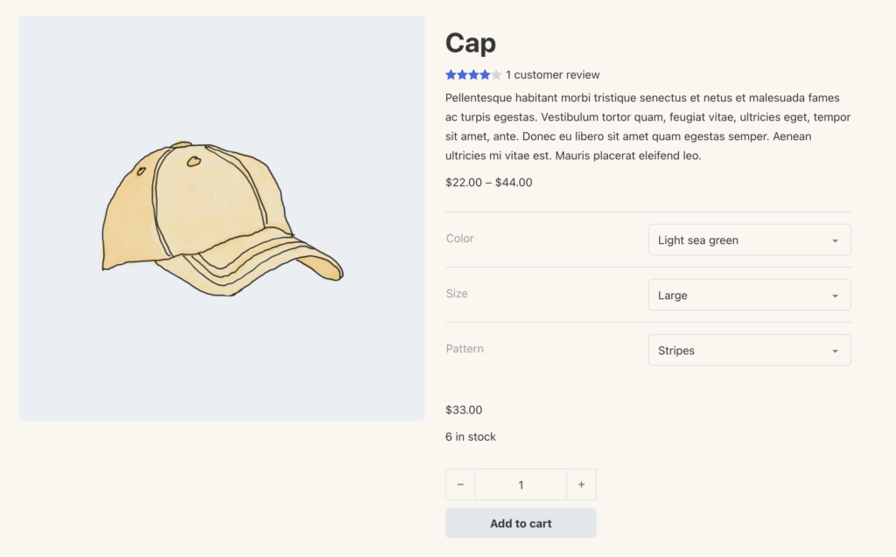
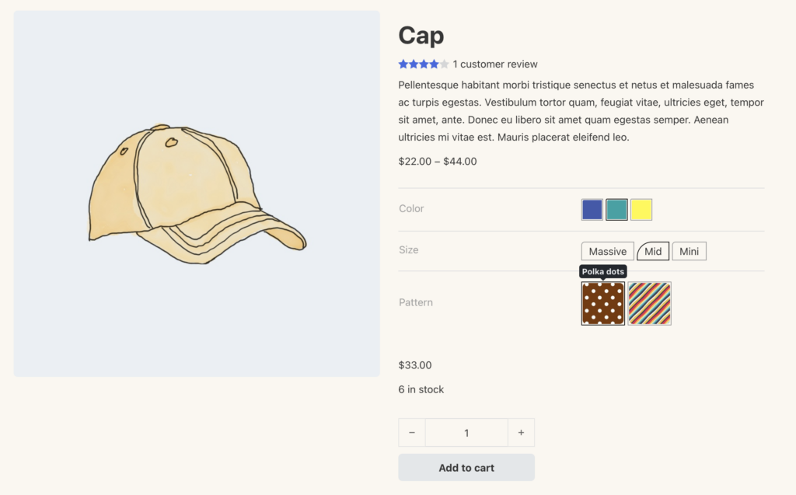
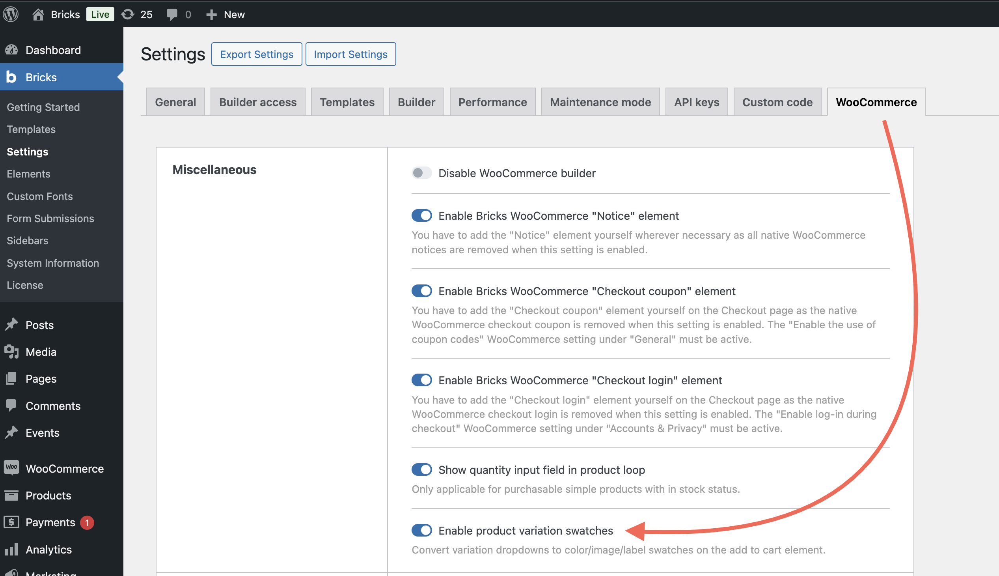
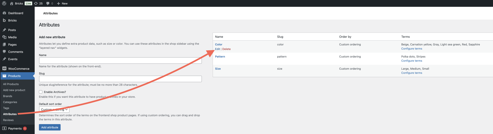
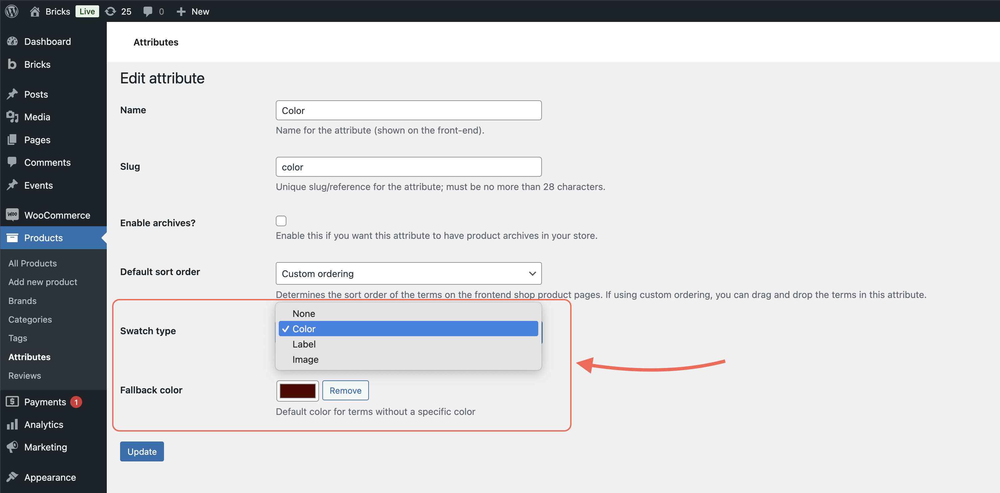
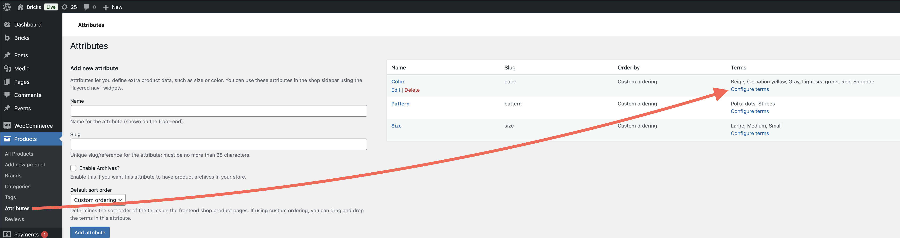
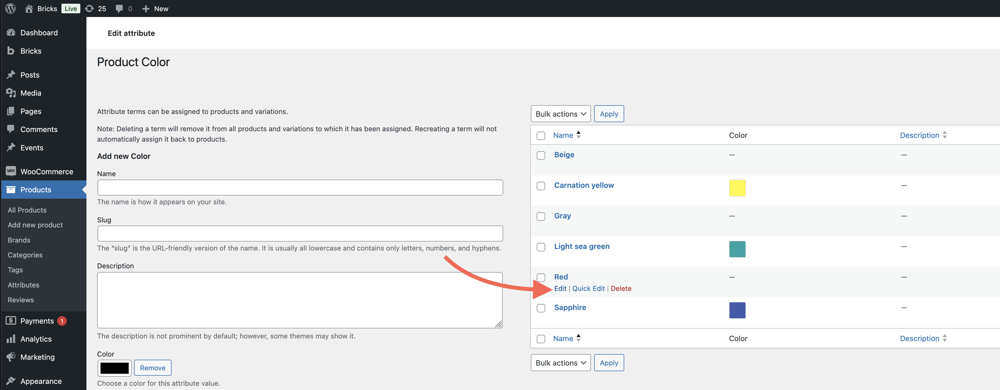
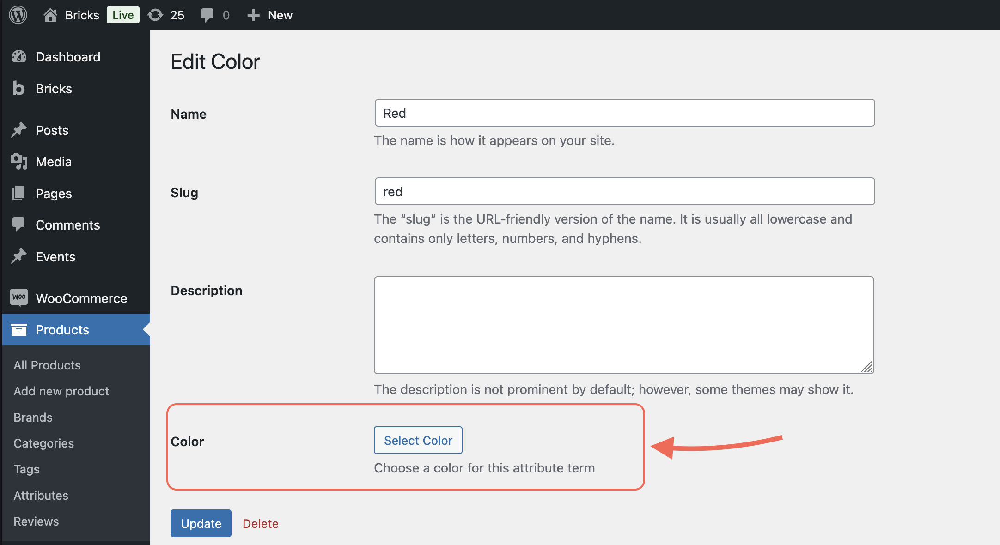

Bricks 2.0 introduces **Product variation swatches**, giving you more control over how product attribute options (i.e. color, size, pattern) appear on the frontend.

Instead of dropdowns, you can now display your product variations as **color swatches, image buttons, or custom labels**, creating a more visual and intuitive shopping experience.

This feature integrates directly into the **Add to cart** element, letting you style variation swatches exactly how you want, without the need for extra plugins.

<figcaption>

Before Product Variation Swatches

</figcaption>

<figcaption>

After Product Variation Swatches

</figcaption>

## Enable product variation swatches

To get started, go to **Bricks > Settings > WooCommerce > Enable product variation swatches**.

Once enabled, you’ll be able to customize variation swatches directly from your product attribute settings.

## Assign a swatch type to product attributes

Go to **Products > Attributes**, and click "Edit" on an existing attribute (or create a new one).

You’ll see a new **Swatch type** setting with the following options:

- **None (default)**: Standard WooCommerce behavior (dropdowns)

- **Color**: Displays swatches using color values

- **Label**: Displays custom text labels for each term

- **Image**: Displays swatches using images from your media library

**Example:** Use the "Color" swatch type to show red and blue color boxes, or choose "Label" for size options like S, M, L.

### Set a fallback value (optional)

While editing the attribute, you can also set a **Fallback value**. This fallback will be used if a specific term doesn't have its own swatch value.

## Assign swatch values to individual terms

Next, click **Configure terms** for the attribute you just edited.

Then, click **Edit** on a specific term (like “Red” or “Large”).

For each term, you’ll see a new input that matches the swatch type:

- **Color** → Choose a color

- **Image** → Select or upload an image

- **Label** → Add custom text

These values are what will be shown on the frontend in the Add to cart element.

## Style swatches in the Add to cart element

Variation swatches are rendered inside the **Add to cart** element, as long as your product uses attributes with a swatch type.

To style them:

1. Select the **Add to cart** element (e.g in your single product template)

3. Open the new **Variation swatches** group in the element settings

From there, you can adjust the size, spacing, borders, active states, tooltips, and more.

That's it. With variation swatches, you can now turn standard variation dropdowns into polished, interactive product selectors, designed your way, directly in the Bricks builder.
