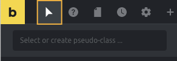
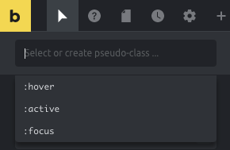
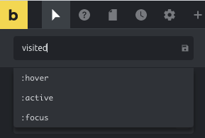
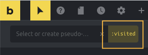
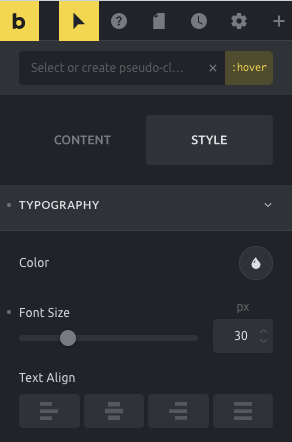
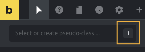
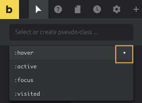
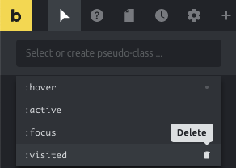

Bricks lets you apply different styles to an element depending on its state (such as on mouse `:hover` or a `:visited` link) via pseudo-classes.

You can also apply different styles to specific parts of an element via pseudo-elements. Such as the `::first-letter` or the `::first-line`.

The video below shows how to work with pseudo-classes & pseudo-elements in Bricks (1.3.5+) and how you can add pseudo keywords yourself to Bricks:

https://youtu.be/0a9teO2moEE

<figcaption>

How to work with pseudo-classes & pseudo-elements in Bricks.

</figcaption>

Pseudo-classes & pseudo-elements are available when editing an element, theme styles, and page settings.

## How to edit a specific element state or part of an element

Click the "cursor" icon in the builder toolbar to toggle the pseudo-class menu:

Click the text input to reveal all available pseudo-classes & pseudo-elements:

## How to create your own pseudo-classes & pseudo-elements

By default, Bricks shows `:hover`, `:active` and `:focus` pseudo-classes, but you can add other pseudo-classes or pseudo-elements yourself.

Simply type out the pseudo-class or pseudo-element you want to create (such as `:visited`) and press enter or click the little save icon:

## Edit styles for element states or parts

Click the "cursor" icon in the builder toolbar to open the pseudo-class menu. Another click inside the text input reveals all available pseudo-classes & -elements. Select the one you want to edit.

The "active" pseudo keyword will now show highlighted in the right corner. The toolbar "cursor" will appear highlighted as well, indicating you're now editing the styles for a pseudo-class or pseudo-element:

At this point, changing the styles controls will only affect the active pseudo-class or pseudo-element. When you finish editing click the "x" icon inside the input to clear the state selection.

After that, you'll notice the input will show a little indicator of how many pseudo-classes or pseudo-elements are configured to this element or theme style:

To clear the styles associated with a pseudo-class or a pseudo-element, open the dropdown list where you'll notice a little dot indicator for the states that have styles associated with them. To clear the styles of a specific state, click the dot indicator:

## Deleting pseudo keywords

You can delete custom-added pseudo-classes or pseudo-elements (except the ones Bricks adds by default).

To do so, open the pseudo-class menu, reveal the dropdown, hover with your mouse over the pseudo keyword you want to delete. Then click the "bin" icon.

Please note, deleting a pseudo-class or a pseudo-element **will delete it globally**. It may affect other elements or theme styles where you used that state or part.

## Example 1: Style a child class when a parent is hovered

Let's say there's a Div having a Heading element and that the heading has a class called `text--blue` with blue color text. Now you want to change the heading text to a different color when the Div is hovered.

For this:

1. Set a padding of say 40px all around for the Div element so the end result can be seen.
2. Select the Div.
3. Click the "States (pseudo-classes)" icon.
4. Click in the input field.
5. Type `:hover .text--blue` and hit return or click the Save (floppy) icon.
6. With the Div element still as the current element that is selected, go to STYLE → TYPOGRAPHY, click the Color control's circle and set your desired color.

Save and check the frontend. Hovering the Div should change the heading color.

Resources (list of available pseudo keywords):

[https://developer.mozilla.org/en-US/docs/Web/CSS/Pseudo-classes](https://developer.mozilla.org/en-US/docs/Web/CSS/Pseudo-classes)

[https://developer.mozilla.org/en-US/docs/Web/CSS/Pseudo-elements](https://developer.mozilla.org/en-US/docs/Web/CSS/Pseudo-elements)
