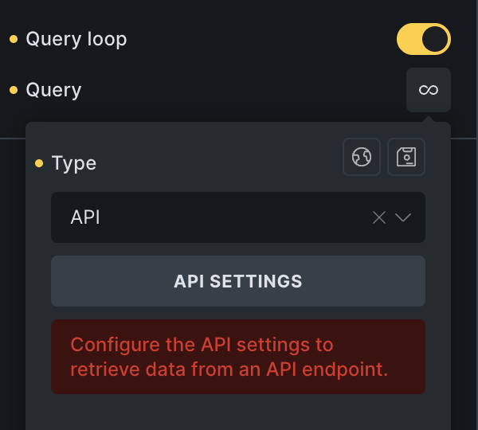
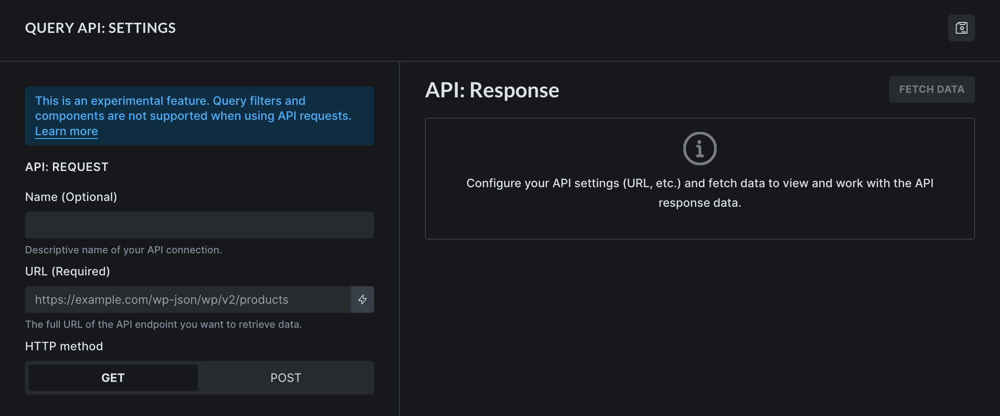
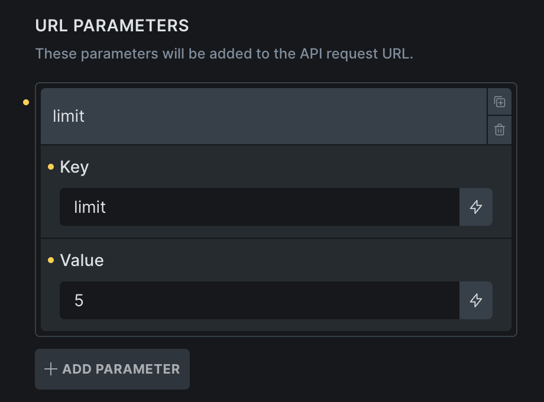
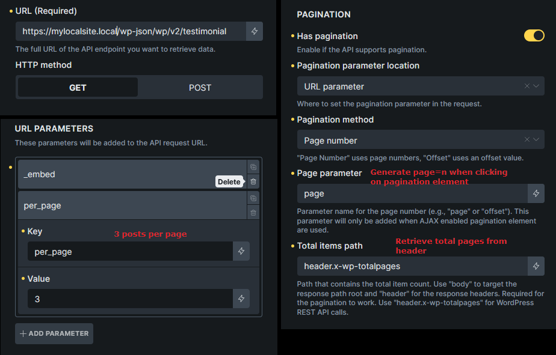
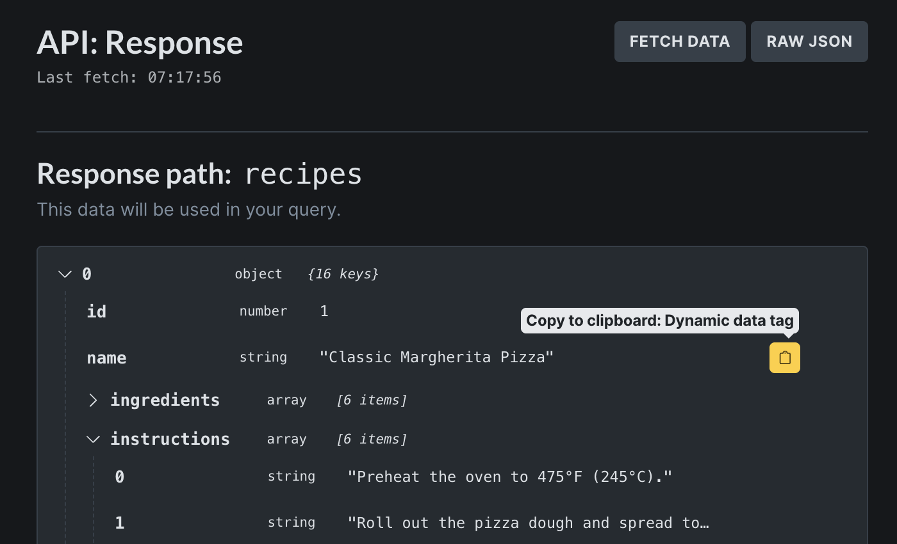
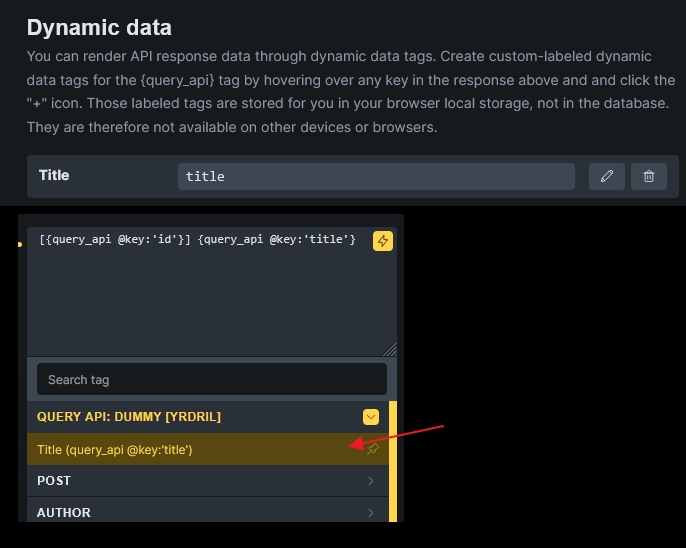

Starting with Bricks 2.1, you can now use the powerful Query Loop builder to fetch and display data from an **API endpoint**—without writing custom PHP code.

This **experimental feature** is perfect for displaying content from third-party services, public APIs, or even another WordPress site via REST API.

https://youtu.be/84jlX9gSz7o

## Getting Started

A new **Query Type** called **API** lets you connect to and consume data from REST API. Once configured, the API response is parsed and rendered using Bricks' dynamic tag system—just like any other query loop.

To begin:

1. Select any nestable element that supports the **Query Loop** (e.g., Container, Block, Div).

3. Enable the **Query Loop** and set the **Query Type** to **API**.

5. Click the **API Settings** button to open the API configuration popup.

## API Settings

In the API settings popup, you can define everything required for the API call—like the endpoint URL, HTTP method, headers, parameters, and more.

Once you have everything configured you can fetch the API response data and preview it in the column on the right-hand side. And copy or generate custom dynamic data tags to easily render the API data inside the loop.

### Name

Internal label for identifying this API connection (e.g. “Books API”, "Google Spreadsheet A").

### URL (Required)

The full API URL based on the documentation.

### HTTP Method

Define if you want to perform a GET (default) or POST request.

### Authorization

Supports API Key (header or URL parameter), Bearer Token, and Basic Auth.

For enhanced security, you can use a PHP constant instead of entering sensitive values directly. Tick the "Use PHP Constant" box, and Bricks will generate a constant name for you. You can then define its value in your environment (e.g., wp-config.php), and Bricks will reference it during the API request.

### Headers

Default headers:

- `Content-Type: application/json`

- `User-Agent: BricksBuilder/{CURRENT_VERSION}`

You can add more headers or override these defaults by defining custom headers in the UI. These headers will be sent with each API request.

### URL Parameters

You can add key-value pairs that will be appended as query parameters to the API URL.

Example: Adding a URL parameter with key `limit` and value `5` when the API URL is `https://dummyjson.com/recipes` generates the final API URL of `https://dummyjson.com/recipes?limit=5`.

### Request Body

If your HTTP method is set to `POST`, you can provide a request body in one of the following formats:

- JSON

- Form Data

- x-www-form-urlencoded

Use this to send payloads when interacting with POST-based endpoints.

### Response path

Specify the **object path** to extract data from within the response. Leave it blank to use the full top-level response.

Example: `data.results` to get results from `{data: {results: […]}}`

**IMPORTANT: Only array data can be looped. The response path must return an array! If it resolves to an object instead, the query loop will not render anything.**

### Cache duration

Set to 0 to disable caching. Default is 300 seconds (five minutes).

Bricks stores the response using WordPress transients, which helps reduce unnecessary API calls during page building or repeated visits.

## Pagination

Bricks' API query loop supports pagination—provided the target API allows navigation via **page numbers** or **offsets**.

To enable pagination:

- Enable the **"Has pagination"** checkbox in the API settings.

- Add a Bricks **Pagination element** to your page and set target query to the API query loop.

- Define the **"Total items path"** so Bricks knows how many pages to generate.

- Choose either **"Page number"** or **"Offset"** pagination method and complete the configuration.

This ensures Bricks can dynamically render pagination and load the correct data when navigating through pages.

### Pagination method: Page number

Use this method when the API supports navigation by specifying the page number (e.g., `page=3`).

**Example**: The WordPress REST API

- Add `page` as a URL parameter

- Set `per_page` to define how many items to load per page (e.g., `per_page=3`)

- Enable **Has pagination**

- Set the **Page parameter** to `page`

Bricks will automatically update the `page=n` value when users interact with the pagination element.

### Total Items Path

WordPress REST API includes `x-wp-totalpages` in the **response headers**, so you can set `header.x-wp-totalpages` for the **"Total items path"** field.

This tells Bricks how many pages exist, allowing it to generate the correct pagination structure.

### Pagination method: Offset

Use this when the API requires offset-based navigation.

**Example**: [DummyJSON Products API](https://dummyjson.com/docs/products?utm_source=chatgpt.com#products-limit_skip)

Based on the documentation, to get 3rd page data when limit (items per page) is 5, we should pass `limit=5&skip=10` in the API request. In Bricks, just need to set as below image.

By doing this, clicking page number "3" on the pagination element generates `limit=5&skip=10` parameter when making the request.

Note that we also indicate `body.total` in the "Total items path" field.

## API Response

The fetched API response data is shown in the API response panel on the right.

This panel lets you inspect the response data in a tree view (default). Click the "RAW JSON" button to view the response in raw JSON format.

### Using the API response data in your loop

Bricks introduces a new `query_api` dynamic data tag to render any piece of the API response defined via the `@key` filter.

In the API response above, to render the recipe `name`, use the `{query_api:raw @key:name}` inside the query loop.

To output nested data, such as the post title in a WordPress REST API response, use the `|` (pipe) delimiter like so `{query_api:raw @key:title|rendered}`.

You can also **copy the dynamic data tag** by hovering over the specific dataset you want to render, and click the clipboard icon to copy the ready-to-use dynamic data tag to your clipboard.

Third, click the `+` icon, next to the clipboard icon, to generate a **custom dynamic data tag** that'll be available inside the DD picker.

**NOTE**: The created dynamic data tag is saved in your browser localStorage instead of the database. So only you in your browser will have access to it.
