This new feature set, introduced in Bricks 1.9.6, enhances content interaction through AJAX-powered filter elements such as search, checkboxes, select options, radio buttons, range sliders, and date selectors.

It allows advanced real-time content sorting, filtering, and searching without a page refresh, resulting in a more dynamic and interactive user experience.

https://youtu.be/5oDHG-bTAfQ

### How To Enable Query Filters

Enable Query filters from your WordPress dashboard under `Bricks > Settings > Query filters`.

Once enabled, a new "Filter" element group with all filter elements becomes available in the builder elements panel.

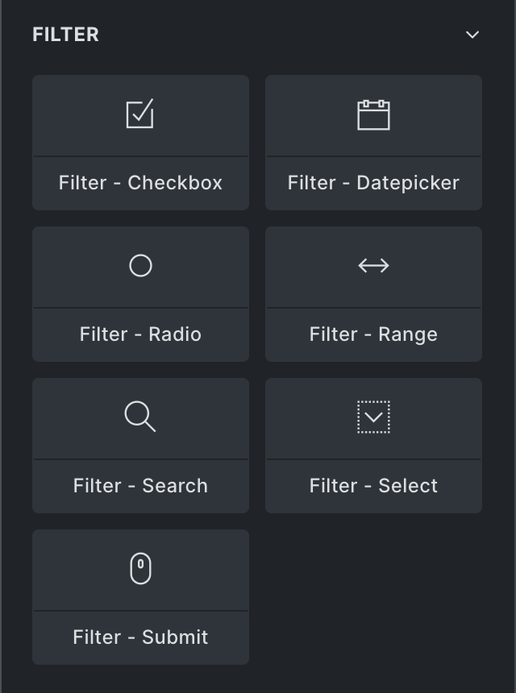

### Important Notes

- **Compatibility warning**: Query filters might conflict with plugins that override the `bricks/query/force_run` filter. It is best to avoid using Bricks query filters in combination with other filter plugins.

- **Scope limitation**: Query sort & filter are limited to target the outer layer (in nested query scenarios). Supported query types: "Post", "Term", and "User" `(@since 1.12)`

- **Custom field support**: By default, Bricks Query Filters work only with simple, plain-text custom field values. They do not support fields that store data in serialized formats. (Please read this [Custom Fields Integration](#custom-fields-integration) if you are using ACF or Metabox.io, we improved this in `1.11.1`)

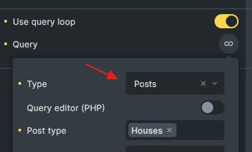

## How To Setup A Filter

When adding a filter element to your page, you always have to assign it a "Target Query". This is necessary so Bricks knows which query a particular filter should affect.

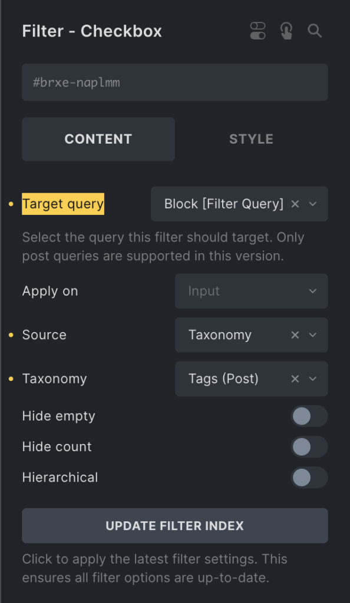

This flexibility of setting the Target Query on the filter element itself allows you to add your filters anywhere on your page. You don't have to arrange all your filters inside one block.

You can, for example, add a sorting element somewhere else on your page, as we did in the following example. Where all filters are located inside the left-hand column, and the sorting element is placed inside the right-hand column right above the query loop.

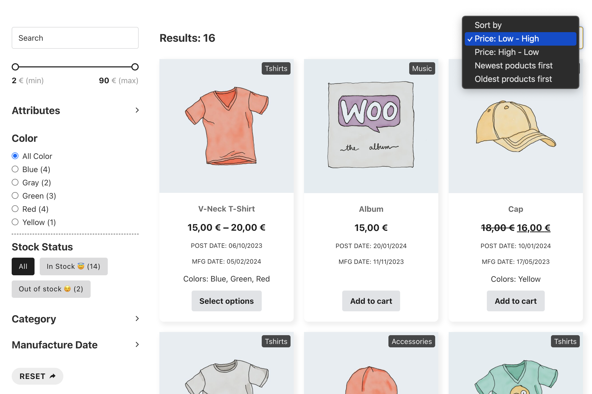

### Apply Filter On "Input" Or "Submit"

By default, any change you apply to a filter, such as selecting a different radio filter option or a checkbox filter value, updates the target query. You can change this behavior by setting the "Apply to" control to "Submit." This way, the query will only be updated by clicking the "Filter - Submit" element connected to the same Target Query.

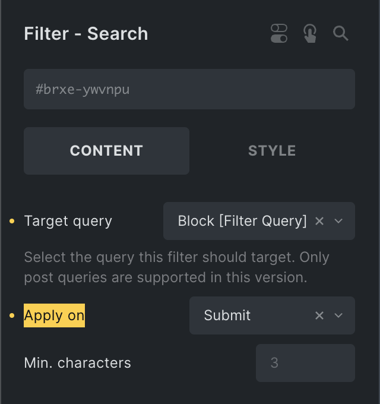

## Filter elements

### 1\. Filter - Active Filters

- **Function**: Displays the currently active or selected filters, allowing users to easily remove a filter with a single click for faster navigation. (@since 1.11)

- **Exclude filter IDs**: If you want certain filters not to appear in the list of active filters once selected, you can specify their Bricks element IDs here (comma-separated).

By default, Bricks displays the value of the active filter as its label. However, you can also customize the label by configuring a Prefix, Suffix, and Title (attribute) on individual filter elements. (See the "Active Filter" tab on each filter element for these options.)

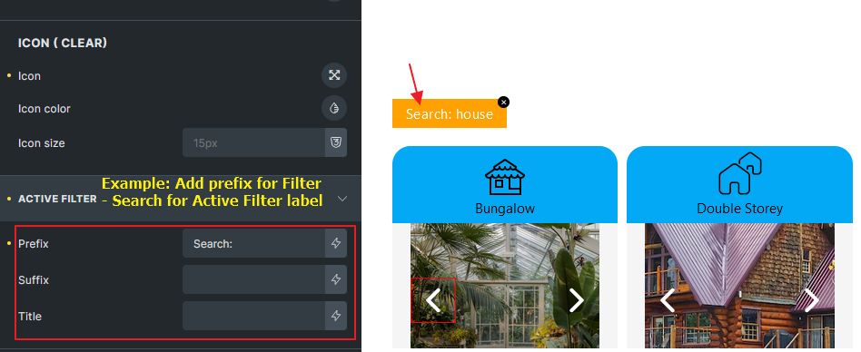

### 2\. Filter - Search

- **Function**: Live AJAX search. (Passes the search term to "s" parameter for Post queries or "search" parameter for User and Term queries.)

- **URL parameter**: This will be used to populate the filter URL parameter in the frontend. (@since 1.11)

- **Debounce (ms)**: Control the delay before triggering the search after typing stops. Improving performance by reducing unnecessary search queries.

- **Min. characters**: The minimum number of characters required to trigger a search. Searches will not initiate with fewer characters. The default is 3 characters.

- **Icon (Clear)**: Set an icon so the search value will be clearable by clicking on it. (@since 1.11)

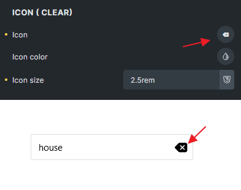

Tips: To ensure compatibility with the WordPress search function when using the Filter - Search element within a Search template, set the URL parameter to "s". This will allow the filter to work seamlessly with the native WordPress search functionality.

### 3\. Filter - Checkbox

- **Filter options**: Taxonomy, Post Fields, Post Meta Fields.

- **Hierarchy display**: Supported.

- **Indent: Prefix/Gap:** Define the prefix or gap for hierarchy display.

- **URL parameter**: This will be used to populate the filter URL parameter in the frontend. (@since 1.11)

- **Terms Order by & Order:** Specify the taxonomy query order parameter. (@since 1.11)

- **Terms (Include/Exclude):** Include/Exclude specific taxonomy terms. (@since 1.11)

- **Top Level Terms Only:** Display only top-level terms (parent = 0) when the source is a taxonomy. (@since 1.11)

- **Hide Count Bracket:** Remove the brackets surrounding the count value. You can style the count by targeting `.brx-option-count`. (@since 1.11)

- **Auto Toggle Child Terms:** If hierarchical option is enabled, this option automatically toggles the check value of child terms when their parent option is clicked. (@since 1.11)

- **Mode:** Option to select “Button” style or traditional “Checkbox” inputs for the filter display. (@since 1.11)

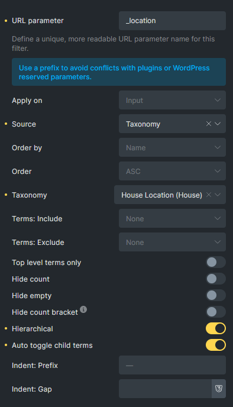

### 4\. Filter - Datepicker

- **Filter options**: Taxonomy, Post Fields, Post Meta Fields.

- **Enable time**: Adds time selection capability to the date filter.

- **Date range**: Enables selection of a range of dates.

- **Min/max date**: Option to utilize minimum and maximum dates from the index table for filtering.

- **URL parameter**: This will be used to populate the filter URL parameter in the frontend. (@since 1.11)

### 5\. Filter - Radio

- **Filter options**: Taxonomy, Post Fields, Post Meta Fields.

- **Hierarchy display**: Supported.

- **Indent: Prefix/Gap:** Define the prefix or gap for hierarchy display.

- **Action**: Choice between applying a filter or sorting.

- **Mode**: Option to select "Button" style or traditional "Radio" inputs for the filter display.

- **URL parameter**: This will be used to populate the filter URL parameter in the frontend. (@since 1.11)

- **Terms Order by & Order:** Specify the taxonomy query order parameter. (@since 1.11)

- **Terms (Include/Exclude):** Include/Exclude specific taxonomy terms. (@since 1.11)

- **Top Level Terms Only:** Display only top-level terms (parent = 0) when the source is a taxonomy. (@since 1.11)

- **Hide Count Bracket:** Remove the brackets surrounding the count value. You can style the count by targeting `.brx-option-count`. (@since 1.11)

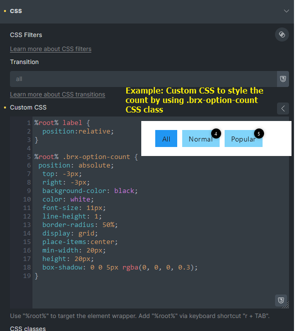

### 6\. Filter - Range

- **Source**: Currently limited to "Custom Field" to specify a meta key (e.g. `_regular_price`, which represents the standard product price in WooCommerce).

- **Automatic min/max**: Automatically sets minimum and maximum values based on the results of the query loop.

- **Mode**: Offers a choice between a "Slider" or "Input" style for the range selection.

- **URL parameter**: This will be used to populate the filter URL parameter in the frontend. (@since 1.11)

- Slider section: More controls to style the "Slider" mode range filter. (@since 1.11)

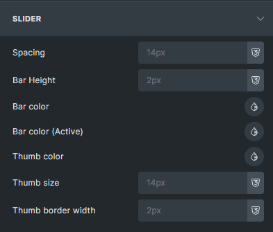

### 7\. Filter - Select

- **Filter options**: Taxonomy, Post Fields, Post Meta Fields.

- **Hierarchy display**: Supported.

- **Indent: Prefix:** Define the prefix for hierarchy display.

- **Action**: Choice between applying a filter or sorting.

- **URL parameter**: This will be used to populate the filter URL parameter in the frontend. (@since 1.11)

- **Terms Order by & Order:** Specify the taxonomy query order parameter. (@since 1.11)

- **Terms (Include/Exclude):** Include/Exclude specific taxonomy terms. (@since 1.11)

- **Top Level Terms Only:** Display only top-level terms (parent = 0) when the source is a taxonomy. (@since 1.11)

### 8\. Filter - Submit / Reset

- **Functionality**: Provides buttons to reset or submit (apply) all filters of the target query.

- **Action:** The button act as a "Submit" or "Reset" button.

- **Hide if No Active Filter:** Enable this option to hide the button when there are no active filters on the target query. Bricks will add the `.brx-no-active-filter` class to this button, allowing you to apply custom CSS for alternative styling. _(Reset action only)._ (@since 1.11)

- **Redirect to:** Specify a URL where Bricks will redirect users while preserving all current filter values. This is particularly useful for scenarios like a Live Search on the homepage, where users can be redirected to a dedicated Search page with pre-filtered parameters. _(Submit action only)._ (@since 1.11)

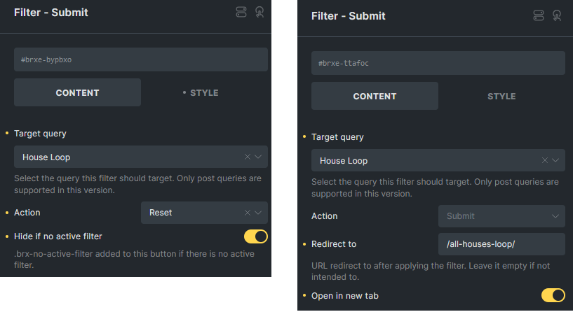

### 9\. Pagination element

Select the "Enable AJAX" option on the Pagination element to ensure compatibility with other filter elements.

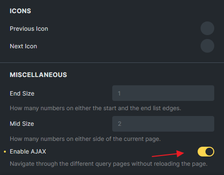

## Dynamic Data Tags

The Query Sort / Filter comes with two new dynamic data tags (`search_term_filter`, `query_results_count_filter`) whose value automatically updates whenever the query results change.

`{search_term_filter:quer34}` - Wraps the search term result in `<span data-brx-ls-term="quer34">>`. Updates dynamically with AJAX when the targeted Query ID `quer34` (your element's Query ID) is refreshed.

`{query_results_count_filter:quer34}` - Encloses the query results count in `<span data-brx-qr-count="quer34">>`. Dynamically updates in response to AJAX changes in the Query ID `quer34` (your element's Query ID).

#### search\_term

The new `search_term` dynamic data tag renders the search term value.

`{search_term}` - Outputs the value of `$_GET['s']` or `get_query_var('s')`, ideal for displaying the current search term on the page.

`{search_term:quer34}` - Retrieves the `search` query variable from the Query ID `quer34`. To find your Query ID, copy the element ID of the query element into your clipboard and use the last six characters, omitting the “#brxe-” prefix.

It is meant to be used on a static search results page. To display the search term value of the `Filter - Search` element, make sure to use the new `search_term_filter` dynamic data tag instead.

#### active\_filters\_count

Since version 2.0, Bricks introduce a new `{active_filters_count}` tag to dynamically display the number of active filters for a target query. It outputs a `<span>` element that updates automatically when filters change.

`{active_filters_count:ehljca}` - Displays the active filter count for the query with ID `ehljca`.

`{active_filters_count:ehljca @exclude:'desplk,mn3p9,88510'}` - Excludes the specified filter element IDs from the count.

You can style the span using:

```php
span[data-brx-af-count] {
  /* Your styles here */
}
```

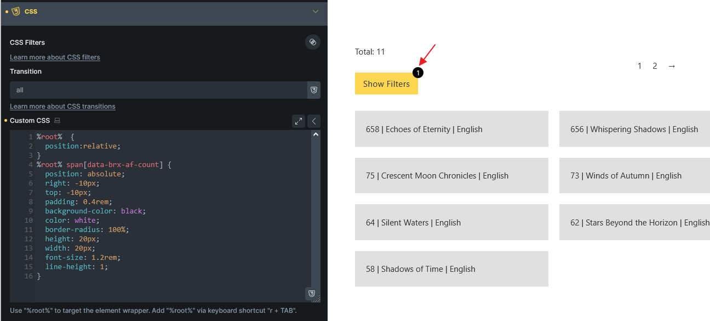

This allows for easy integration into buttons, badges, or other UI components to show the number of active filters visually while the actual filters located inside Offcanvas.

## Live Search

While the "Filter - Search" element connected to a Target Query updates the results immediately, it is meant to be used for search queries that you render on the initial page load, such as your WooCommerce shop page or your blog home page.

You can also create a true live search, whose query results only appear after performing a search using the "Filter - Search" element.

All you need to do is enable the "Is live search" setting inside your target query loop element like this:

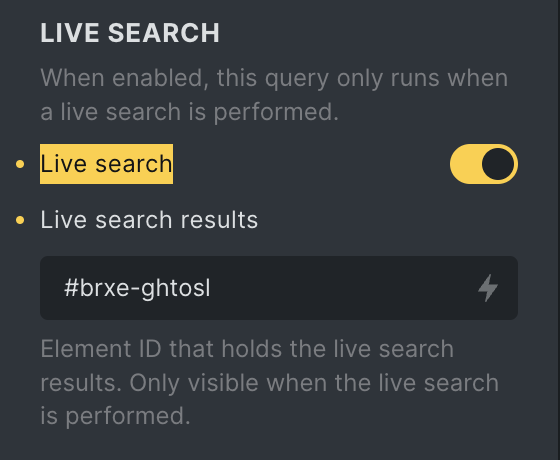

Once enabled, this query only runs when a live search is performed.

To hide the query initially (on page load), edit the element that holds your live search results. This is usually the parent element of your query loop or another outer element of your query.

Then, copy its element ID (e.g. `#brxe-dx44gp`), return to your query settings, and paste this element ID from your clipboard into the `Live search results` text input field.

**Live search demo:** [https://youtu.be/5oDHG-bTAfQ?si=ZR61wiAVxFFbjP-c&t=461](https://youtu.be/5oDHG-bTAfQ?si=ZR61wiAVxFFbjP-c&t=461)

## Update Filter Index

Applicable for checkbox, datepicker, radio, range, and select elements inside the builder. Also available from the WordPress dashboard under `Bricks > Settings > Query filters`.

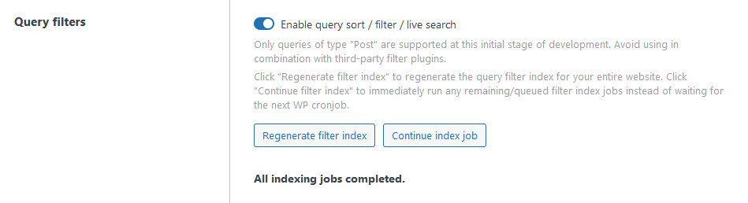

If the indexing jobs remain pending without any progress, please check [this solution](/article/known-issues/#query-filter-indexer-no-progress).

Regenerate filter index:

- **Purpose**: Ensures all filter options are up-to-date.

- **Function**: Regenerate indexing job for all filter elements, generate index records and stored in a custom table.

Continue index job: (`@since 1.10`)

- **Purpose**: Immediately run any remaining/queued filter index jobs instead of waiting for the next WP cronjob.

- **Function**: Trigger the indexing jobs and update the progress on settings page.

If your website is protected by HTTP Authentication, the indexing process may get stuck. To prevent this, add the following snippet to your child theme.

```php
add_filter( 'bricks/remote_post', function( $args, $url ) {
  if ( strpos( $url, 'action=bricks_background_index_job' ) === false && strpos( $url, 'action=bricks_system_info_wp_remote_post_test' === false ) ) {
    return $args;
  }

  // Add Basic Auth to the request
  $username = 'XXXX'; // Replace XXXX to your HTTP Auth username
  $password = 'XXXX'; // Replace XXXX to your HTTP Auth password

  $args['headers']['Authorization'] = 'Basic ' . base64_encode( $username . ':' . $password );

  return $args;
}, 10, 2 );
```

## Custom Option Labels

Applicable for checkbox, radio, and select elements.

- **Use Case**: "Source" is set to "Custom field" or "WordPress field."

- **Example**: Mapping `_stock_status` to a user-friendly label.

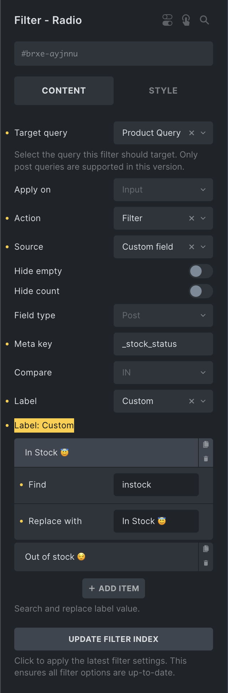

## Filter By URL Parameter

Starting with version 1.11, Bricks Query Filters now support filtering based on URL parameters.

A new control, "**URL Parameter**", has been added for the Filter types: Search, Checkbox, Radio, Range, Datepicker, and Select. If you don't define a custom parameter, Bricks will automatically use `brx_{BRICKS_ID}` as the default parameter. For example, a filter with the ID qwe123 would use the URL parameter `brx_qwe123`.

You can assign unique parameters to each filter using the "**URL Parameter**" field. When setting custom parameters, it's recommended to use a unique prefix to prevent conflicts with other plugins or WordPress reserved parameters.

#### What to Expect

- Filter options will be pre-selected or activated if the URL contains the corresponding parameter, such as: `/my-page/?filter-a=230&filter-b[]=3&filter-b[]=5`

- On page load, the query will display the filtered results based on the provided URL parameters.

- As users interact with filter options after the page loads, the URL parameters will dynamically update to reflect the selected filters.

- For **[Live Search Queries](#live-search)**, URL parameters won't be populated. However, you can use a **[Filter-Submit](#filter-submit-reset-element)** element and define a URL if you wish to pass the current filter values to a specific page or target URL.

## Browser History

Starting in version 1.11, each filter action will be tracked and added to the browser's history using the **popstate** event. This means users can navigate through their filtering history using the browser’s forward and backward buttons, and the filtered results will be displayed accordingly.

This feature ensures a smoother browsing experience, allowing users to easily revisit previous filter states without losing their progress. As they navigate through the filter history, the query will automatically update to reflect the filters active during that step, providing a more intuitive and user-friendly experience.

## Interactions

In version 1.11, two new interaction triggers —**Filter: Empty** and **Filter: Not Empty**— were introduced. These triggers allow you to dynamically show or hide elements based on whether the associated filters' options or values meet specific conditions.

These triggers are particularly useful for enhancing user experience by adapting the visibility of elements based on the state of filters in real time. You can set interactions on any element, enabling a more dynamic and responsive design without writing custom JavaScript.

Example:  
Imagine you have a block containing a heading element that says "Active Filters" and an **Active Filters** element listing the filters currently in use. You want to hide this entire block when no filters are active. To achieve this, you can apply an interaction on the block using the **Filter: Empty** and **Filter: Not Empty** triggers with **Hide element** and **Show element** action.

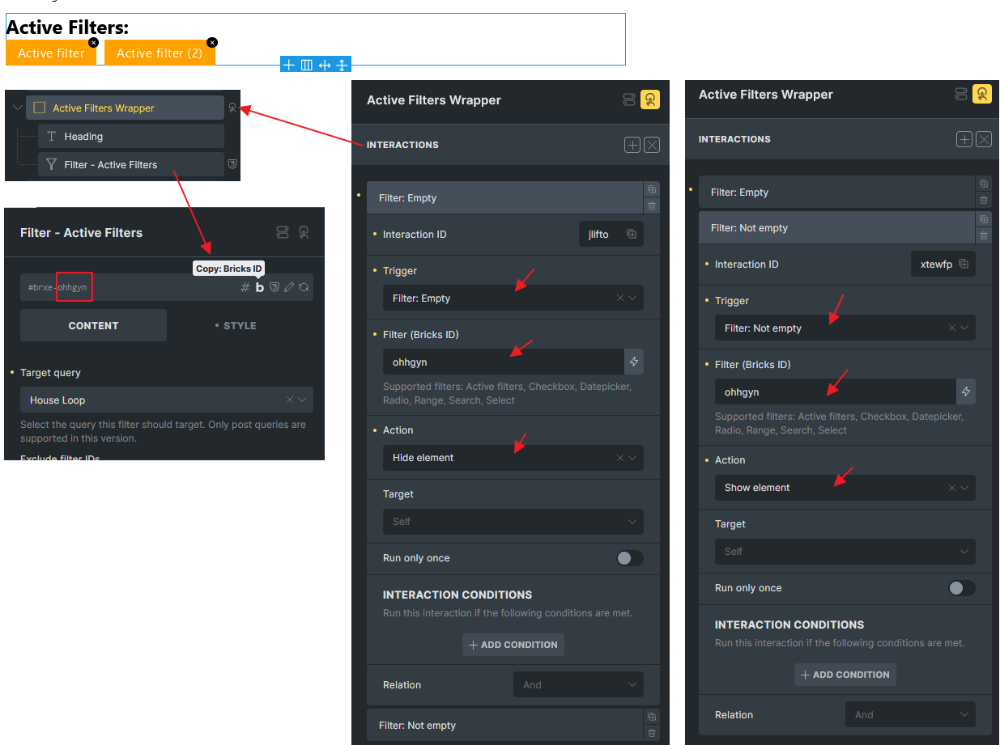

Expected result:

- **Filter: Empty** – The block will hide when there are no active filters, ensuring the page doesn’t show unnecessary UI elements.

- **Filter: Not Empty** – The block will appear when at least one filter is active, keeping the heading and filter list visible for the user to interact with.

For more details on these triggers, see the [Interactions documentation](/article/interactions/#trigger-filter-empty-or-not-empty).

## Custom Fields Integrations

Starting with version 1.11.1, Bricks introduced a **Custom Fields Integrations** feature, which you can enable under **Bricks > Settings > Query Filters**. When this setting is turned on, Bricks can retrieve settings from supported custom field providers, allowing it to index field values accurately and generate query parameters for filtering—even for fields stored in serialized format, which wasn’t previously possible.

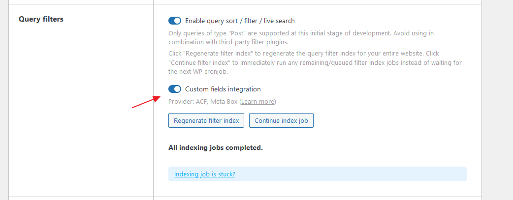

In the builder, when the filter source is set to "Custom Field," a new **Provider** dropdown will appear. Select the appropriate provider here, and a **Dynamic Tag** picker will then appear in the "Meta Key" field. Use this picker to select the custom field. From this point on, Bricks will automatically retrieve the field's settings.

Note: The dynamic tag is not intended to parse dynamic data directly; it simply allows Bricks to access the field settings. Do not use irrelevant dynamic tag here.

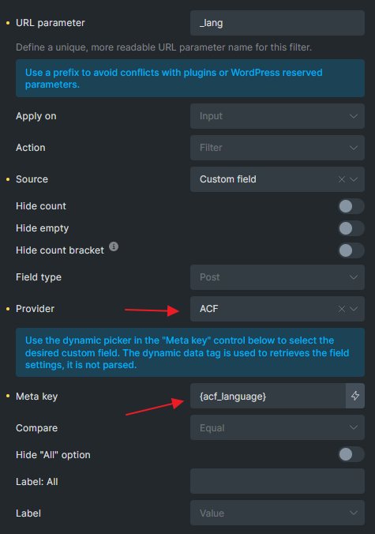

With this feature enabled, Bricks can:

- Automatically retrieve choices set in ACF or Meta Box fields and display them as options in **Filter - Checkbox, Radio, and Select** elements.

- **Filter - Datepicker:** Access ACF and Meta Box date and time formats without requiring manual configuration.

- **ACF Compatibility:** Support fields like Relationship, multiple values fields, and Post Object fields.

- **Meta Box Compatibility:** Support fields such as multiple choices, and Post, Taxonomy, and User fields. Not support Custom Table fields.

Currently, integrations are available for **Advanced Custom Fields (ACF)** and **Meta Box**.

## New Action: "Results Per Page" for Select and Radio Filters

Introduced in version 1.12.2, the **"Results Per Page"** action is now available for **Filter - Select** and **Filter - Radio** elements. This feature allows users to dynamically adjust the number of results displayed per page in the target query. Supported query types: “Post”, “Term”, and “User”

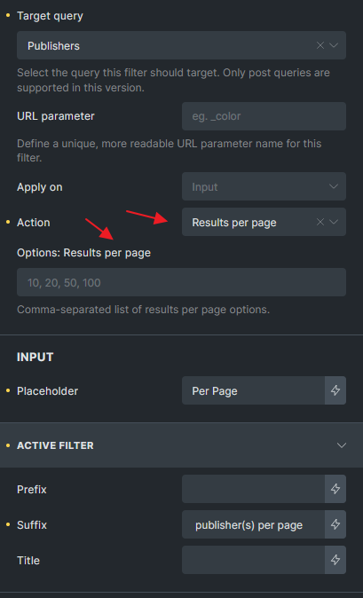

By default, the available options are 10, 20, 50, and 100. However, you can customize these values using the "Options: Results Per Page" control. URL parameter will be generated and supported too like other filter elements.

Example:

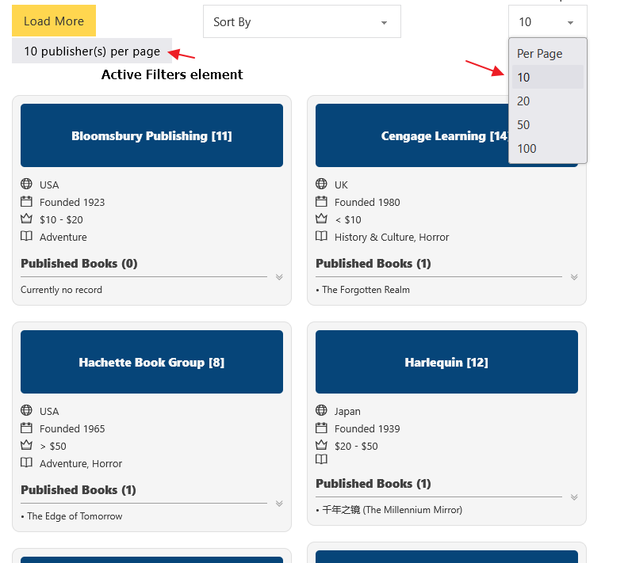

Note: This action does not modify the original query per page setting. When active, it will be displayed in the Active Filters element (if present). If you do not want it to appear, you can exclude it by entering the element ID in the Active Filters element settings.

This enhancement provides greater flexibility, allowing users to refine their search experience by selecting their preferred number of results per page.

## WooCommerce Filter Support (Source)

Starting from version 2.0, you can now choose WooCommerce as a Filter Source if WooCommerce is installed on your website.

Once selected, each filter element will display additional WooCommerce-specific options depending on the filter element and action mode.

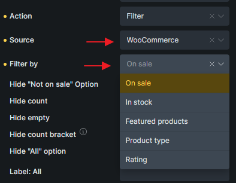


|  | Filter - Radio, Filter - Select | Filter - Checkbox | Filter - Range |
| --- | --- | --- | --- |
| On Sale | ✔️ | ✔️ |  |
| In Stock | ✔️ | ✔️ |  |
| Featured Products | ✔️ | ✔️ |  |
| Product Type | ✔️ | ✔️ |  |
| Rating | ✔️ |  |  |
| Price |  |  | ✔️ |
| (Sort) Price | ✔️ |  |  |
| (Sort) Rating | ✔️ |  |  |


These filters make it easier to create intuitive product filtering experiences for WooCommerce stores without custom coding. Let customers narrow down product listings using stock status, pricing, rating, and more—all fully integrated with Bricks Query Filters. (**Note: Filter by Rating in Radio or Select elements is text-based only.**)
