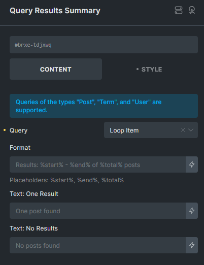
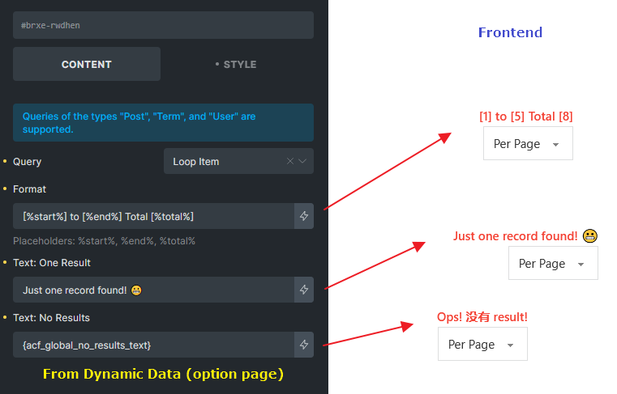

The Query Results Summary element, introduced in version 1.12.2, allows you to display a dynamic count of results within a query, helping users understand which items they are currently viewing in relation to the total number of results. This is particularly useful for search results, archive pages, and paginated lists where users navigate through multiple pages of content. It can be found in the elements panel under the "Query" category.

**Note:** If a third-party plugin disables Bricks Query history via the `[bricks/query/force_run](/article/filter-bricks-query-force_run/)` hook, the results summary may display incorrect information.

## Controls

#### Query

Select the **target query** for which the summary should be displayed.

#### Format

Customize the summary text using placeholders:

- `%start%` – The index of the first item on the current page.

- `%end%` – The index of the last item on the current page.

- `%total%` – The total number of results.

Default format: `Results: %start% - %end% of %total% posts`

Example output: Results: 1 - 5 of 14 posts

#### Text: One Result

Define a custom message when the query returns exactly **one** result to handle singular/plural differences.

Default text: One post found

#### Text: No Results

Specify a custom message when the query returns **zero** results.

Default text: No posts found

## Compatibility

The **Query Results Summary** element works seamlessly with Bricks' native AJAX actions, including:

- AJAX Pagination

- Load More

- Infinite Scroll

- Query Filters

This ensures that the summary updates dynamically as users interact with query-based elements on the page.

Example:

