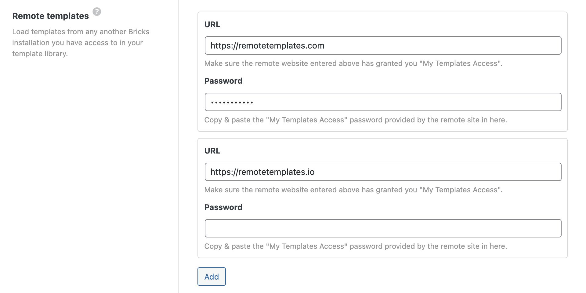
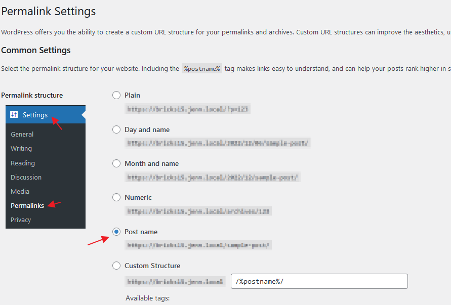
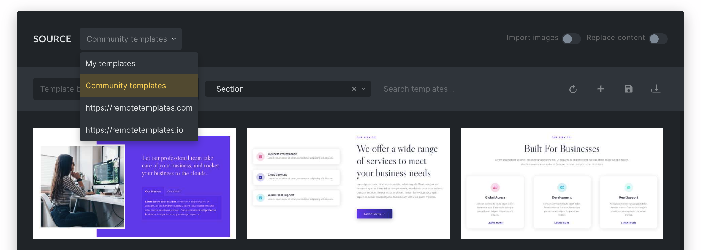

Remote templates allow you to view & insert templates of another Bricks installation. Avoiding the constant template export from one site and then importing them on another site.

Public access to your templates is disabled by default. Follow the steps below to make your templates easily available as a remote template source.

## Step 1: Enable My Templates Access

First, you have to enable template access on the site whose templates you want to browse and insert.

In your WordPress dashboard, go to **Bricks → Settings → Templates** and enable the **My Templates Access** checkbox. With this setting enabled, your template library is accessible to anyone who knows your site URL.

It is recommended to restrict access by whitelisting URLs and/or password protection:

Use the **Whitelist URLs** setting to provide template access only to the specified URLs.

Set a password under **Password Protection** to restrict template access to people who know the correct password.

**Since Bricks 1.9.4, you can add unlimited remote template URLs!** Click the "Add" button to add another template URL. To remove a previously added remote source, clear the URL and password input fields and save your settings.

Please ensure the **permalink structure** of this WordPress website (Settings > Permalinks) is set to something other than **Plain**.

## Step 2: Remote Templates Settings

Log into the site you want to browse and insert templates from.

Go to **Bricks → Settings → Templates** and paste the URL of the Bricks site you want to retrieve templates from into the **Remote Templates URL** field.

If you've set password protection on the other website, make sure to enter the password under **Remote Templates Password**.

Then click **Save Settings**, open the builder, and then open the template library.

You should now see the remote template URLs added to the template `SOURCE` dropdown, as illustrated in the following screenshot:

Since version 1.9.4, Bricks pulls in the latest template data every time you view a remote template source instead of storing it in your database. Guaranteeing you that you always work with the latest remote template data without having to worry about refreshing the remote templates every time.
