What looks great on a large desktop screen usually needs some refinement for smaller devices. This typically involves applying smaller font sizes, margins, paddings, column width/stacking, or hiding certain elements on smaller devices.

Bricks provides the following four breakpoints out-of-the-box:

| **Breakpoint** | **@media query** |
| --- | --- |
| Desktop | Base breakpoint |
| Tablet portrait | < 992px |
| Mobile landscape | < 768px |
| Mobile portrait | < 478px |

Styles set on the base breakpoint are inherited by all other breakpoints.

Once you've finished styling a page on the base breakpoint (desktop), make sure to view & adjust the styling on the other breakpoints too.

To view & edit the styles for a specific breakpoint simply click on its breakpoint icon located in the center of the builder toolbar. Or via the [keyboard shortcut](https://academy.bricksbuilder.io/article/keyboard-shortcuts/) "CMD/CTRL + B".

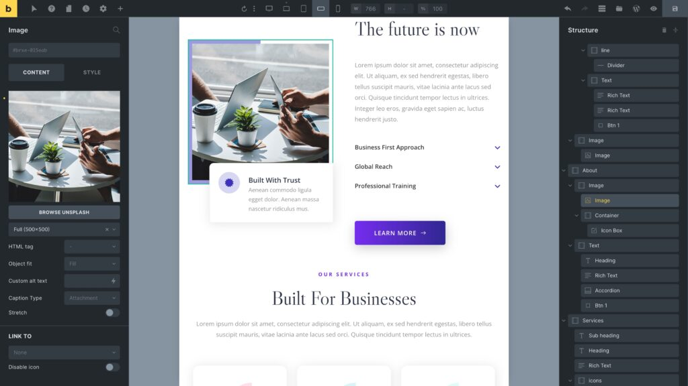

<figcaption>

Editing in the "Mobile landscape" breakpoint

</figcaption>

The screenshot above shows the builder editing the **Mobile portrait** breakpoint.

Next to the breakpoint icons are inputs for width ("W"), height ("H"), and scale (%).

## Custom Breakpoints

To start using custom breakpoints, you first have to enable them in your WordPress dashboard under `Bricks > Settings > General > Custom breakpoints`:

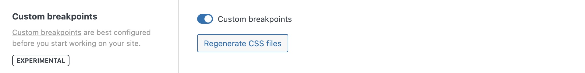

Once enabled, you can access the **breakpoint manager** in the builder by clicking the three-dotted icon in the builder toolbar (next to the first breakpoint icon):

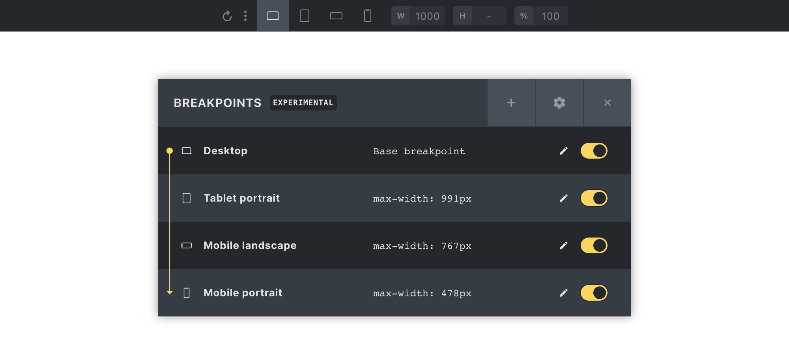

<figcaption>

Breakpoint Manager (open via the three-dotted icon in the builder toolbar)

</figcaption>

### Editing a breakpoint

Clicking the pencil icon brings up the editing options of the selected breakpoint:

<figcaption>

Editing the default "Tablet portrait" breakpoint

</figcaption>

You can edit the following breakpoint properties:

| **Property** | **Description** |
| --- | --- |
| Label | Used when hovering over the breakpoint icon in the builder toolbar |
| Width (px) | @media query min-width/max-width value (depending on the base breakpoint) |
| Width (Builder) | Width is used when switching to the breakpoint in the builder |
| Icon | Used as the breakpoint icon in the builder toolbar |
| Base breakpoint | Set breakpoint as base breakpoint |
| _Key_ | _Not customizable (used to store & identify breakpoint settings)_ |

The most common action is to customize the widths of the default (mobile) breakpoints. The following screenshot shows you the "Tablet portrait" with a custom width of 1023px:

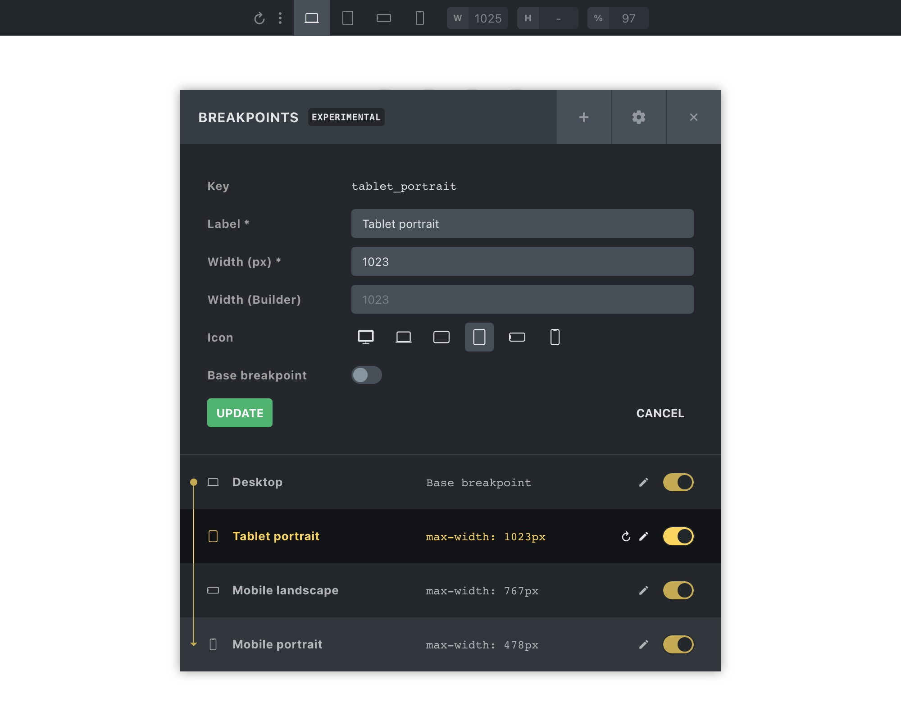

That means any styles set on the "Tablet portrait" breakpoint will apply to devices with a width of less than 1024px.

### Creating new breakpoints

You can create as many additional custom breakpoints as you want. Although, it is recommended to customize the widths of the default mobile breakpoints to your liking before utilizing more breakpoints.

You should rarely need more than one or two additional breakpoints on top of the default ones.

Clicking the "+" (plus) icon in the breakpoint manager's header launches the breakpoint creator form.

The following screenshot shows how we created a new breakpoint named "Large" with a width of 1400px:

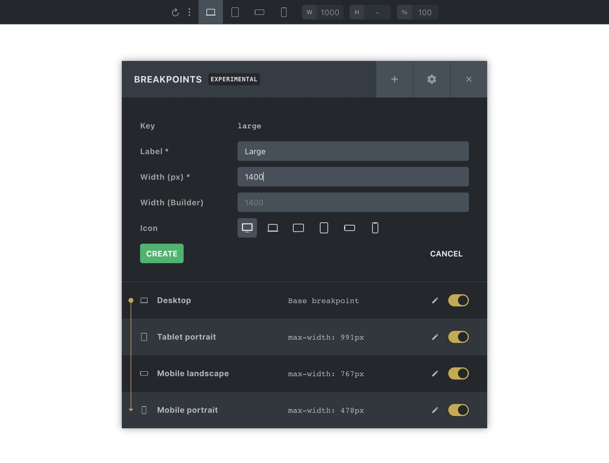

<figcaption>

Creating a new breakpoint

</figcaption>

Once you click "Create" your newly created breakpoint should appear in the breakpoint manager (alongside a "CUSTOM" label) & in the builder toolbar like this:

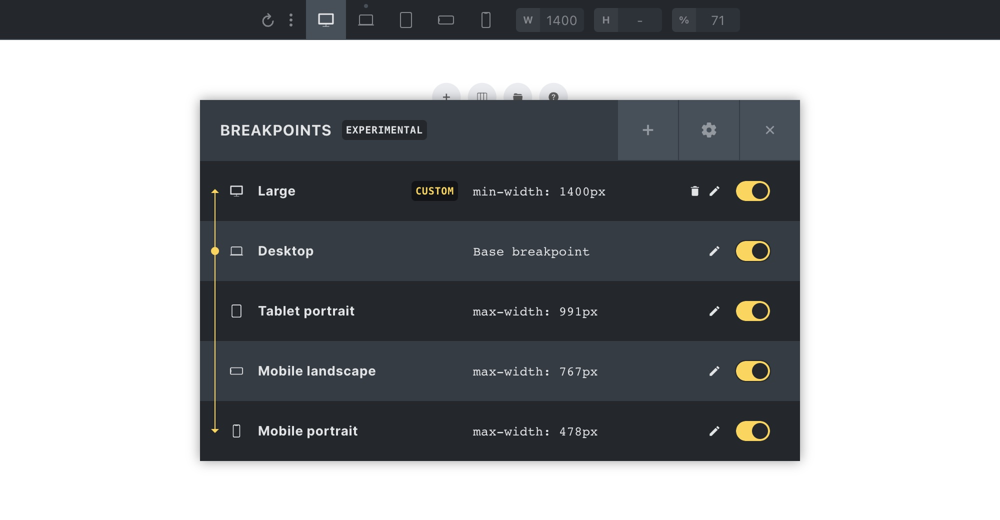

<figcaption>

Breakpoint manager with new custom breakpoint

</figcaption>

As we've set the width of this new breakpoint to 1400px, it shows as the first breakpoint, as it is now the largest of our breakpoints. The Desktop (base breakpoint) has a default width of 1279px.

### Pausing a custom breakpoint

You can pause any of your custom breakpoints by toggling the checkbox at the right-hand side of the breakpoint manager:

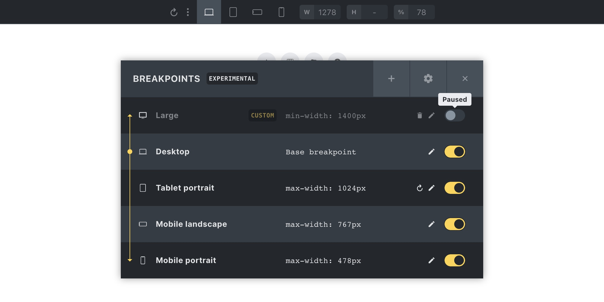

<figcaption>

Pausing custom breakpoint "Large"

</figcaption>

Pausing a custom breakpoint allows you to skip generating the styles for it on the frontend, while still retaining the styles you've set throughout your site without having to delete them one by one. Which, on a full-built-out site, can go into thousands of settings.

### Resetting a default breakpoint

To restore the default values of a default breakpoint, click on the "reset" icon (next to the pencil) icon.

### Resetting all breakpoints

Clicking the "gear" icon in the breakpoint manager header opens up the "Reset: Breakpoints" action. Clicking this button removes all your breakpoint edits (default & custom breakpoints) from the database.

**Breakpoint-specific settings performed on an element or the Theme Styles are not deleted. Please choose desktop or mobile-first at the very beginning.**

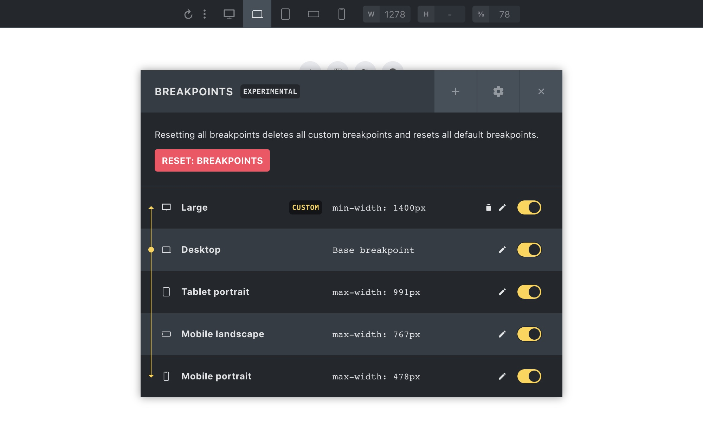

### Understanding the base breakpoint

The base breakpoint doesn't have a @media query. So all styles set on the base breakpoint apply to all screen widths.

That is why, by default, any styles set on the "Desktop" breakpoint are visible on any other breakpoint. Unless you specify a style on a specific breakpoint. Then the breakpoint-specific rule precedes the base breakpoint style.

When editing a breakpoint, you can set it as the "Base breakpoint". Then all styles set on this new base breakpoint are inherited up & down the breakpoint chain.

In the following screenshot, you can see that the "Tablet portrait" breakpoint has been set as the base breakpoint.

The yellow dot, lines, and arrows next to the breakpoint icons should help to visualize the style inheritance:

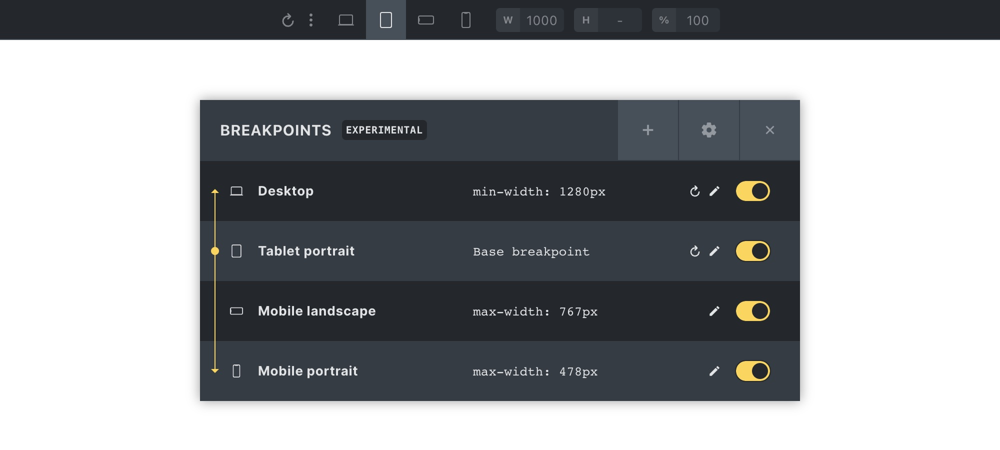

<figcaption>

Changed base breakpoint to "Tablet portrait"

</figcaption>

### Mobile-first design

Styling in Bricks, by default, happens from the largest breakpoint down to "Tablet portrait" > "Mobile landscape" and "Mobile portrait".

Utilise a so-called `**mobile-first**` design approach by setting the smallest breakpoint as the base breakpoint.

The following screenshot shows the "Mobile portrait" (our smallest breakpoint) set as the base breakpoint. We now use the mobile-first approach. Also indicated by the "MOBILE FIRST" label in the breakpoint manager header:

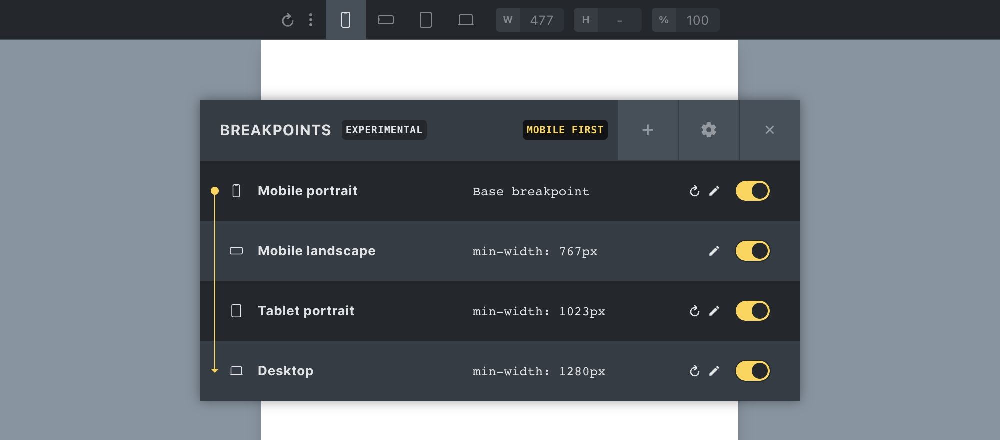

<figcaption>

Mobile-first design in Bricks

</figcaption>

You'll also notice that the order of the breakpoints is reversed and now starts at the smallest breakpoint. You can now start to design your pages starting at the smallest breakpoint.

### Regenerating (Bricks) CSS files

Whenever you customize the width of a default breakpoint, Bricks automatically updates any Bricks CSS files (like frontend.min.css, etc.) that contain media queries for this breakpoint.

If you experience that your breakpoint widths on the front end are not correctly applied, please regenerate your Bricks CSS files by clicking the "Regenerate CSS files" button under `Bricks > Settings > General > Custom breakpoints`.

## Responsive control indicator

In Bricks 1.11.1, we introduced the responsive control indicator which helps you see which controls can have different values at different breakpoints. We provide multiple options for when to show this indicator to suit different preferences. You can adjust these under `Bricks > Settings > Builder > Control panel > Responsive control indicator`:

- **Show if any value exists (Default)**: Displays if a control has any value set across breakpoints.

- **Show if non-base breakpoint value exists**: Shows only if a control’s value differs from the base breakpoint.

- **Show on all responsive controls**: Displays on all responsive controls, regardless of values.

- **Disable**.

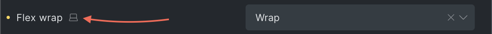
