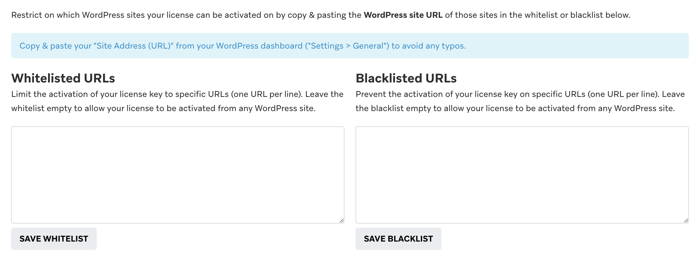
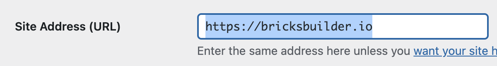

By default, you can activate your Bricks license key on any website that runs the Bricks theme. That is, if you have not already reached the site limit of your purchased license ([https://bricksbuilder.io/pricing/](https://bricksbuilder.io/pricing/)).

To restrict on which WordPress sites your license can be activated, navigate to the "Sites" tab of your Bricks account at [https://my.bricksbuilder.io/#sites](https://my.bricksbuilder.io/#sites) and scroll to the "Whitelist/blacklist URL" section at the bottom:

There, you can add the URLs of the WordPress sites that you want to allow your license key to be activated at (= whitelist) or disallow your license key to be activated at (= blacklist).

**NOTE:** Removing an activated site from the list of sites at https://my.bricksbuilder.io/#sites is not enough to stop it from reappearing. Please make sure to remove the site, and add it to either the white- or blacklist.

### Using the correct site URL

To make sure you are adding the correct URL to the list, navigate the the WordPress dashboard of the site you want to exclude, and copy the URL under `Settings > General > Site Address`.

If you don't have access to the backend of the site, use the home page URL of the site, but without any trailing slash at the end.
