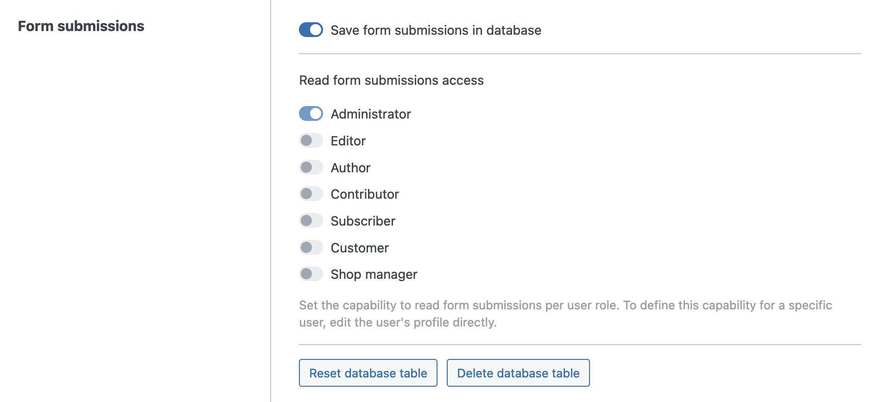
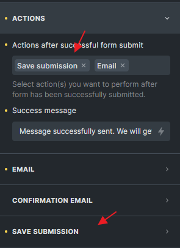
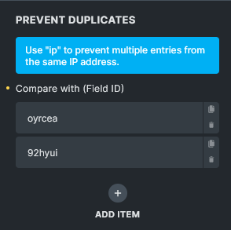
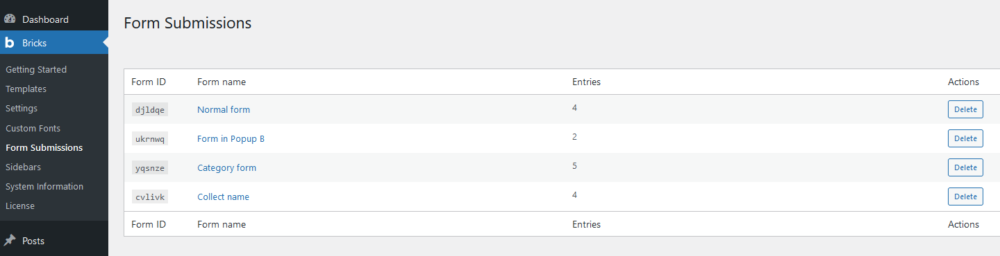
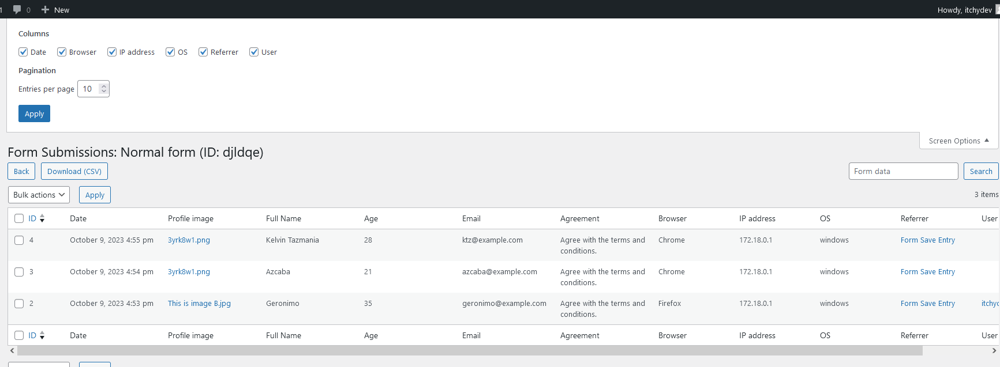

Bricks 1.9.2 introduces an exciting new feature that allows you to capture form submissions. With the new `**Save form submissions in database**` setting, your Bricks experience is now even more powerful and versatile. In this article, we will delve into the details of this feature.

## How to enable

You can find and enable the new `**Save form submissions in database**` setting under `Bricks > Settings > General > Form submissions`.

After enabling it, save your settings. Bricks now creates a custom table named `bricks_form_submissions` in your database (plus your WP database prefix).

You should now also see the following action buttons:

- **Reset database table**: Click this button to remove all form submissions from your database.

- **Delete database table**: Click this button to delete the custom form submissions database table.

It's important to exercise caution when using these buttons, as it permanently clears or deletes the form submissions database table. Make sure you have a backup of your data before proceeding.

## Form action: Save submission

Collecting form submissions is a straightforward process. Simply select the **"Save Submission"** action under the Form element's "Actions" control group.

In the following example, we set the "Save submission" and "Email" actions.

The sequence of your actions matters. If an action fails, execution of all subsequent form actions is halted. Set the order of your form actions according to your workflow and requirements.

In our example, this means if the "Save submission" action fails, the "Email" action that follows it won't be triggered.

## Save submission settings

### Form name

Make sure to give your form a unique and descriptive name, as this name is used on the "Form submissions" page in your dashboard under `Bricks > Form submissions`.

### Save IP address

Enabling this checkbox to save the IP address of the user who submitted the form in the form submission entry. Make sure to add any required information about collecting this person's IP address.

### Max. entries

Set the maximum number of form submissions you want to store in the database for this particular form. This is useful for event registration forms etc.

### Prevent duplicates

You can prevent storing duplicate form submissions if an entry with this particular data already exists.

Copy the unique, six-character ID of the form field you want to check against, create a new item under "Prevent duplicates" and paste your form ID in there.

If you've enabled "Save IP address", you can use the `ip` keyword to prevent saving any submission coming from the same IP address.

A submission is considered a duplicate if all field values you check against match an existing entry in the database.

Submissions flagged as a duplicate aren't saved. A customizable error message appears, and all subsequent form actions are halted.

## Viewing form submissions

To view all collected form submissions, navigate to `Bricks > Form submissions` in your WordPress dashboard.

### Overview page

This overview page provides a summary of all form submissions grouped by their respective forms. This helps you quickly understand the submission distribution across different forms on your website.

The "Delete" button in each form row allows you to delete all entries of the respective form.

This action permanently removes all submissions for the selected form, so make sure you have a backup or genuinely intend to delete them.

### Individual form submission

Click on the "Form name" of the overview page lets you view all entries of a specific form.

A click on "Screen options" in the top-right corner lets you toggle the form submission columns. The available columns include metadata such as Date, Browser, IP address, OS (Operating System), Referrer, and User (if logged in during form submission).

The search box allows you to search for specific form submissions based on the submitted form data. Note that the search queries the form field values, not the metadata such as browser, IP address, etc.

You can select multiple entries from the list and delete them in bulk. This feature simplifies the process of removing specific submissions, especially if you want to clear out any irrelevant, outdated, or test data.

A click on the "**Download (CSV)**" button exports all form submissions for the form you are viewing into a CSV file for further analysis, reporting, or data processing.

### Form submission access

Bricks 1.11 introduces more granular control over who can view form submissions on your site. With the new `bricks_form_submission_access` capability, you can specify which user roles or individual users have permission to access form submissions.

#### User role access

To configure role-based access:

1. Navigate to **Bricks** > **Settings** > **General** > **Form submissions**.

3. Under **Form submissions access**, you will see checkboxes for various user roles on your site such as Administrator, Editor, Author, Contributor...etc.
    - The **Administrator** role is always enabled by default and cannot be disabled.
    
    - For other roles, simply check or uncheck the boxes to grant or revoke access to form submissions.

This allows you to easily control who on your team can view form submissions based on their user role.

#### Individual user access

To configure access on an individual user level:

1. From the WordPress dashboard, go to **Users**.

3. Click to edit a specific user’s profile.

5. In the user profile, find and adjust the **Read form submissions** setting.

This lets you manage form submissions access for specific users, overriding the broader role-based settings if needed.
