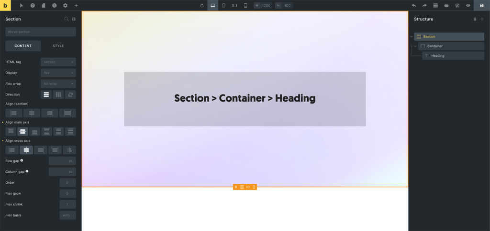

The Section element (available since 1.5) allows you to structure/divide your page into self-containing areas (think: one topic per section).

The [Understanding the Layout](https://academy.bricksbuilder.io/article/layout/) article covers in more detail how to best use the layout elements in Bricks.

The Section element has a default width of 100%, uses the `section` tag, and flexbox.

It should be used at the root level to structure your page into self-containing areas.

When adding a Section to the canvas, a Container element is added inside of the Section automatically. You can delete this Container if not needed. It's just the default behaviour to speed up your site creation process.

<figcaption>

Example: Section > Container > Heading

</figcaption>

## Theme Style: Element - Section

You can change the section `width`, `min-width`, `max-width`, `margin`, and `padding` in your theme styles under the "Element - Section" group.
