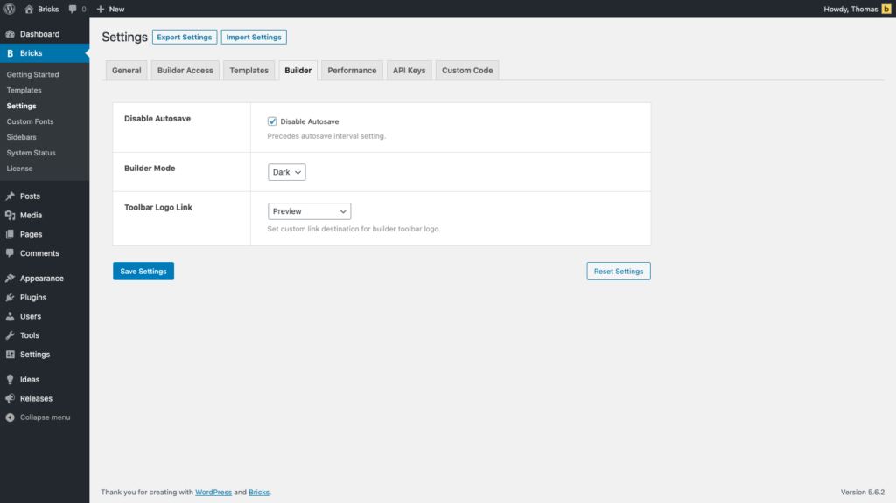

Before diving into the builder lets have a look at the global settings, which you can define under **Bricks > Settings** in your WordPress dashboard. They are organized into different tabs and look like this:

<figcaption>

WordPress Dashboard: **Bricks > Settings**

</figcaption>

## General

- **Post Types:** Select the post types you want to edit with Bricks. Pages are enabled by default. For post types like Posts or custom post types like Property where every post/property shares the same layout you don't have to enable Bricks. You'd create a Bricks template instead and select the post type you want to use this template for under template conditions.

- **WordPress Data:** Select if you want to load your existing WordPress data into Bricks, and save Bricks data into Gutenberg/WordPress compatible data.

- **SVG Uploads:** For security reasons SVG file uploads are disabled in WordPress. Select the user roles you want to enable SVG uploads for. Each SVG upload will be automatically sanitised. As no sanitiser can guarantee a 100% sanitisation it is recommended to only enable SVG uploads for users you trust to upload safe files.

## Builder Access

By default only site admins have full access to Bricks. You can define [builder access](https://academy.bricksbuilder.io/article/builder-access/) for every user role and set it to either No Access, Edit Content, or Full Access. You can also set builder access for individual users when editing a user profile in WordPress.

"Edit content" access means that those users will be able to edit content such as text, images, etc., but aren't able to perform any style or layout changes in Bricks.

## Templates

You'll find all template-related global settings under this tab. For an in-depth look into templates please check out the [Template topic](https://academy.bricksbuilder.io/topic/templates/).

## Builder

Here you can customize the builder autosave interval or disable autosave. Choose between a light or dark builder mode. A little hidden feature is the ability to customise the link destination of the yellow Bricks logo in the builder toolbar.

## Performance

WordPress loads a load of styles and scripts by default, which you might not need on your site. This tab lets you disable emojis, embeds, jQuery migrate.

But also Bricks built-in lazy loading, in case you are experiencing any issues with it.

## API Keys

This is where you have to copy & paste your API keys for services such as Google Maps, Unsplash, Mailchimp, Facebook, etc. into.

## Custom Code

Here you can add any global custom CSS and JavaScript (Google Analytics, etc.) to your site.

## Export/Import

It is possible to save your configuration as a JSON file and transfer it to a fresh installation. However, certain settings including Builder Access, SVG Upload, and Code Execution are not included in the export due to security measures, so they will need to be configured manually after each import.
