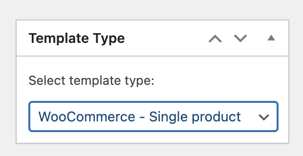
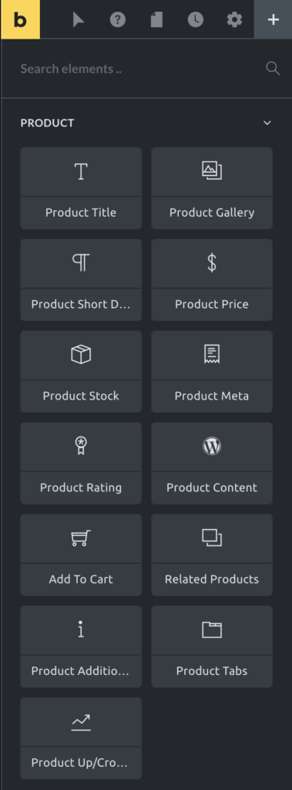
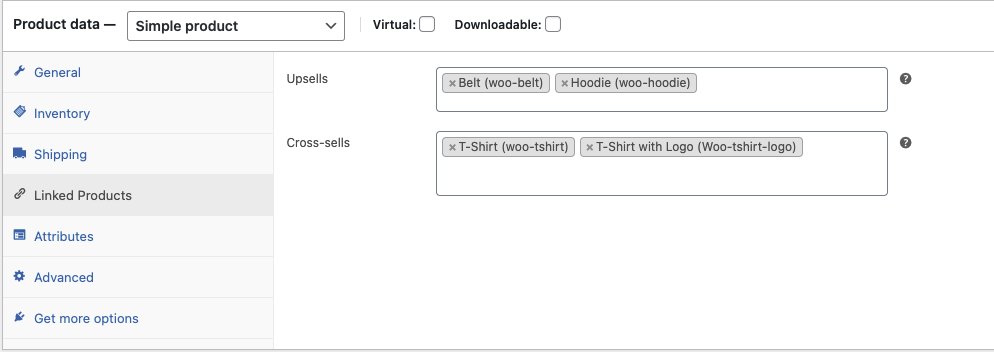

The template type "WooCommerce - Single Product" is only visible if WooCommerce is installed & active.

Create a template of type "WooCommerce - Single product" in Bricks to design an individual layout for the single products page.

To create this template, go to the Bricks templates screen and add a new template. Then select the template type **"WooCommerce - Single Product"** from the top-right dropdown:

Click "Publish" or "Save Draft". Then "Edit with Bricks" to open the builder.

It is also possible to create/edit this and other templates in the Bricks editor interface by clicking on the Folders icon or pressing CMD / CTRL + SHIFT + L.

Please remember to add [template hooks](/article/woocommerce-template-hooks/#single-product-template-hooks) if you are using third-party plugins.

## Single Product Elements

When editing a "Single Product" template you'll find the "Products" elements at the very top of the elements panel:

### Product title

The product title renders the title of the product.

### Product gallery

The product gallery element displays the product images defined in the product image and in the product gallery meta boxes.

_To disable the image zoom or lightbox, go to "Bricks > Settings > WooCommerce > Single Product"._

### Product short description

Renders the content of the Product short description editor.

### Product price

Renders the product price. If the product is on sale, you could hide the regular price.

### Product stock

Displays the number of products in stock. You can replace the number of products in stock with a custom message for "in", "low", or "out of stock".

### Product meta

Use the product meta element to display product data like the SKU, the product categories or tags, or any other WooCommerce metadata. Use [Dynamic Data](https://academy.bricksbuilder.io/article/dynamic-data/) to pull the values.

### Product rating

Shows the product's rating on a scale of 1 to 5 stars.

### Product content

Renders the product's main content as written in the WordPress editor.

### Add to cart

This element adds an "Add to cart" button to trigger the addition of this element to the cart. With this element, you may style the product variations inputs, the product stock, the quantity input, and the look & feel of the button itself.

### Related products

Shows a list of products that have the same product categories and tags of the main product displayed in the page.

### Product additional information

Renders the list of product attributes. This information will also be part of the product tabs element.

### Product tabs

Renders a section with the default tabs: Description, Additional Information, and Reviews. Other tabs might be added by third-party plugins.

### Product up/cross-sells

The product up/cross-sells element renders the list of products defined in the linked product section. You could use this element to list the upsell & cross-sell products (by default, it lists the upsells products).

<figcaption>

WooCommerce product editor screen - Linked Products

</figcaption>

