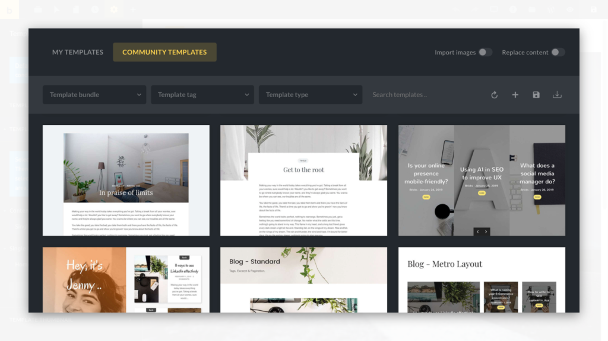
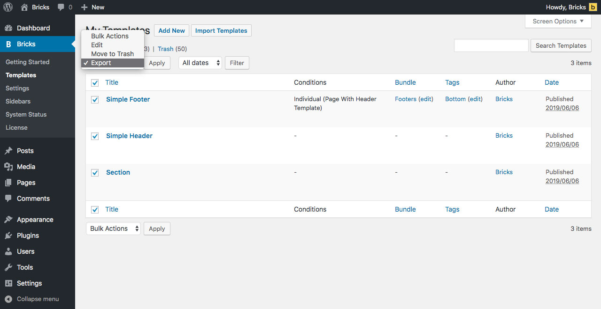

Open the Template Library by clicking the Templates (folder) icon in the builder toolbar or using the CMD / CTRL + SHIFT + L keyboard shortcut. All of your own templates are located under the "My Templates" tab. Browse dozens of pre-designed templates that you can insert with a single click under "Community Templates".

<figcaption>

Template Library: My Templates & Community Templates

</figcaption>

https://www.youtube.com/watch?v=Nj8uPGQ56VY

## Remote Templates

If you've set a Remote Templates URL under **Bricks → Settings** in your WordPress dashboard, then you'll see a **Remote Templates** label instead of Community Templates.

[Remote Templates](https://academy.bricksbuilder.io/article/remote-templates/) allow you to browse templates from any other Bricks installation that you have access to.

## Import Images & Replace Content

In the top right corner of the Template Library are two checkboxes (set to appear like toggles):

- **IMPORT IMAGES**: When checked all template images are downloaded into your media library. Leave it unchecked to insert a template without images. A placeholder image will show instead.

- **REPLACE CONTENT**: When checked your existing content is deleted and the template will be inserted on a blank canvas. If unchecked the template will be inserted after the last section.

## Template Filters

Located below the template sources are the following template filters:

- **Template Bundle**: Select a template bundle to show only templates that belong to the selected bundle. A template bundle can be a collection of templates of the same website (e.g. home page, contact, about us page, etc.)

- **Template Tag**: Select a template tag to show only templates that have the selected tag assigned to them.

- **Template Type**: Select a template type to show only templates of the selected template type.

- **Search Templates**: Enter any keyword to search for a specific template.

## Template Actions

Next to template filters you'll find the following actions:

### Create Template

Click the "+" icon to create a new template. Enter a title and select a template type. The template bundle is optional. Click **CREATE TEMPLATE** to create a new template.

You can also create a new Bricks template from the WordPress dashboard by going to **Bricks → Templates** and click **Add New**. Then give your template a title, select a template type from the meta box on the right side of the editing screen and click **Publish**. Template tags and bundles are optional.

### Save As Template

Click the "disk" icon to save your existing content as a template. Enter a title and select a template type. Selecting a template bundle is optional. Click **SAVE NEW TEMPLATE** to save your template.

To save a specific section as a template hover over a section in the builder. The Edit (pen) icon should appear in the bottom right corner. Hover over it, and click the "disk" icon (Save Section As Template). Give your template section a name and select template type "Section". Then click **SAVE NEW TEMPLATE**.

### Import Template

Click the download icon to import existing template(s). You can import a single template (JSON file) or multiple templates in ZIP format.

Click "Select file(s) to import" and select the JSON/ZIP file from your computer or drag and drop those files into the marked drop zone.

To import templates from the WordPress dashboard go to   
**Bricks > Templates** and click **Import Templates**.

Select your template file (JSON/ZIP) from your computer and click **Import template(s)**. Or drag and drop those files into the drop zone.

### Sync Templates

The sync icon is only available for Community Templates, and will check if any new Community Templates are available.

## Export Template(s)

To export a template, hover over the template title and click **Export Template**. This will generate and download a JSON file with your template data onto your computer.

To export multiple templates at once as a ZIP file, go to **Bricks → Templates** in your WordPress dashboard, and select the templates you want to export.

Now select **Export** from the **Bulk Actions** dropdown, and click **Apply**:

A ZIP file of your selected templates will be generated and downloaded onto your computer.

This ZIP file contains all templates as individual JSON files. Either unzip it to import individual templates or import the entire ZIP file to bulk import all templates at once.
