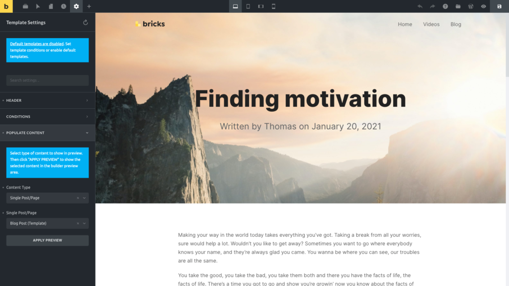
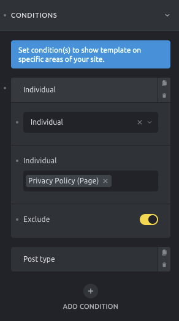

When editing a template click the **Settings** (gear) icon in the builder toolbar to access the **Template Settings**:

<figcaption>

Toolbar > Settings > Template Settings

</figcaption>

You should see the following Template Settings groups:

## Group: Header

Only available when editing a header template. Here you can set the header position (top/right/left), header width (when header position is set to left/right). Make your header sticky and optionally slide up on scroll.

## Group: Conditions

We had a look at Template Conditions in the [Intro To Templates](https://academy.bricksbuilder.io/article/an-intro-to-templates/#template-conditions) article. They determine where on your site a specific template is displayed.

You can choose from the following template conditions:

- Entire website (usually used for header/footer templates)
- Front page
- Post type (e.g. single post blog layouts)
- Archive (your archive pages)
- Search results (your search results page)
- Error page (404 error page)
- Terms (term archive pages)

Bricks, by default, displays published templates of certain [template types](https://academy.bricksbuilder.io/article/an-intro-to-templates/#template-types) on the frontend of your site.

To disable this behavior visit your WordPress dashboard and go to **Bricks → Settings → Templates → Disable Default Templates**.

A blue notification in the builder panel tells you if this setting is disabled or not (see screenshot above). Clicking the notification link brings you to the Bricks settings page, where you can disable default templates.

### Exclude conditions

Since Bricks 1.3.6 you'll be able to apply exclude conditions for any template. To exclude a specific condition you need to toggle the exclude control. Excluding a certain condition will let Bricks know that if the condition applies in a certain scenario, then this template won't be used.

## Group: Populate Content

Here you can choose to populate the canvas with the content of a specific page.

Let's say you are editing your header template and would like to see how it looks together with your homepage content.

Select **Single Post/Page** under **Content Type** and then select your homepage from the dropdown below. Click **Apply Preview** to saves and reload your template with the selected content.

### WordPress Admin Area: Set Template Preview Image

A template's featured image is used when browsing "My Templates" in the Template Library. You can assign a featured image when editing a template in the WordPress dashboard.
