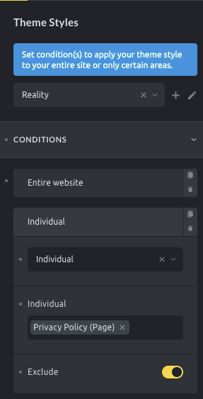

Adjust the default styling of your site layout, elements, colors, links, typography, etc. throughout your site via Theme Styles for a consistent and easy-to-maintain design system for your entire site.

Access the Theme Styles by clicking the **Settings** (gear) icon in the builder toolbar. Then go to **Theme Styles**.

To create your own Theme Style, click the **Create** (plus) icon and provide a name.

Apply any styling changes you want in the control groups below (like setting your fonts under "Typography", etc.).

https://youtu.be/UgoMtcacMus

## Conditions

Open the **Conditions** control group to tell Bricks where on your site this theme style should be used.

To apply a theme style to your entire website open the **Conditions** control group, click **Add Condition**, and select **Entire Website**.

You can set as many theme style conditions as you want.

Let's say you want to apply a Theme Style to two specific landing pages and your home page. You simply add a condition, click on Individual, and select your two landing pages. Then you add another condition and select **Front page**.

These are the available control groups:

- CONDITIONS

- GENERAL

- COLORS

- CONTENT

- LINKS

- TYPOGRAPHY

- ELEMENT - SECTION

- ELEMENT - CONTAINER

- ELEMENT - BLOCK

- ELEMENT - DIV

- ELEMENT - ACCORDION

- ELEMENT - ALERT

- ELEMENT - BUTTON

- ELEMENT - CAROUSEL

- ELEMENT - CODE

- ELEMENT - COUNTER

- ELEMENT - DIVIDER

- ELEMENT - FORM

- ELEMENT - HEADING

- ELEMENT - ICON BOX

- ELEMENT - IMAGE

- ELEMENT - IMAGE GALLERY

- ELEMENT - LIST

- ELEMENT - NAV MENU

- ELEMENT - POST CONTENT

- ELEMENT - META DATA

- ELEMENT - POST NAVIGATION

- ELEMENT - RELATED POSTS

- ELEMENT - TAXONOMY

- ELEMENT - POST TITLE

- ELEMENT - PRICING TABLES

- ELEMENT - PROGRESS BAR

- ELEMENT - SEARCH

- ELEMENT - SIDEBAR

- ELEMENT - SLIDER

- ELEMENT - ICON LIST

- ELEMENT - SVG

- ELEMENT - TABS

- ELEMENT - TEAM MEMBERS

- ELEMENT - TESTIMONIALS

- ELEMENT - TEXT

- ELEMENT - VIDEO

- ELEMENT - WORDPRESS

- WOOCOMMERCE - BUTTON

### Exclude condition

Since Bricks 1.3.6 you'll be able to set exclude conditions for any theme style. To exclude a specific condition you need to toggle the exclude control. Excluding a certain condition will let Bricks know that if the condition applies in a certain scenario, then that theme style won't be used.

<figcaption>

Use this theme style everywhere except for the Privacy Policy page

</figcaption>

## Export

1. Inside the builder go to `Settings > Theme styles`

3. Select the theme style you wish to export

5. Click the **Edit** (pencil) icon

7. Click the **Export** (download) icon

9. Download the generated JSON file to your computer

## Import

1. Inside the builder go to `Settings > Theme styles`

3. Click the **Create** (plus) icon

5. Click the **Import** (upload) icon

7. Select the theme style JSON file from your computer, and upload it

If a theme style with the same name already exists in your installation, the import will fail. This is to prevent any theme styles with identical names.

## Style Hierarchy

Bricks applies styles based on specificity:

- Element settings override everything

- Page settings override theme styles

- Theme styles apply last unless overridden above

### Loading Method

By default, Bricks loads only the **most specific** theme style on a page.

For example, if one theme style targets the entire website and another targets a specific page, only the one with the more specific condition (the specific page) is applied.

You can change this behavior under `WordPress Admin > Bricks > Settings > General > Theme Styles: Loading Method`

Options:

- **Most specific** (default): Loads only one theme style, the one with the most specific condition.

- **Load all matching theme styles**: Loads all theme styles whose conditions match the page.

Use "Load all matching theme styles" if you want to stack styles, like a global typography style combined with a post-type-specific layout.
