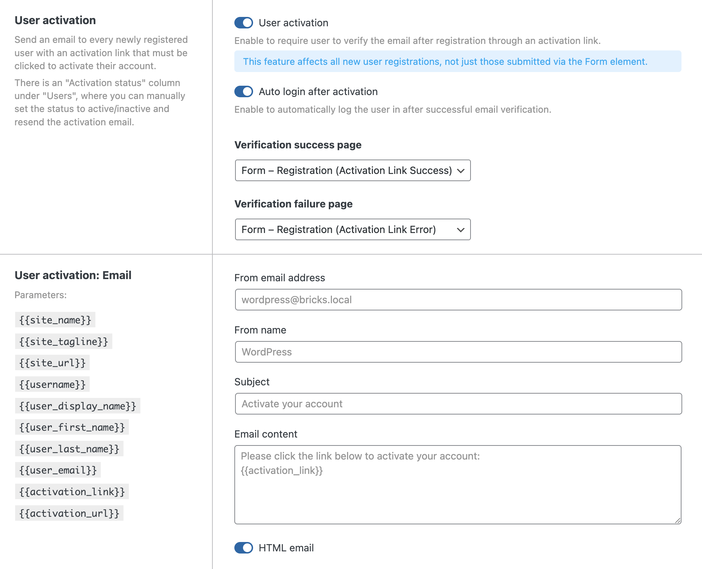
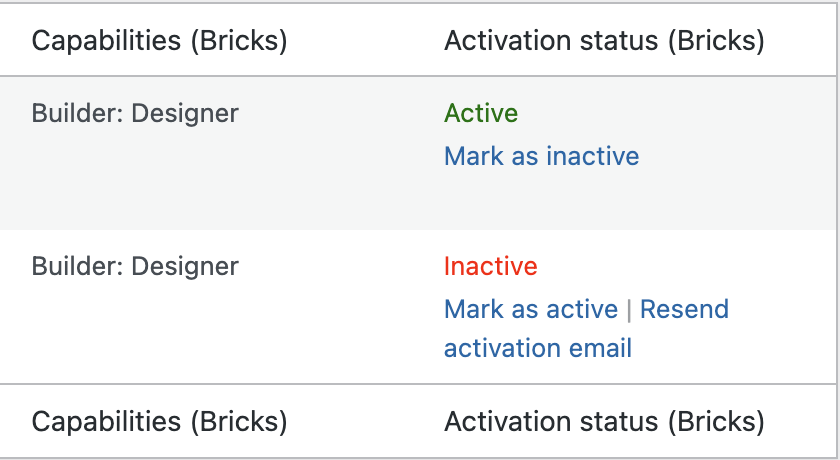

Starting with **Bricks 2.1**, you can enable the new **User activation** feature. Once enabled, newly registered users must confirm their email address (via a one-click activation link) before they can log in.

**IMPORTANT: This feature applies to all new user registrations, not just those submitted via the Form element.**

## Quick overview

Here is a step-by-step overview of how this feature works once it's enabled.

1. When user activation is enabled, **every new user** must confirm their email by clicking a unique activation link before their account becomes active.

3. The activation email contains a link the user must click to complete verification, and it's automatically sent on user registration.

5. After clicking:
    - If verification **succeeds**, the user is marked **Activated** and is redirected to your chosen **Verification success page.**
    
    - If verification **fails**, the user is redirected to your chosen **Verification failure page**.

7. You can enable **Auto login after activation** so users are automatically logged in after successful verification.

9. The activation feature **applies to all new registrations**, not just registrations submitted with the Form element.

11. Users created **before** you enabled User activation are **automatically active**.

13. If a user is **Inactive**, they cannot log in until activated. An error message will be shown.

## Configuration and controls

Inside the WP Dashboard go to Bricks > Settings > General, and scroll down to **User activation** group, where you will find the following settings:

**User activation**: to enable activation, you have to toggle this on. After you toggle this on, you can access the other settings described below.

_NOTE: After activating this, the auto-login after registration setting in the Bricks Form element will not be available anymore. You can use the next control for this._

**Auto login after activation**: users will be automatically logged in after the registration and successful activation.

**Verification success page**: page where the user will be redirected after successful activation. Useful for writing an welcome message, and if user is also auto logged in, you can also use user dynamic tags

**Verification failure page**: page where the user will be redirected after failed activation. Useful for notifying users about the next step and possible manual approval.

**User Activation Email**:

- From email address

- From name

- Subject

- Email content (use the available placeholders listed the left-hand side)

- HTML email (toggle on if your content includes HTML)

## Users page

A new **Activation status** column appears on the WordPress **Users** page.

Possible statuses:

- **Active**: user can log in normally.

- **Inactive**: user cannot log in until activated.

For each user, you can perform different actions based on their activation status, by hovering of the user entry:

- For an **active** user:
    - **Mark as inactive** (useful to prevent the user from logging in).

- For an **inactive** user:
    - **Resend activation email** sends a new activation link using the current email template.
    
    - **Mark as active** will manually mark the user as active, bypassing the email verification.
