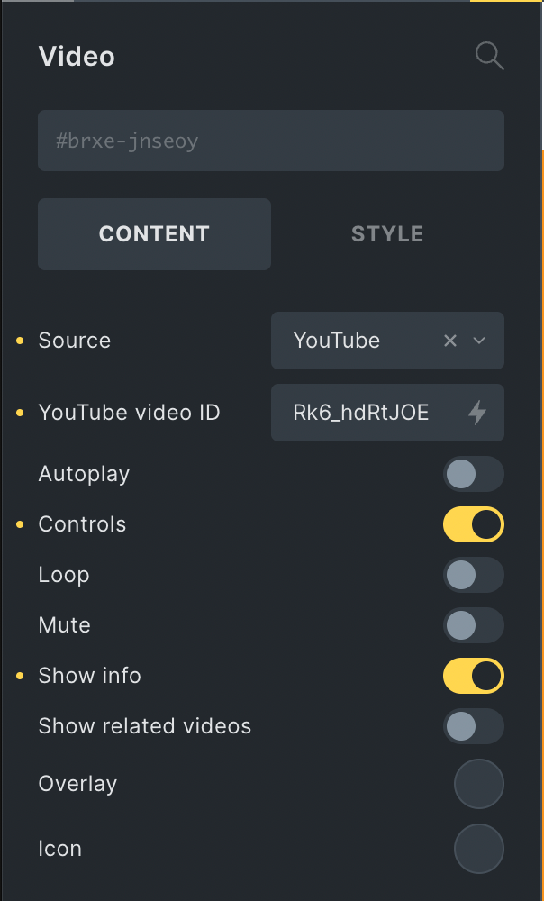

The Video element in Bricks enables you to display responsive videos from several sources.



Source dropdown options:

- YouTube

- Vimeo

- Media

- File URL

- Dynamic Data

**NOTE**: Enabling the "YouTube Preview Thumbnails" setting of the Perfmatters plugin might result in an empty space above the YouTube videos. A possible fix is adding the following CSS:

```php
.brxe-video .perfmatters-lazy-youtube {
    margin-top: -56.25%;
}
```
