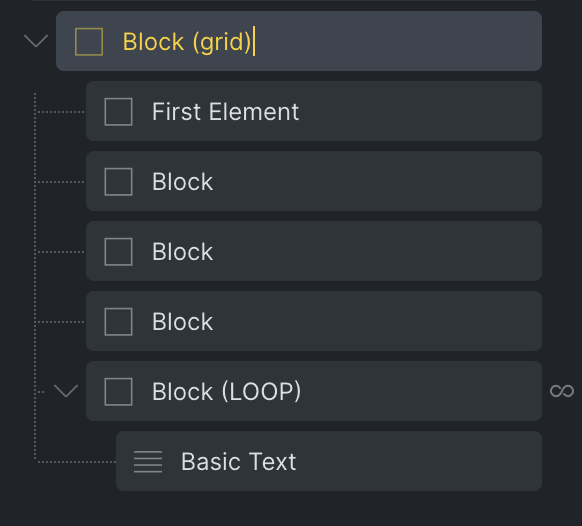
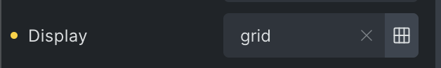
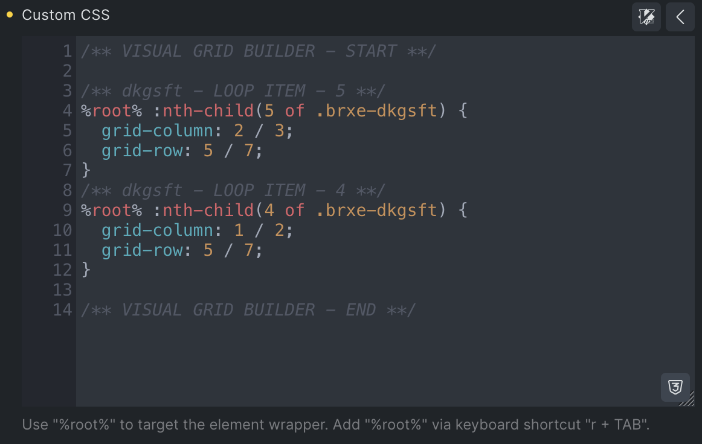
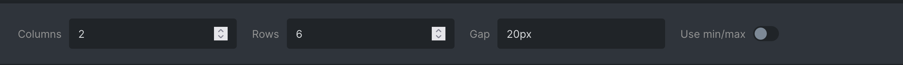
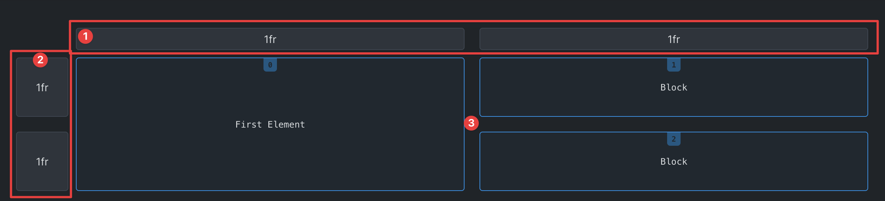

The new **Visual Grid Builder** allows you to visually design and manage your grid layouts. The feature becomes is available for any element with the `display` control set to `grid`, and allows you to:

- **Adjust grid size**: Modify the number of columns and rows to fit your design needs.

- **Resize and move elements**: Easily adjust the size and position of elements within your grid through simple drag and drop.

- **Query loop support**: Tweak any query loop item inside your grid.

- **Breakpoint support**: Create different grid layouts for various breakpoints to ensure responsiveness.

- **Rename elements**: Organize your layout by renaming elements for better identification.

- **Edit elements**: Hover over any grid item and click the pencil icon to continue editing it in the element panel.

- **Reset options**: Reset the entire grid or individual elements on the current breakpoint.

- **History**: Use history buttons to go back and forth between changes.

- **Fill grid**: Auto-fill any empty grid cells with one click using Block elements.

- **ID & class level**: Visually design your grid on the element ID or class-level.

<figcaption>

Visual Grid Builder modal

</figcaption>

## How it works

### **Accessing the Visual Grid Builder**

Begin by setting the `display` property of your grid layout element to `grid`. Once once, the Visual Grid Builder icon appears next to the `grid` value.

_NOTE: The visual grid builder (icon) is not available when bulk-editing elements._

### **Styling elements**

The Visual Grid Builder allows you to style both individual elements and elements that are part of a query loop. The approach to styling depends on whether you are working at the class or ID level. Here’s an overview of how this works:

**Static elements:**

- **ID level**: When you resize or move a static element, the changes are reflected in the `Grid Item` controls, specifically updating the `Grid Column` and `Grid Row` properties. This approach is straightforward and directly modifies the element's grid positioning.

- **Class level**: If you have defined the grid at the class level, any resizing or movement of the element will save the changes as custom CSS. These custom styles are applied to the `Custom CSS` control of the main element.

**Query loop element:**

- **ID or class level**: When working with elements that are part of a query loop, changes to size or position are saved as custom CSS in the `Custom CSS` control of the main element, regardless of whether you are styling at the ID or class level.

**Important**: It is crucial not to alter the auto-generated CSS styles, as they are essential for maintaining the layout's integrity. These styles are clearly marked with code comments, making them easy to identify and preserve. After moving or resizing an element, the CSS will automatically update to reflect the new values. If you choose to reset an element, the auto-generated custom CSS will be cleared, reverting the element to its original state.

## Controls

**Grid actions:**

1. **Reset (Grid)**: Resets all grid styles for the currently selected breakpoint.

3. **Breakpoints**: Toggle between different breakpoints without leaving the editor.

5. **History**: Undo or redo actions.

**Grid controls:**

1. **Columns and rows**: Adjust the number of columns and rows within the grid.

3. **Gap**: Modify the gap between grid elements using any valid CSS value, including variables.

5. **Use min/max**: Toggle to set column or row size to `minmax(0, 1fr)` for better flexibility.

When you open the Visual Grid Builder, it will automatically detect and adjust the column and row controls to match your existing grid configuration.

**Grid panel controls:**

1. **Individual Columns and rows**: Precisely control the size of columns and rows.

3. **Elements**: Edit the elements within the grid.

Sizes aure automatically calculated from your main element settings. For instance, `repeat(3, 2fr)` is converted to `2fr 2fr 2fr`. You can also customize sizes using values like `1fr`, `300px`, or `minmax(0, 1fr)` or any other valid value, to adjust the design to your needs.

**Single element controls:**

1. **Resize**: Click and drag the borders to resize elements.

3. **Move**: Click and drag within the element to reposition it.

5. **Rename**: Click on the element label to rename it.

7. **Reset**: Reset all styling for the element on the current breakpoint.

9. **Edit**: Close the Visual Grid Builder and select the element in the structure panel for further editing.

You can also view the index of each element, and if an element is part of a query loop, its specific index within the loop will be displayed, starting at 0.
