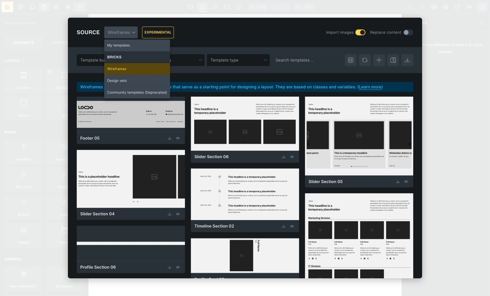
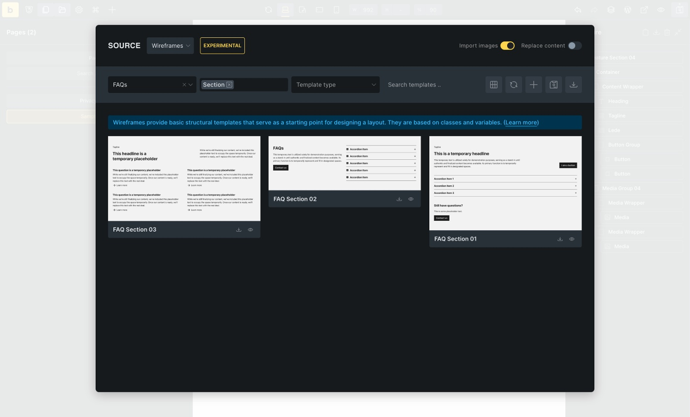
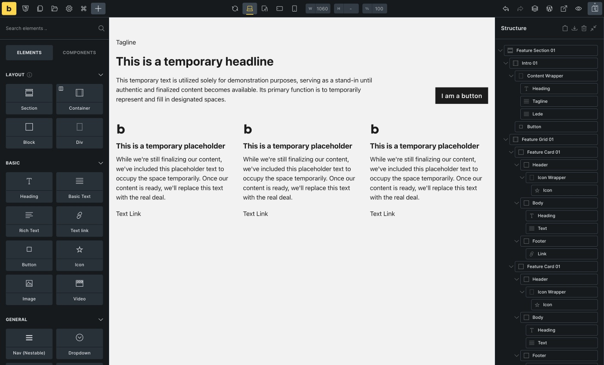
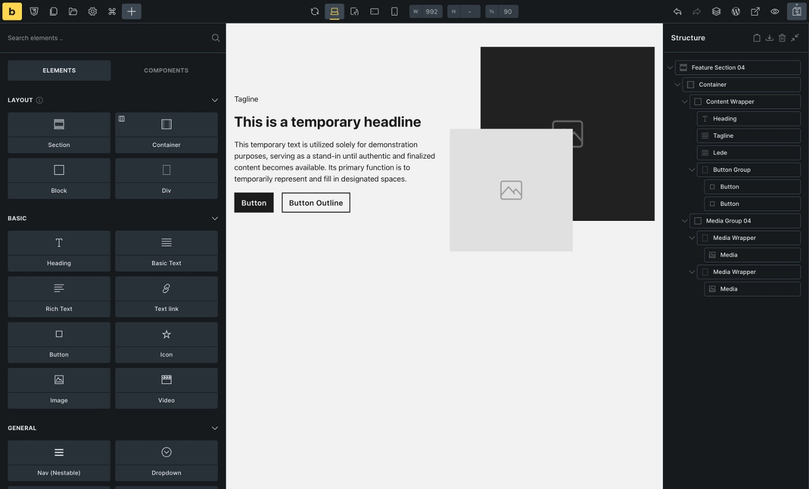
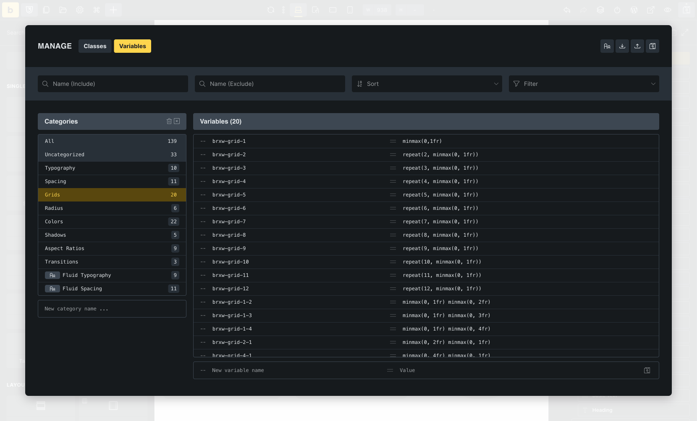
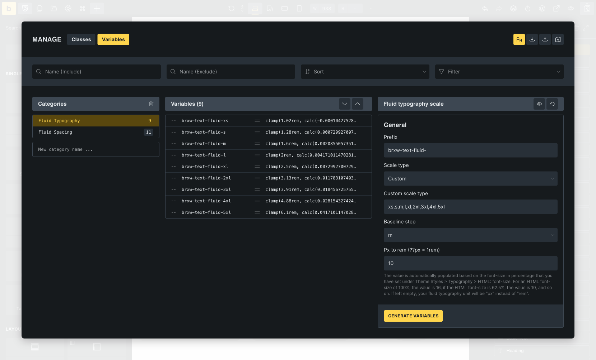

https://youtu.be/B53\_o8GfpvQ

## What are Wireframes

Wireframes are premade layouts that allow you to build your templates and pages quickly and effortlessly.

Focusing on structure, layout, and functionality. They contain minimal styling, use placeholder texts, and only represent the overall structure of a specific area on your website such as a section, grid, or card.

Get an overview of all currently available wireframe templates: [https://templates.bricksbuilder.io/wireframes/](https://templates.bricksbuilder.io/wireframes/)

Primarily intended for building new pages, but can also be used in existing websites.

Bricks wireframes are based on classes and variables to keep them as flexible, maintainable, and extensible as possible.

In other words, most don't contain styles on the element ID (see [Styling: Classes, IDs and CSS variables](#styling-classes-ids-variables)), but almost every element is assigned a class.

If you have never worked with classes or variables before, we recommend the following free courses and articles:

- [https://www.youtube.com/watch?v=NtRmIp4eMjs](https://www.youtube.com/watch?v=NtRmIp4eMjs)

- [https://www.youtube.com/playlist?list=PL4-IK0AVhVjOT2KBB5TSbD77OmfHvtqUi](https://www.youtube.com/playlist?list=PL4-IK0AVhVjOT2KBB5TSbD77OmfHvtqUi)

- [https://css-tricks.com/a-complete-guide-to-custom-properties/](https://css-tricks.com/a-complete-guide-to-custom-properties/)

- [https://developer.mozilla.org/en-US/docs/Web/CSS/Using\_CSS\_custom\_properties](https://developer.mozilla.org/en-US/docs/Web/CSS/Using_CSS_custom_properties)

- [https://academy.bricksbuilder.io/article/global-class-manager/](https://academy.bricksbuilder.io/article/global-class-manager/)

- [https://academy.bricksbuilder.io/article/global-variables-manager/](https://academy.bricksbuilder.io/article/global-variables-manager/)

## Prerequisites

Please enable the necessary settings to use the wireframes to their full extent.

### Required settings

**Bricks > Settings > General:**

1. SVG Uploads (Administrator) must be activated

3. Class Manager & Variable Manager not deactivated

### Optional settings

**Bricks > Settings > Performance:**

1. Disable chaining element & global class

**Bricks > Settings > WooCommerce:**

1. Miscellaneous: Enable Bricks WooCommerce "Notice" element

3. Products: Set Product badge "Sale" to percentage or text

5. Ajax Add to cart: Enable AJAX add to cart

## Types of wireframes

By default, the wireframe templates are organised through **Template bundle**, **Template type**, and **Template tags**.

Use these filters to find the most suitable wireframe template quickly.

### Template bundles

Template bundles categorize templates by theme/topic.

The **Blog** bundle, for instance, includes Article/Post layouts along with individual Article Cards, Article Sections, and Article Grids. Similarly, the **FAQs** bundle features individual (FAQ) accordions and FAQ sections.

| **Bundle** |
| --- |
| 404 |
| Avatars |
| Blog |
| Contact |
| Content |
| CTAs |
| FAQs |
| Features |
| … |

### Template Types

A template type is assigned to each wireframe template. The template types are comparable to the [WordPress Template Hierarchy](https://developer.wordpress.org/themes/basics/template-hierarchy/) and let WordPress know what kind of template it is (e.g., a single template for single posts, an archive, a WooCommerce cart, ...).

Using [Template Conditions](https://academy.bricksbuilder.io/article/template-settings/#template-conditions), you can specify in detail where and when a template is displayed (except for "Section templates").

| **Type** |
| --- |
| Header |
| Footer |
| Single |
| Section |
| Archive |
| Popup |
| WooCommerce - Single Product |
| WooCommerce - Account - Orders |
| … |

Additional information: [https://academy.bricksbuilder.io/article/an-intro-to-templates/#template-types](https://academy.bricksbuilder.io/article/an-intro-to-templates/#template-types)

### Template Tags

Template tags organize the templates according to their function.

| **Tag** | **Tag Description** |
| --- | --- |
| Single | A single element or a small group of elements, such as a custom list, feature card, image/media groups, forms, intros, etc., that can be used anywhere. |
| Grid | A layout grid, usually with CSS grid or flexbox, grouping single templates, e.g., feature cards.  |
| Section | A section usually contains one or more grid templates or individual layouts. |
| Template | A fully functional template (see template types) such as a single post/product, archive, header, footer, 404, …  |
| Popup | A popup layout is, strictly speaking, a template, too, but it has its tag, so it’s easier to find |

## Template structure and layout

Most Bricks Wireframe templates have a modular structure, i.e., several templates are combined into one template. Imagine a section that contains a grid with various cards. This results in a total of three templates:

1. A card template (tag "Single")

3. A grid template (tag "Grid"), which contains the cards

5. The section template (tag "Section"), which contains the grid template including cards

Each of these templates is available as an individual template.

For example, you can use the card in a different context or place the grid template with cards in a different section ("mix and match").

### Example: "Feature Section 01"

"Feature Section 01" contains a total of three templates:

1. Intro 01 (template tag "Single")

3. Feature Grid 01 (template tag "Grid")

5. Feature Card 01 (template tag "Single")

In this case, all templates have the same index (01) because they were created within the same context. You may also see templates with different or no indexes, which is perfectly fine and doesn’t affect how you can use them.

### Example: "Feature Section 04"

If we take a closer look at "Feature Section 04", we can see that the "Content Wrapper" block has no index - "Media Group 04", on the other hand, does.

This means that the content wrapper only applies to this template (Feature Section 04) and does not exist as a separate template. "Media Group 04", on the other hand, exists as a separate template and can, therefore, also be used in different places.

### When do I use a section template, and when do I use a grid?

Each page of your website should be divided into sections.

Sections represent, semantically speaking, a new topic. For example, your homepage could contain the following sections: Hero Section, Feature Section, About Us Section, and a CTA or Contact Section.

Make sure to not place sections within sections.

Grid templates are placed within sections. If they belong together thematically, you can put several grids in a section.

A negative example is adding a blog post grid and a product grid to the same section. Both grids should be placed in a separate section because they make no semantic sense together.

### Can I customize the templates and add additional elements or delete elements that are not needed?

Of course, you can customize the templates and add or delete elements you don't need.

It is best to save the customized template in your custom templates so that you can reuse it. If you import the template from the community templates again, it will not contain the structural changes you have made. However, changes to imported classes or variables will persist across the site unless you delete or override them by re-importing the original class (more on that later).

Remember that the templates are only a starting point and are by no means finished, complete, or 100% suitable for every project. You are welcome to add your own sections, grids, and single templates to adapt them to your project.

## Styling: Theme Styles / CSS Variables / Color Palette Import

When importing a wireframe, you will be asked whether you want to import the associated CSS variables, theme style, and color palette.

### CSS Variables

Since CSS variables are used almost exclusively, the import of variables is mandatory.

### Theme Style

The theme style contains basic settings like responsive font sizes using the default 62.5% HTML font size, section padding, container width, gaps, and others. If you already use a custom theme style, transfer the settings to your theme style (if necessary) and leave the brxwireframes theme style as a reference without a condition. This way, you can always fall back on it in case of doubt. If you are not yet using a custom theme style, don't forget to assign a condition “entire website” to the wireframes theme style.

### Color Palette

In some templates it is necessary to use colors (e.g. for overlays, border-, background- or text-colors). For this purpose, we created 12 neutral color variables (--brxw-color-neutral-xxx), which are also available in a "Bricks Wireframes" color palette. We recommend importing the color palette, as this gives you a visual reference of the [existing variables](#styling-colors) and allows you to quickly assign the colors to other elements.

## Styling: Classes, IDs and CSS variables

As mentioned in the introduction, the Bricks wireframes are class- and variable-based to keep them as flexible, maintainable, and extendable as possible.

All classes and CSS variables use `**brxw-**` as a prefix to prevent overlaps with existing classes and variables.

Almost every element within a template is assigned at least one class whose naming convention is based on the [BEM ("Block Element Modifier") methodology](https://getbem.com/).

**Blocks** are independent parent elements. An example could be a card, a menu, or a grid. Block classes only contain hyphens. _Example:_ .brxw-article-card-01

**Elements** are the child elements within a block. They are connected to the block by two underscores. _Example:_ .brxw-article-card-01\_\_title

**Modifiers** are variants of a block or element that change the status or appearance. Modifiers are connected to the block or element by two hyphens.  
_Example:_ .brxw-article-card-01--dark.

Block, element, and modifier classes can be easily distinguished based on the spelling alone. However, it may be confusing that BEM uses the terms "block" and "element" just like Bricks. If you need clarification, just remember this: BEM Block classes can be used on all Bricks parent elements - it doesn't matter if the parent element is a Bricks block, div, section, container, nav menu, or icon list.

BEM element classes are applied to Bricks elements within a BEM block, regardless of which Bricks elements you use.

### Example: Article Card 01

| **Block Class** | **Element Classes** |
| --- | --- |
| .brxw-article-card-01 | .brxw-article-card-01\_\_body |
|  | .brxw-article-card-01\_\_title |
|  | .brxw-article-card-01\_\_taxonomy |
|  | .brxw-article-card-01\_\_text |
|  | .brxw-article-card-01\_\_footer |
|  | .brxw-article-card-01\_\_date |
|  | .brxw-article-card-01\_\_author |
|  | .brxw-article-card-01\_\_media-wrapper |
|  | .brxw-article-card-01\_\_media |

### Important to know:

- **Not all blocks must have children - they can exist independently**

- **Blocks can have other blocks as children**  
    _Example:_ The section element in the “Article section 04 template” is an independent block (.brxw-article-section-04) and contains two different blocks: .brxw-intro-02 and .brxw-article-grid-04, which in turn have children.

- **Elements cannot exist without a parent block.**  
    _Example:_ .brxw-intro-02\_\_title cannot exist without its parent block .brxw-intro-02

#### When do I style on the existing brxw-classes, when on custom classes, and when on the ID?

You should consider carefully where and how often you want to insert the relevant template. There are different possibilities depending on this.  
  
For templates that are used multiple times (e.g., a section placed various times, cards in a loop, etc.), styling on classes (brxw- or custom) is preferable to ID styling, as the CSS ID must be unique and may, therefore, only occur once per page.

##### Existing brxw-classes

Styling on the existing brxw-classes is the standard method for giving the elements the desired styling. You can also adjust the values, such as the number of grid columns within the templates, to your needs - they are not set in stone.  
  
If you import the same template again from the community templates elsewhere, it will automatically receive the same styling and the exact customizations that you have applied to the brxw-class.

##### Custom classes

In addition to the brxw-classes, you can add custom classes containing your custom styles. In most cases, this also makes it possible to overwrite the existing values of the brxw-classes.  
  
However, if you insert the same template elsewhere from the community templates, you must add your custom classes manually, if desired. Alternatively, you can save the customized template including the custom classes in your templates to reuse it later.

##### IDs

Sometimes, you can use the ID to style your elements or to overwrite class styles.  
  
Imagine you place the same section template twice on your homepage. You select the section class and assign it a background color that applies to both sections accordingly. To "exceptionally" give the second section a different background color, you can style on the section ID to overwrite the class.  
  
**Remember:** IDs always have a higher specificity than classes. Accordingly, it is impossible to overwrite an ID style with a class but the other way around. If you re-import the same template from the community templates, the section will not contain any ID styles but will include the changed class styles.

#### Can I rename the existing classes?

You can rename the `brxw-` classes if you wish. However, remember to do this for the block and contained element classes of the child elements, if available ([Class Manager](https://academy.bricksbuilder.io/article/global-class-manager/)).

If you import the same template again, it will use your class names and style changes. However, this also means you cannot re-import the original template unchanged.

Suppose you want to retain the option of re-importing the original template **without** changes to the class name or styles. In that case, it is not enough to rename the classes, as they still have the same ID in the database, i.e., the same unique identifier. In this case, you would have to duplicate the classes ([Class Manager](https://academy.bricksbuilder.io/article/global-class-manager/)) so that they each have a new, unique identifier, reassign them to the elements, and remove the "old" classes from the elements.

#### I have accidentally deleted a brxw-class. Can I restore it?

Yes. In the first step, look in the Class Manager’s trash (top right), and if the class is still there, you can restore it directly.  
  
If you have emptied the trash, you can simply re-import the template.  
  
In both cases, remember to reassign the class to the elements on which it is missing, as it will be removed from the elements as soon as it is deleted.

### CSS variables

If values are assigned to a `brxw-` class (or theme style settings), the values are defined as CSS variables, with few exceptions. You can find the variables and values in the [Global Variables Manager](https://academy.bricksbuilder.io/article/global-variables-manager/).

CSS variables offer the advantage of reusability, flexibility, and easy maintenance of styles, as they define central values that all elements in the CSS can use. For example, if you want to increase or decrease the gap of your grids, you only need to adjust the value of the variable `–brxw-grid-gap`. The change now affects every grid in which the variable is used.

#### Variable categories

The available variables cover essential areas such as CSS grids, font sizes, spacing, gaps, border radius, and others, which are sufficient for the "start" of a project. If you need additional categories or variables, you can create them as per your requirements in the variable manager.

| **Variable Category** | **Examples** | **Purpose** |
| --- | --- | --- |
| Grids | –brxw-grid-1, –brxw-grid-2, …, –brxw-grid-12 | Used within CSS Grids to set the number of columns |
| Spacing | –brxw-space-xs, –brxw-space-2xl, … | Used within margins, paddings, widths, heights, gaps, …  |
| Typography | –brxw-text-xs, –brxw-text-m, –brxw-text-2xl | 9 (fluid) font sizes from xs to 5xl |
| … |  |  |

#### Variable values

The brxw-variables use [CSS clamp functions](https://developer.mozilla.org/en-US/docs/Web/CSS/clamp) for font sizes, spacing, and border-radius, which calculate the value based on a minimum, preferred, and maximum value depending on the viewport (minimum/maximum width). This has the advantage that you do not manually adjust the font size or padding in the mobile breakpoint, for example, as it is automatically adjusted (reduced or enlarged).

As a basis for this calculation, the wireframe templates assume a minimum viewport of 320px, and a maximum viewport of 1440px, which should be a good starting point for typical websites.

#### I already use a framework and CSS variables (e.g., ACSS, Frames, or CoreFramework). Can I continue to use my variables?

Of course, you can continue to use your existing variables. However, remember that the values of your variables will probably differ from those of the brxw-variables.

As there is a lot of overlap with other frameworks, you can use your existing variables as the brxw-variable value. This allows you to adapt the wireframe templates to your existing layout and spacing without editing each template.

##### Example ACSS

| **ACSS Variable** | **brxw-Variable** | **Extended brxw-variable** |
| --- | --- | --- |
| \--container-gap: var(--space-xl) | \--brxw-container-gap: var(--brxw-space-2xl) | –brxw-container-gap: var(--container-gap) |
| \--grid-gap: var(--space-l) | \--brxw-grid-gap: var(--brxw-space-l) | –brxw-grid-gap: var(--grid-gap) |
| –space-m: clamp(2rem, calc(1.09375vw + 1.65rem), 3.4rem) | –brxw-space-m: clamp(1.6rem, calc(0.36vw + 1.49rem), 2rem) | –brxw-space-m: var(--space-m) |
| –h2: clamp(2.592rem, calc(1.725vw + 2.04rem), 4.8rem) | –brxw-text-fluid-3xl: clamp(2.56rem, calc(1.04vw + 2.23rem), 3.73rem) | –brxw-text-3xl: var(--h2) |
| … |  |  |

##### Example Core Framework

| **Core Framework Variable** | **brxw-Variable** | **Extended brxw-Variable** |
| --- | --- | --- |
| \--space-m:clamp(1.6rem, calc(1.11vw + 1.24rem), 2.8rem) | \--brxw-space-m: clamp(1.6rem, calc(0.36vw + 1.49rem), 2rem) | –brxw-space-m: var(--space-m) |
| \--radius-m: clamp(1rem, calc(-0.19vw + 1.26rem), 1.2rem) | –brxw-radius-m: clamp(1rem, calc(-0.18vw + 1.26rem), 1.2rem) | –brxw-radius-m: var(--radius-m) |
| … |  |  |

##### Custom responsive variable values (clamp)

If you want to use other viewport sizes (instead of 320px min, 1440px max), all variable values that use clamp /Fluid Typography, Spacing, Radius) must/should be customized/regenerated.

We do not recommend doing this manually (unless you are a math genius). Instead, you can use the built-in **Fluid Typography Scale Generator** located in the Variable Manager to create new text or spacing variables. The radius variables were created with CoreFramework (free) because they are not based on a base value but should have individual min and max values.

Alternatively, you can use generators that provide you with the ready-made clamp functions. Depending on which generator you use, you can adjust the variable name/prefix directly in the generator, or you have to do this later in a code editor of your choice.

All generators mentioned are currently (September 2025) free of charge and are not affiliated or connected with Bricks:

1. [fluid-type-scale.com](https://www.fluid-type-scale.com/calculate?minFontSize=16&minWidth=320&minRatio=1.25&maxFontSize=18&maxWidth=1440&maxRatio=1.333&steps=xs,s,m,l,xl,2xl,3xl,4xl,5xl&baseStep=m&prefix=brxw-text&useContainerWidth=false&includeFallbacks=false&useRems=true&remValue=10&decimals=2&previewFont=Inter&previewText=Almost+before+we+knew+it,+we+had+left+the+ground&previewWidth=1280)

3. [utopia.fyi](https://utopia.fyi/type/calculator/?c=320,16,1.25,1440,18,1.333,4,2,&s=0.75%7C0.5%7C0.25,1.5%7C2%7C3%7C4%7C6,s-l&g=s,l,xl,12)

5. [coreframework.com](https://coreframework.com)

## Styling: Color Palettes

Most wireframes do not contain any colors unless absolutely necessary or beneficial (e.g., overlays, borders, backgrounds, text-colors). For this purpose, we have created a neutral color palette (shades of grey) with 12 color-steps from light to dark, which can be imported during template import.

The colors are defined in CSS variables, located in the Variable Manager (--brxw-color-neutral-25, --brxw-color-neutral-50, --brxw-color-neutral-100, ..., --brxw-color-neutral-950) and can be adjusted there. If you don't want to use any predefined colors at all, delete the color variables from the variable manager.  
  
There are various free generators for creating custom color palettes (to add primary or secondary colors, or change the existing neutral color values). We have had good experiences with these generators, for example:

- [https://components.ai/color-scale/rnjyBVIn24NiNNH0ob2W](https://components.ai/color-scale/rnjyBVIn24NiNNH0ob2W)

- [https://uicolors.app/create](https://uicolors.app/create)

## Custom CSS / JS / Code

### Custom CSS

We try to avoid custom CSS. However, some layouts or customizations would not be possible without it.

### Custom JS / Code

Custom JS or PHP is only used if the use case requires it. We've commented the code used in as much detail as possible. When using a template with a Code element, remember to enable code execution and sign the code.

## Frequently asked questions

- **Why are there no wireframes for Category X or Y?**
    - Bricks is designed to give you the ultimate flexibility to create exactly what you need. While we will add new wireframes as part of our ongoing work with community templates, we've provided all the tools you need to easily create your own wireframes for any category or design. This way, you are not limited by what’s available and can build to your unique vision.

- **Can I request new wireframes?**
    - Of course! We’re always open to hearing your ideas. While we can't guarantee every suggestion will be implemented, your input helps us better understand what’s important to the community. Feel free to contact us by email (subject: "Wireframes") or share your suggestions in the forum under the Feature Requests/Improvements category (prefix your title with "Wireframes").

- **Who can I contact if I have found a potential bug?**
    - Please contact us by email (subject "Wireframes") or create a new report in the forums bugs category (title prefix: "Wireframes"). Please tell us the name of the template and the issue in as much detail as possible.

Happy wireframing!
