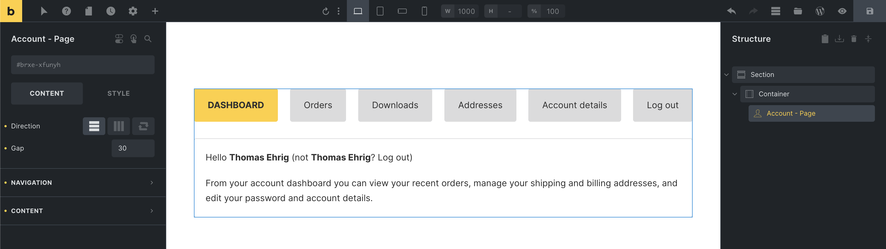
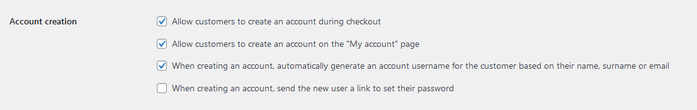
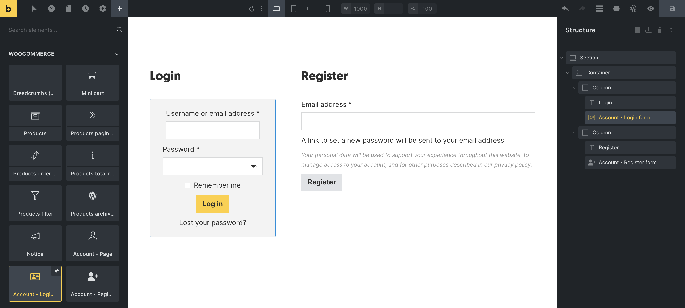
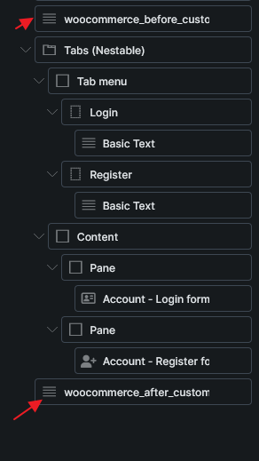
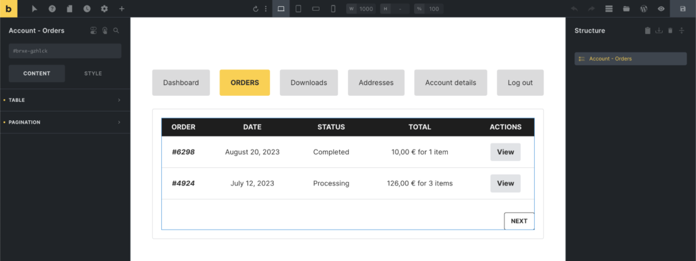

Bricks 1.9 introduces the My Account builder, which lets you customize the account area of your WooCommerce site.

This includes the My Account page (logged-in), the account login/register/lost & reset password pages (shown when not logged-in), and all My Account endpoints (e.g., Orders, Downloads, etc.).

**IMPORTANT:** In order to ensure that all your customizations to the WooCommerce My Account templates are properly applied, it is imperative that you complete the "[My Account Page (logged in)](#my-account-page)" step.

## My Account Page (logged in)

To design your My Account page (navigation + content wrapper), **please edit your "My Account" page directly**. You'll find a dedicated "Account Page" element that you can add and adjust its settings to your liking.

<figcaption>

Custom My Account page using the "Account - Page" element

</figcaption>

**IMPORTANT:** If you have the _"Enable Bricks WooCommerce "Notice" element"_ Bricks setting enabled, please make sure that you have added the "Notice" element to your account page or to all account templates individually. So the notifications when submitting the account forms (e.g., address, reset password, etc.) are displayed.

## Account - Login / Register

The login form is displayed when a not-logged-in visitor views the My Account page. And the registration form, if you have the _"Allow customers to create an account on the "My account" page"_ WooCommerce setting enabled.

You can design your account login/registration layout by creating a new template type "WooCommerce - Account - Login".

When editing this template, you'll find dedicated elements for the **"Account - Login form"** & **"Account - Register form"** as shown in the screenshot below:

You should also check the **Account creation** settings located at _WooCommerce > Settings > Accounts & Privacy_ section to control what form to be displayed via **Account - Register form** element.

<figcaption>

Custom account login/register template

</figcaption>

**IMPORTANT:** Ensure you have inserted a Basic Text element with `{do_action:woocommerce_before_customer_login_form}` before your Login and Register form. And another Basic Text element with `{do_action:woocommerce_after_customer_login_form}` after the forms.

<figcaption>

Example do\_action location. Before and after the login/register forms.

</figcaption>

## Account - Lost / reset password

The WooCommerce account builder in Bricks also provides the following dedicated templates and elements for the lost & reset password pages:

| **Account page** | **Template type** | **Elements** |
| --- | --- | --- |
| Lost password | WooCommerce - Account - Lost password | Account - Lost password |
| Lost password confirmation | WooCommerce - Account - Lost password (Confirmation | Displayed after submitting the lost password form. No special elements.      Example:   _A password reset email has been sent to the email address on file for your account, but may take several minutes to show up in your inbox. Please wait at least 10 minutes before attempting another reset._ |
| Reset password | WooCommerce - Account - Reset password | Account - Reset password |

## Templates for specific account endpoints

Designing the account content area for individual account endpoints (Orders, Downloads, etc.) is possible by creating templates of the corresponding template type.

In the example below, we created a "WooCommerce - Account - Orders" template, to which we then added the "Account - Orders" that we styled a bit.

When editing the template for an account endpoint (Orders, Downloads, etc.), the drag & drop area is located inside the account content area. Offering a better preview in the builder than just rendering an empty canvas without the account navigation.

The process of creating those account endpoint templates is the same for all other WooCommerce account template types.

## Account template types & elements

| **Template type** | **Endpoint** | **Element** |
| --- | --- | --- |
| WooCommerce - Account - Dashboard | `/` | \- |
| WooCommerce - Account - Orders | `orders/` | Account - Orders |
| WooCommerce - Account - View order | `orders/view-order/{order_id}/` | Account - View order |
| WooCommerce - Account - Downloads | `downloads`/ | Account - Downloads |
| WooCommerce - Account - Addresses | `edit-address/` | Account - Addresses |
| WooCommerce - Account - Edit address | `edit-address/billing/`   `edit-address/shipping/` | Account - Edit address |
| WooCommerce - Account - Edit account | `edit-account/` | Account - Edit account |
