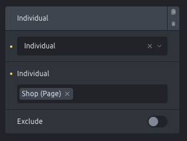
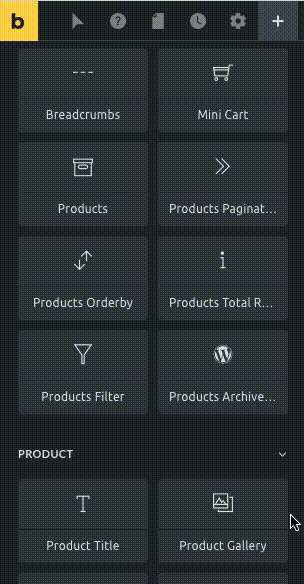
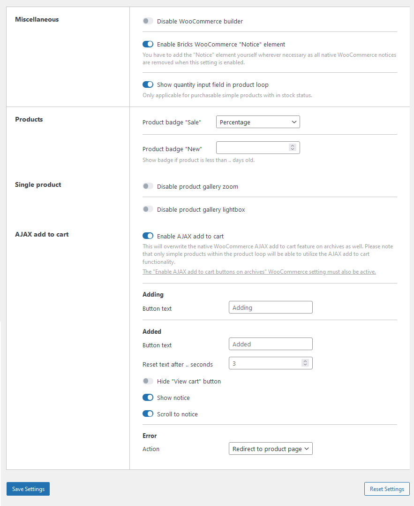
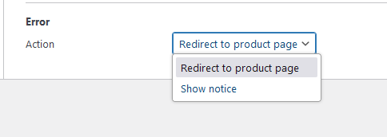
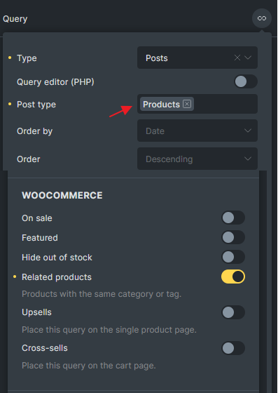

WooCommerce is a free plugin to manage the e-commerce functionality of your WordPress site. It is the world's most popular open-source solution to create and manage a shop on the Internet, and therefore Bricks proudly integrates with it.

Bricks introduces the new in-theme WooCommerce Builder, which allows you to build your entire store with it. Including the main shop page, single product page, products archives, cart, checkout, and account pages.

To design these layouts, Bricks offers WooCommerce-specific elements and template types.

Certain elements only show when editing a specific template type.

The `Checkout customer details` element, for example, is only available when editing the `WooCommerce Checkout` template.

## Getting Started

To access the WooCommerce Builder in Bricks, install and activate the free WooCommerce plugin available in the official [WordPress repository](https://wordpress.org/plugins/woocommerce/) or through your WordPress dashboard under `Plugins → Add New`.

After activation, you might want to set up the store using the in-site configuration wizard or do it manually through the WooCommerce settings menus.

Please note that during the configuration wizard, you won't need to pick up a new theme because Bricks is already a theme and fully supports WooCommerce.

With the configuration done and after adding some products, you can start visually building your WooCommerce layouts with Bricks.

## WooCommerce Templates

With WooCommerce activated, you can visually create and style the following WooCommerce templates in Bricks:

| **Template Type** | **Description** |
| --- | --- |
| **Single product** | Individual product page. |
| **Product archive** | Archive pages like product categories, tags, attributes, etc. Set visibility via Template Conditions. |
| **Cart** | The cart (when it contains products). |
| **Empty cart** | The empty cart (when it doesn't contain any products). |
| **Checkout** | Checkout screen where the customer enters billing & shipping details and selects the payment method. |
| **Pay** | Checkout screen where the customer enters the payment details. |
| **Thank you** | Displayed after successful checkout completion. |
| **Order receipt** | Displayed when viewing the order receipt. |
| **Account login** | Displayed when viewing the My Account page not logged in. |
| **Account lost password** | Displayed when viewing the lost password My Account page. |
| **Account lost password (confirmation)** | Displayed after submitting the lost password form. |
| **Account reset password** | Displayed after clicking the link in the password reset email. |
| **Account dashboard** | Displayed when viewing the My account page logged in. |
| **Account orders** | Displayed when viewing the "Orders" tab of the My Account page. |
| **Account view order** | Displayed when viewing an individual order. |
| **Account downloads** | Displayed when viewing the "Downloads" tab of the My Account page. |
| **Account addresses** | Displayed when viewing the "Addresses" tab of the My Account page. |
| **Account edit address** | Displayed when editing the billing or shipping address on the My Account page. |
| **Account edit account** | Displayed when editing the account details on the My Account page. |

## My Account builder

Starting at Bricks 1.9, you can also visually design your Account page. Including the login/registration, lost & reset password pages.

For more details, please refer to our dedicated Academy article about the new WooCommerce Account builder here [https://academy.bricksbuilder.io/article/woocommerce-account-builder/](https://academy.bricksbuilder.io/article/woocommerce-account-builder/)

## Shop page

The shop page is a special WooCommerce page which is defined as the archive page for your products.

To design a unique Shop page layout, you can directly edit the Shop page with Bricks.

Or you could add a template condition in your `WooCommerce - Product Archive` template so this template is used for the Shop page as well. In this case, you would need to set the template conditions to target the shop page individually like so:

## WooCommerce elements

Bricks aims to provide the most flexible approach to the visual design of the WooCommerce templates without losing the functionality & hooks WooCommerce already provides that many third-party WooCommerce plugins/extensions rely upon.

Among the general WooCommerce elements and Products element, Bricks has special elements for specific WooCommerce template types like the cart or the checkout.

More than 30 WooCommerce-specific elements in total are available to design your WooCommerce templates & pages with Bricks.

These are some of the WooCommerce-specific elements:

- Add to cart

- Product title

- Product gallery

- Product price

- Product stock

- Product meta

- Product rating

- Product reviews

- Product content

- Product short description

- Product additional information

- Product tabs

- Product up/cross-sells

- Related products

## Dynamic Data

The WooCommerce integration adds new [dynamic data tags](https://academy.bricksbuilder.io/article/dynamic-data/#:~:text=Bricks%201.4%20introduces,support%20double%20quotes) to target product and [order properties](https://academy.bricksbuilder.io/article/checkout/#order-receipt-template).

`{woo_product_price}` - Returns the full product price with currency and HTML  
`{woo_product_regular_price}` - Returns the product regular price with currency and HTML  
`{woo_product_sale_price}` - Returns the product sale price with currency and HTML. If no sale price set, empty string will be returned.  
`{woo_product_regular_price:plain}` - Returns product regular price with currency without HTML  
`{woo_product_regular_price:value}` - Returns product regular price as simple string (e.g: 65.3, 2.5, 5)  
`{woo_product_cat_image}` - Renders the product category image  
`{woo_product_images}` - Renders the product featured image and product gallery images. Can use on Carousel and Image gallery element. You can also use `:value` filter to output the gallery images IDs in comma separated format. (@since 1.11)  
`{woo_product_gallery_images}` - Renders the product gallery images (excluded the product featured image). Can use on Carousel and Image gallery element. You can also use `:value` filter to output the gallery images IDs in comma separated format. (@since 1.11)  
`{woo_add_to_cart}` - Renders the add to cart button  
`{woo_product_on_sale}` - Renders the on-sale badge if the product is on sale  
`{woo_product_rating}` - Renders the product rating  
`{woo_product_rating:plain}` - Outputs the product rating in text form. Ex: Rated 5.00 out of 5  
`{woo_product_rating:format}` - Outputs the product rating even if no rating has been submitted yet  
`{woo_product_sku}` - Returns the the product SKU  
`{woo_product_excerpt}` - Renders the product short description  
`{woo_product_stock}` - Renders the product stock (append \`value\` filter outputs number of products in stock)  
`{woo_product_stock_status}` - Outputs \`instock\`, \`outofstock\`, or \`onbackorder\` (Useful for element conditions)  
`{woo_product_badge_new}` - Renders "New" span with classes `.badge.new` if condition met. (@since 1.11.1) (Bricks Settings > WooCommerce > Products.)  
`{woo_product_badge_new:plain}` - Renders "New" text only if condition met. (@since 1.11.1) (Bricks Settings > WooCommerce > Products.)  

You can use the basic dynamic tags as well.

`{post_id}` - Outputs the product ID  
`{post_title:link}` - Renders the product title with link  
`{post_terms_product_cat}` - Renders the product categories with links  
`{post_terms_product_cat:plain}` - Renders the product categories without links)  

## Bricks Settings: WooCommerce

You'll find a dedicated tab for the WooCommerce integration in your WordPress dashboard under "Bricks > Settings > WooCommerce".

- **Disable WooCommerce Builder** - This toggle disables the Bricks' WooCommerce integration.

- **Product Badge "Sale"** - Choose between not showing the on-sale badge, showing the "Sale" badge, or the discount percentage.

- **Product Badge "New"** - Show a "New" badge if the product was published in less than the .. days configured.

- **Disable Product Gallery Zoom/Lightbox** - Disable the product gallery zoom or lightbox scripts.

- **AJAX add to cart Error action** - Select either "Redirect to product page" or "Show notice" when an error occurs during the AJAX add to cart process. (@since 1.11)

## Theme Styles

When WooCommerce is active, you'll find the following control groups in the Theme Styles panel:

- WooCommerce - Button

- WooCommerce - Notice

## WooCommerce Products Query Loop

You can use these checkboxes under WooCommerce section to easily retrieve WooCommerce products. Please select the "Products" post type; otherwise, the WooCommerce section will be hidden. (`@since 1.10`)  
  
Check [this article](/article/query-loop/#woocommerce) for more examples.
