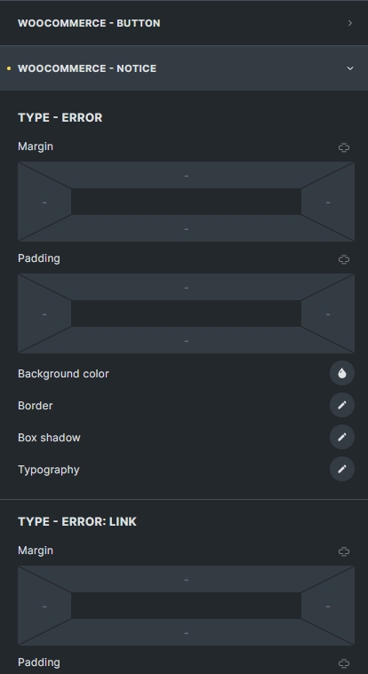
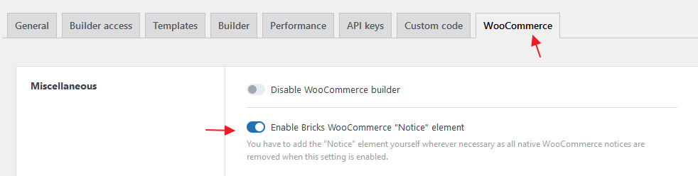
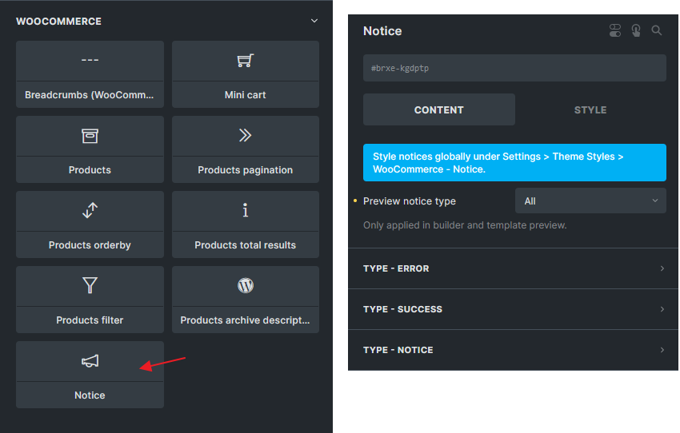

New theme style settings under "WooCommerce - Notice" and a new "WooCommerce Notice" element were introduced in Bricks `1.8.1`. Allowing you to elevate the appearance of WooCommerce (WC) notices across your website.

With this new theme style, you can effortlessly customize the design of WC notices, ensuring they blend seamlessly with your website's overall look and feel.

In this article, we will explore the functionalities and benefits of this feature and guide you through the process of implementing it effectively.

## Theme Style: WooCommerce - Notice

You can find the "WooCommerce - Notice" settings in the builder under Settings > [Theme Styles](/article/theme-styles/).

There are three different types of notice: Error, Success, and default Notice.

With the WC notice theme style, you can effortlessly align your notice styles with your brand guidelines, and achieve a uniform and professional appearance for your notices.

## Element: WooCommerce Notice

One of the primary objectives of this new feature is to offer you greater control over the placement of WC notices within their website's design.

Native WC notices often pose challenges, as they may appear outside of the desired design or wrapper, impacting the aesthetics and user experience.

To start using the Bricks WooCommerce notice element you first have to enable it under `Bricks > Settings > WooCommerce > Enable Bricks WooCommerce Notice Element`.

Once enabled all native WC notices are automatically removed from your website. So you can & have to manually place the notice element in your desired template & location.

<figcaption>

WC notice element. Not only theme style but can also style individual elements as well.

</figcaption>

**The following Bricks templates should be equipped with the Notice element:**

- WooCommerce Product Archive

- WooCommerce Single Product

- WooCommerce Cart

- WooCommerce Empty Cart

- WooCommerce Checkout

- WooCommerce My account layout (available in Woo Phase 3)

- WooCommerce My account lost password (available in Woo Phase 3)

- WooCommerce My account reset password (available in Woo Phase 3)

In addition to the Bricks templates mentioned above, several pages within your WooCommerce website require the Notice element **if they are edited and rendered using Bricks**. These pages include:

- My Account page (if the WC notice is not placed in the My account layout (Woo Phase 3))

- Checkout page (if the WC notice is not placed in the Checkout template)

- Cart page (if the WC notice element is not placed in the Cart template)

- Shop page (if the WC notice element is not placed in the Product Archive template)

**Only one Notice element is needed per page.**

If you happen to add multiple WC notice elements, only the first one will output the actual notices, following the native WooCommerce behavior. WooCommerce clears notices after the 1st output. Check WooCommerce `wc_print_notices()` for more information.
