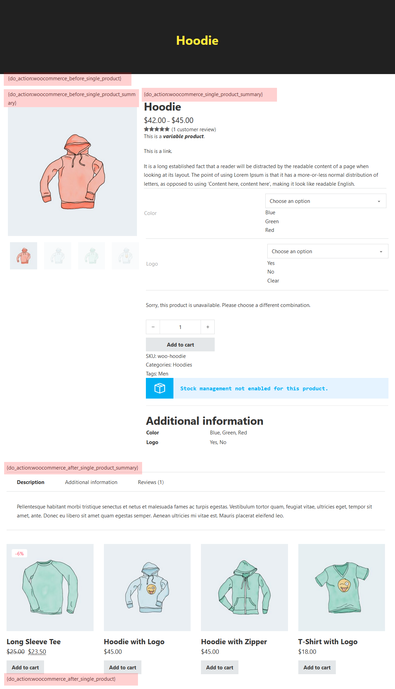
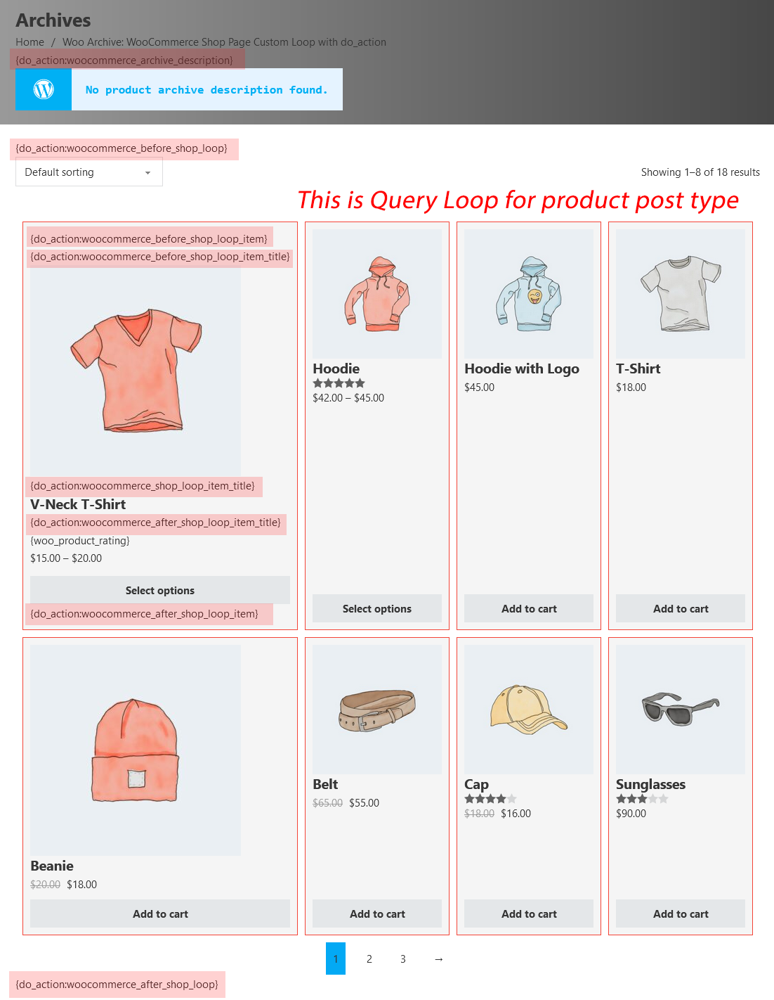
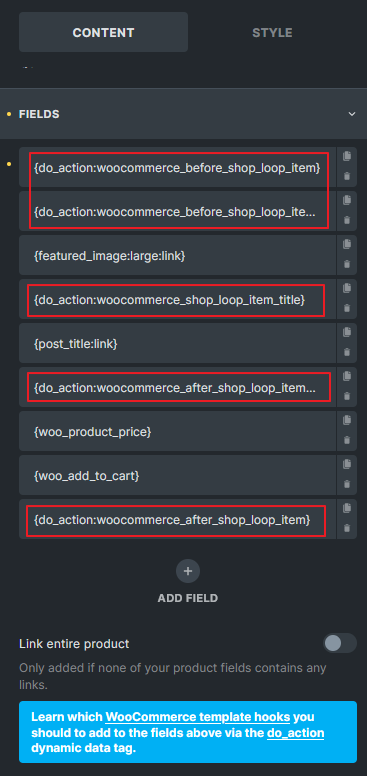
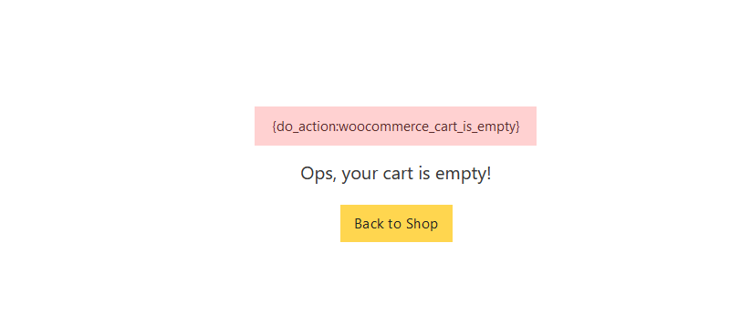
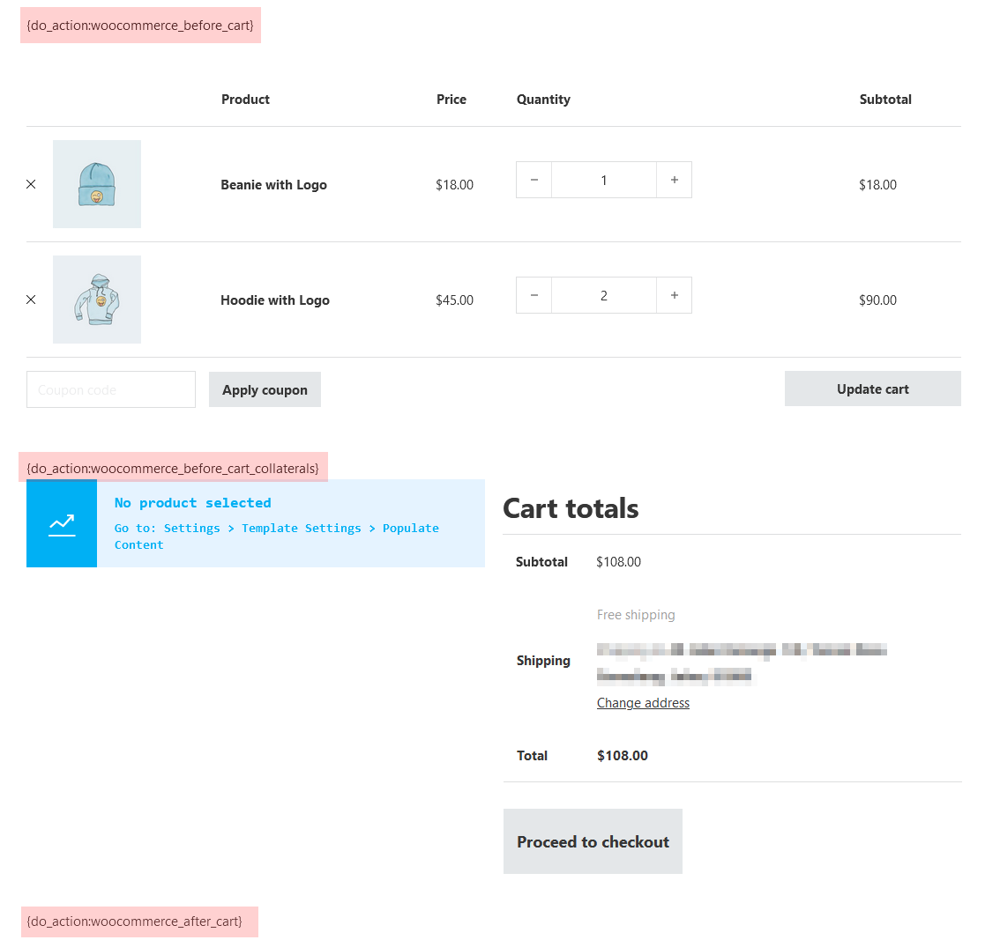
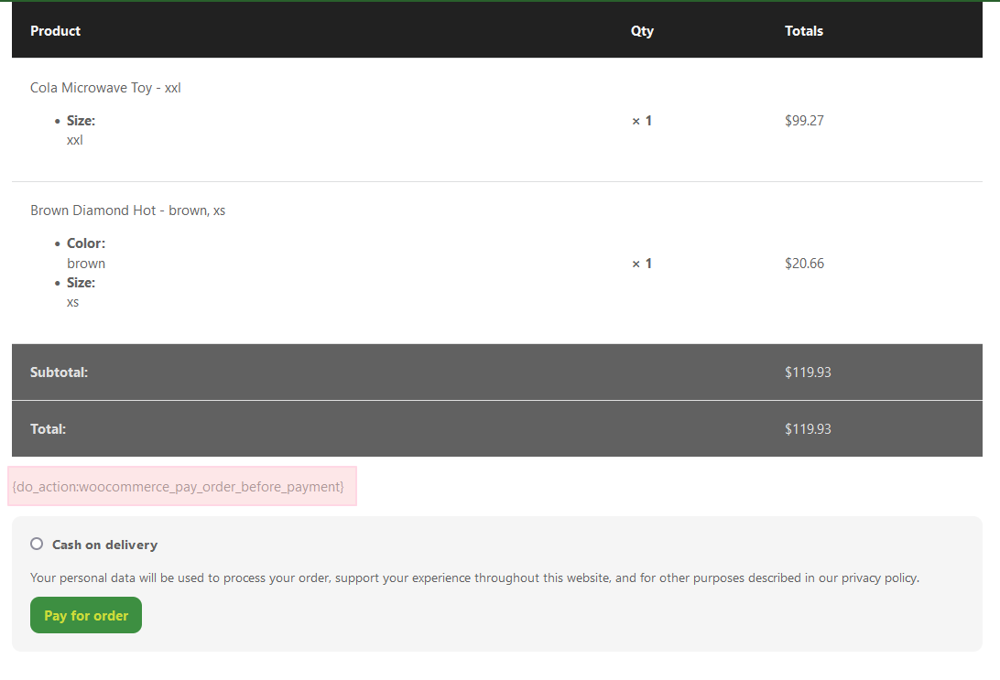

Bricks 1.7 introduces a new `[do_action](https://academy.bricksbuilder.io/article/dynamic-data/#do_action)` dynamic tag, which is designed to address the majority of compatibility issues between Bricks and third-party WooCommerce plugins. This new dynamic tag not only solves these compatibility issues but also enhances the flexibility of design by allowing users to place hooks anywhere they desire.

This article will guide you through the templates that need to be updated with the new `do_action` dynamic tag, though this step is optional if your Bricks-built WooCommerce website is already functioning properly.

Please note that when using the `do_action` dynamic tag with the specified hooks, Bricks will automatically remove certain native WooCommerce actions to prevent duplicate content.

As an example, consider using `{do_action:woocommerce_after_shop_loop_item_title}` dynamic tag in Bricks. This tag will automatically remove the `woocommerce_template_loop_rating` and `woocommerce_template_loop_price` actions. The reason for this is because the Product price and Product rating elements will be used to output the information in the desired location. At the same time, other plugins or codes will still be able to successfully hook onto the dynamic tag.

#### WooCommerce actions list removed by Bricks when using the do\_action tag

| Hook | Actions removed by Bricks, Priority |
| --- | --- |
| woocommerce\_before\_shop\_loop\_item | woocommerce\_template\_loop\_product\_link\_open, 10 |
| woocommerce\_before\_shop\_loop\_item\_title | woocommerce\_show\_product\_loop\_sale\_flash, 10   woocommerce\_template\_loop\_product\_thumbnail, 10 |
| woocommerce\_shop\_loop\_item\_title | woocommerce\_template\_loop\_product\_title,10 |
| woocommerce\_after\_shop\_loop\_item\_title | woocommerce\_template\_loop\_rating, 5   woocommerce\_template\_loop\_price, 10 |
| woocommerce\_after\_shop\_loop\_item | woocommerce\_template\_loop\_product\_link\_close, 5   woocommerce\_template\_loop\_add\_to\_cart, 10 |
| woocommerce\_before\_single\_product\_summary | woocommerce\_show\_product\_sale\_flash, 10   woocommerce\_show\_product\_images, 20 |
| woocommerce\_single\_product\_summary | woocommerce\_template\_single\_title, 5   woocommerce\_template\_single\_rating, 10   woocommerce\_template\_single\_price, 10   woocommerce\_template\_single\_excerpt, 20   woocommerce\_template\_single\_add\_to\_cart, 30   woocommerce\_template\_single\_meta, 40   woocommerce\_template\_single\_sharing, 50 |
| woocommerce\_after\_single\_product\_summary | woocommerce\_output\_product\_data\_tabs, 10   woocommerce\_upsell\_display, 15   woocommerce\_output\_related\_products, 20 |
| woocommerce\_before\_main\_content | woocommerce\_output\_content\_wrapper,10   woocommerce\_breadcrumb, 20 |
| woocommerce\_archive\_description | woocommerce\_taxonomy\_archive\_description, 10   woocommerce\_product\_archive\_description, 10 |
| woocommerce\_before\_shop\_loop | woocommerce\_result\_count, 20   woocommerce\_catalog\_ordering, 30 |
| woocommerce\_after\_shop\_loop | woocommerce\_pagination, 10 |
| woocommerce\_after\_main\_content | woocommerce\_output\_content\_wrapper\_end, 10 |
| woocommerce\_cart\_is\_empty | wc\_empty\_cart\_message, 10 |

Simply use a Basic Text element when applying the `{do_action:xxx}` dynamic tag within your template.

## WooCommerce Single Product Template Hooks

For the WooCommerce Single Product template, the following hooks are recommended to be used with the `do_action` dynamic tag:

- `{do_action:woocommerce_before_single_product}` - Important (WooCommerce notice)

- `{do_action:woocommerce_before_single_product_summary}`

- `{do_action:woocommerce_single_product_summary}` - Important (Many third-party plugins using this hook to inject their code)

- `{do_action:woocommerce_after_single_product_summary}`

- `{do_action:woocommerce_after_single_product}`

Best to place all of these in your single product template if you are not sure which hook will be using by the third-party plugins.

<figcaption>

Single product template hooks location

</figcaption>

## WooCommerce Product Archive Template Hooks

For the WooCommerce Product Archive template, the following hooks are recommended to be used with the `do_action` dynamic tag:

- `{do_action:woocommerce_archive_description}`

- `{do_action:woocommerce_before_shop_loop}` - Important (WooCommerce notice)

- `{do_action:woocommerce_before_shop_loop_item}`

- `{do_action:woocommerce_before_shop_loop_item_title}`

- `{do_action:woocommerce_shop_loop_item_title}`

- `{do_action:woocommerce_after_shop_loop_item_title}`

- `{do_action:woocommerce_after_shop_loop_item}`

- `{do_action:woocommerce_after_shop_loop}`

<figcaption>

Product archive template hooks location (Custom Query Loop)

</figcaption>

In Bricks 1.7, the dynamic tag `do_action` hooks will be automatically included in the fields of the Products element (for newly inserted Products elements only).

<figcaption>

Default Products element with do\_action hooks (Bricks 1.7+)

</figcaption>

## WooCommerce Empty Cart Template Hooks

For the WooCommerce Empty Cart template, the following hook is recommended to be used with the `do_action` dynamic tag:

- `{do_action:woocommerce_cart_is_empty}` - Important (WooCommerce notice)

<figcaption>

Empty cart template hook location

</figcaption>

## WooCommerce Cart Template Hooks

For the WooCommerce Cart template, the following hooks are recommended to be used with the `do_action` dynamic tag:

- `{do_action:woocommerce_before_cart}` - Important (WooCommerce notice)

- `{do_action:woocommerce_before_cart_collaterals}`

- `{do_action:woocommerce_after_cart}`

<figcaption>

Cart template hooks location

</figcaption>

## WooCommerce Pay Template

For the WooCommerce Pay template, the following hooks are recommended to be used with the `do_action` dynamic tag:

- `{do_action:woocommerce_pay_order_before_payment}`

<figcaption>

Pay template hooks location

</figcaption>

By following this guide, you can ensure that the templates created in Bricks are fully compatible with WooCommerce and that all necessary actions and details are displayed as intended.
